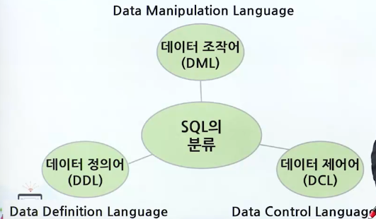
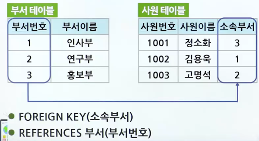
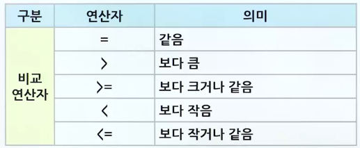
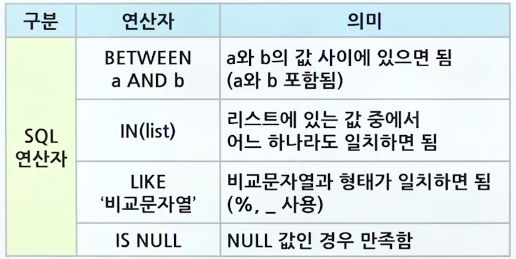
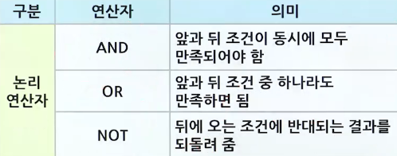
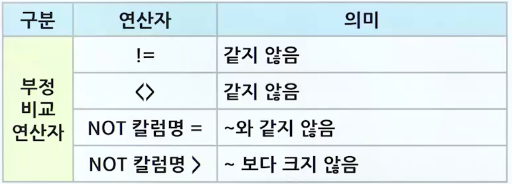
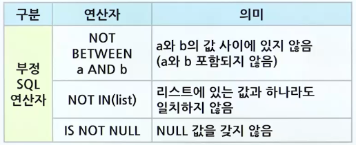
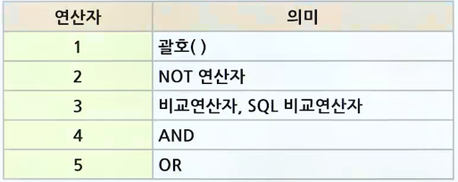

# SQL의 개요 및 SQL 명령어 기본

## SQL, NoSQL의 정의 및 특징

### SQL

- SQL의 특징
  - Structured Query Language의 약자
  - SQL은 관계형 데이터베이스를 위한 표준 질의어
  - 고급 비절차적 데이터 언어
  - SQL은 개개의 레코드 단위로 처리하기 보다는 레코드 집합 단위로 처리
  - 사용 방식
    - 대화식 SQL
      - 직접 데이터베이스 관리 시스템에 접근해 질의를 작성하여 실행
    - 삽입 SQL
      - 프로그래밍 언어로 작성된 응용 프로그램에 삽입
- SQL의 분류
  - 데이터 정의어 (DDL)
    - 테이블을 생성하고 변경/제거하는 기능을 제공
  - 데이터 조작어(DML)
    - 테이블에 새 데이터를 삽입하거나, 테이블에 저장된 데이터를 수정/삭제/검색하는 기능을 제공
  - 데이터 제어어(DCL)
    - 보안을 위해 데이터에 대한 접근 및 사용 권한을 사용자별로 부여하거나 취소하는 기능을 제공
  - 
- SQL의 변천과정
  - SQL-86 최초의 표준안
  - SQL-89(SQL 1) 표준안
    - 참조 무결성의 표현을 추가
  - SQL-92(SQL 2)의 표준안
    - 삽입 SQL의 표현 기능과 새로운 표현 기능 추가
  - SQL-99(SQL 3) 객체지향 DB

### NoSQL의 특징

> 관계형 데이터베이스의 SQL이 ACID라면 NoSQL은 BASE

- ACID
  - Atomicity(원자성)
  - Consistency(일관성)
  - Isolation(고립성/독립성)
  - Durability(지속성)
- BASE
  - Basically Available
    - 기본적으로 Available
  - Soft-state
    - 사용자가 관리(refresh, modify)하지 않으면 Data가 expire될 수 있음
  - Eventually consistency
    - 지금 당장은 아니지만 언젠가는 Data가 일관성을 ㅏㄱ짐

#### NoSQL의 특징

- 일관성 보다는 가용성과 확장성에 중점을 둠
- 관계형 데이터 모델을 사용하지 않는 모든 Database
- 데이터 모델링에서 RDBMS는 테이블 디자인이 중요
  - NoSQL은 쿼리 디자인이 중요
- RDBMS는 테이블 디자인에 정규화
  - NoSQL은 데이터 비정규화
- 빅데이터와 실시간 웹 응용에 많이 사용되지만 빅데이터 처리에 NoSQL이 꼭 필요한 것은 아님

## CREATE, ALTER, DROP 명령문

### CREATE 문

#### 기본 테이블 생성

- 기본 테이블을 생성하기 위한 생성문의 형식
- ```sql
    CREATE TABLE 기본테이블
        (열이름 데이터_타입 [NOT NULL] [DEFAULT 값])
        [PRIMARY KEY (열이름_리스트)]
        [UNIQUE (열이름_리스트)]
            [FOREIGN KEY (열이름_리스트)]
                REFFERENCES 기본테이블 [(열이름_리스트)]
                [ON DELETE 옵션]
                [ON UPDATE 옵션]
                [CONSTRAINT 이름] [CHECK (조건식)]

  ```

- []의 내용은 생략이 가능
- SQL 질의문은 세미콜론(;)으로 문장의 끝을 표시
- SQL 질의문은 대소문자를 구분하지 않음
- SQL은 열값으로 NULL을 허용하지 않으려면 NOT NULL 명세
  - ex. 고객명 VARCHAR(20) NOT NULL
- PRIMARY KEY
  - 기본키를 명세하는 것
    - 유일한 값이며 Null 허용 불가
    - ex. PRIMARY KEY(고객아이디), PRIMARY KEY(주문고객, 주문제품)
- UNIQUE
  - 대체키를 명세한 것
    - 유일한 값이며 널 값 허용
    - ex. UNIQUE (고객이름)
- FOREIGN KEY
  - 외래키로서 참조 무결성을 유지하기 위한 것으로, 참조되는 행이 삭제(ON DELETE)되거나 변경(ON UPDATE)될 때 취해야 할 작업을 명세하는 것
  - 옵션
    - NO ACTION, CASCADE, SET NULL, SET DEFAULT
  - NO ACTION
    - 참조 무결성이 위배되는 경우에는 참조되고 있는 튜플의 삭제가 거절
  - CASCADE
    - 참조되는 튜플이 삭제될 때 이 튜플을 참조하는 튜플도 파급해서 삭제
  - SET NULL, SET DEFAULT
    - 외래키를 Null 값으로 변경하거나 기정 값으로 설정
- CHECK 절
  - 테이블의 행이 갱신되거나 삽입될 때 유지되어야 할 무결성 제약조건
    - ex. CHECK(재고량 >= 0 AND 재고량 <= 10000)

#### 외래키 예제

- 참조 무결성 제약조건 유지를 위한 튜플 삭제 예
  - 
- 옵션
  - ON DELETE NO ACTION
    - 부서 테이블의 튜플을 삭제하지 못하게 함
  - ON DELETE CASCADE
    - 부서 테이블 튜플 삭제 시 사원테이블 튜플 함께 삭제
  - ON DELETE SET NULL
    - 부서 테이블 튜플 삭제 시 사원테이블 외래키 값을 NULL로 변경
  - ON DELETE SET DEFAULT
    - 부서 테이블 튜플 삭제 시 사원테이블 외래키 값을 기본 값으로 변경

#### 기본 테이블 생성 예제

- 예제1
  - 테이블명 : 고객
  - 속성은 고객아이디, 고객이름, 나이, 등급, 직업, 적립금으로 구성
  - 고객아이디 속성이 기본키, 고객이름과 등급 속성은 값을 반드시 입력
  - 적립금 속성은 값을 입력하지 않으면 0이 기본으로 입력
  - ```sql
      CREATE TABLE 고객 (
          고객아이디  VARCHAR(20) NOT NULL,
          고객이름    VARCHAR(10) NOT NULL,
          나이        INT,
          등급        VARCHAR(10) NOT NULL,
          직업        VARCHAR(20),
          적립금      INT DEFAULT 0,
          PRIMARY KEY (고객아이디)
      );
    ```
- 예제2
  - 테이블명 : 제품
  - 속성은 제품번호, 제품명, 재고량, 단가, 제조업체로 구성
  - 제품번호 속성이 기본키
  - 제약조건은 재고량이 항상 0개 이상 10,000개 이하를 유지
  - ```sql
      CREATE TABLE 제품 (
          제품번호   CHAR(3) NOT NULL,
          제품명     VARCHAR(20),
          재고량     INT,
          단가       INT,
          제조업체   VARCHAR(20),
          PRIMARY KEY (제품번호),
          CHECK (재고량 >=0 AND 재고량 <= 10000)
      );
    ```
- 예제3
  - 테이블명 : 주문
  - 속성은 주문번호, 주문고객, 주문제품, 수량, 배송지, 주문일자로 구성
  - 주문번호 속성이 기본키
  - 주문고객 속성이 고객 테이블의 고객아이디 속성을 참조하는 외래키
  - 주문제품 속성이 제품 테이블의 제품번호 속성을 참조하는 외래키
  - ```sql
      CREATE TABLE 주문 (
          주문번호 CHAR(3) NOT NULL,
          주문고객 VARCHAR(20),
          주문제품 CHAR(3)
          수량     INT,
          배송지   VARCHAR(30),
          PRIMARY KEY (주문번호),
          FOREIGN KEY (주문고객) REFERENCES 고객(고객아이디),
          FOREIGN KEY (주문제품) REFERENCES 제품(제품번호)
      );
    ```

### ALTER 문

- 기본 테이블에 대해 새로운 열의 첨가
- 기존 열에 대한 새로운 기정값 명세
- 기존 열의 삭제
- 기본 테이블에 새로운 무결성 조건의 명세 또는 기존 무결성 조건의 삭제 수행

#### ALTER 문 형식 및 예제

- 예제1
  - 새로운 속성 추가
    - ```sql
        ALTER TABLE 테이블_이름
            ADD 열이름 데이터_타입 [NOT NULL] [DEFAULT 기본_값];
      ```
    - 고객 테이블에 가입날짜 속성을 추가
      - ```sql
          ALTER TABLE 고객 ADD 가입날짜 DATETIME;
        ```
- 예제2
  - 기존 속성 삭제
    - ```sql
        ALTER TABLE 테이블_이름
            DROP 열이름 CASCADE | RESTRICT;
      ```
  - CASCADE
    - 삭제할 속성과 관련된 제약조건이나 참조하는 다른 속성을 함께 삭제
  - RESTRICT
    - 삭제할 속성과 관련된 제약조건이나 참조하는 다른 속성이 존재하면 삭제 거부
  - 고객 테이블의 등급 속성을 삭제하면서 관련된 제약조건이나 등급 속성을 참조하는 다른 속성도 함께 삭제
    - ```sql
        ALTER TABLE 고객 DROP 등급 CASCADE
      ```
- 예제3
  - 새로운 제약조건 추가
    - ```sql
        ALTER TABLE 테이블_이름
            ADD CONSTRAINT 제약조건_이름 제약조건_내용;
      ```
  - 고객 테이블에 20세 이상의 고객만 가입할 수 있다는 제약조건을 추가
    - ```sql
        ALTER TABLE 테이블_이름
            ADD CONSTRAINT CHK_AGE CHECK(나이 >= 20);
      ```
- 예제4
  - 새로운 제약조건 삭제
    - ```sql
        ALTER TABLE 테이블_이름
            DROP CONSTRAINT 제약조건_이름;
      ```
  - 고객 테이블에 20세 이상의 고객만 가입할 수 있다는 제약조건을 삭제
    - ```sql
        ALTER TABLE 고객 DROP CONSTRAINT CHK_AGE;
      ```

### DROP 문

- 테이블 제거 시 사용
- 형식 및 예제
  - ```sql
      DROP TABLE 테이블_이름 [CASCADE | RESTRICT];
    ```
  - RESTICT
    - 제거할 테이블을 참조하는 다른 테이블이 존재하면 제거 거부
  - CASCADE
    - 제거할 테이블을 참조하는 다른 테이블도 함께 제거
  - 고객 테이블을 삭제하되, 고객 테이블을 참조하는 다른 테이블이 존재하면 삭제가 수행되지 않음
    - ```sql
        DROP TABLE 고객 RESTRICT;
      ```

## SELECT 명령어 형식 및 WHERE 절 조건식 사용법

### SELECT문

#### SELECT 형식

- ```sql
    SELECT [DISTINCT] 열_리스트 FROM 테이블_리스트
    WHERE 조건
    GROUP BY 열_리스트 [HAVING 조건]
    ORDER BY 열_리스트 [ASC | DESC];
  ```
- SELECT 절
  - 관계대수의 추출(PROJECTON)
  - 연산(질의 결과를 포함하려는 속성 나열),
  - DISTINCT 절을 사용하여 중복 제거
- FROM 절
  - 질의에서 필요로 하는 릴레이션 리스트 나열
- WHERE 절
  - 관계대수의 선택(SELECT) 조건에 해당(속성들의 조건으로 구성)
- GROUP BY 절
  - 테이블을 지정된 열 리스트 값에 따라 논리적 그룹으로 나누어 줌
- HAVING 절
  - 그룹에 대한 조건 명세, HAVING절 사용 시 GROUP BY절은 반드시 존재
- ORDER BY 절
  - 최종 검색 결과의 정렬을 수행(ASC: 오름차순, DESC: 내림차순)

##### WHERE 절 조건식에 사용되는 연산자

- 
- 
- 
- 
- 

##### 연산자 우선순위

- 
