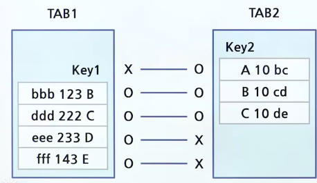
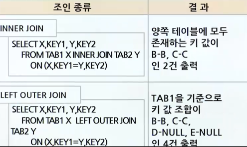
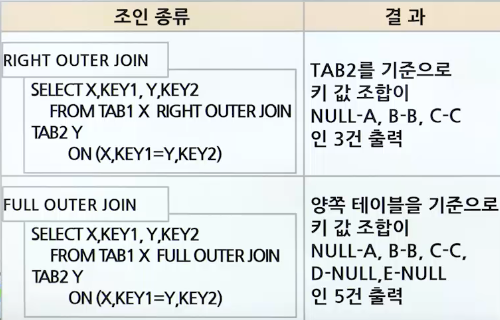
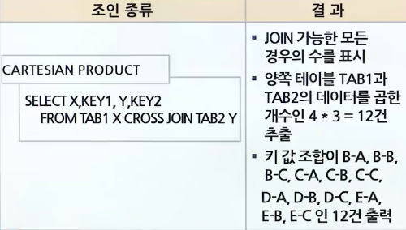
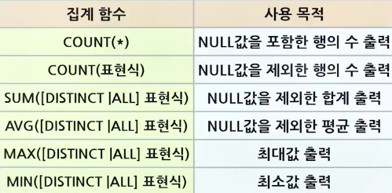

# SQL 데이터 검색 응용

## ORDER BY 구문을 통한 데이터 정렬

### ORDER BY의 특징

- SQL 문장으로 조회된 데이터들을 다양한 목적에 맞게 특정 칼럼을 기준으로 정렬하여 출력
- 사용자가 검색 결과의 순서를 오름차순(ASC)이나 내림차순(DESC)을 명세할 수 있음
- 별도로 정렬 방식을 지정하지 않으면 기본적으로 오름차순 적용
- 숫자 형 타입
  - 오름차순으로 정렬했을 경우에 가장 작은 값부터 출력
- 날짜 형 타입
  - 오름차순으로 정렬했을 경우 날짜 값이 가장 빠른 값이 먼저 출력
- 널 값
  - 오름차순에서는 가장 마지막에 나타남
  - 내림차순에서는 가장 앞에 나타남
- ORDER BY 사용 예제
  - SALARY가 3,000,000 이상인 직원에 대해 나이의 오름차순으로 정렬하되, 같은 나이에 대해서는 봉급의 내림차순으로 직원의 이름을 검색하라
  - ```sql
      SELECT 이름 FROM 직원
      WHERE 봉급 >= 3000000
      ORDER BY 나이 ASC 봉급 DESC;
    ```

## 복수 테이블로부터 JOIN을 통한 데이터 검색

### JOIN 문

- 조인의 특징
  - 조인은 두 개의릴레이션으로부터 연관된 튜플들을 결합
  - 조인의 일반적인 형식
    - SELECT문과 같은 FROM 절에 두 개 이상의 릴레이션들이 열거되고, 두 릴레이션에 속하는 애트리뷰트들을 비교하는 조인 조건이 WHERE 절에 포함됨
  - 조인 조건은 두 릴레이션 사이에 속하는 애트리뷰트 값들을 비교 연산자로 연결한 것
  - 가장 흔히 사용되는 비교 연산자 : (=)
    - ```sql
        SELECT A, B FROM R, S
        WHERE R.A <비교 연산자> S.B;
      ```
- 조인의 종류
  - 
- INNER VS. OUTER VS. CROSS JOIN 비교
  - 
  - 
  - 
  - 
- 조인 예제

  - 모든 사원의 이름과 이 사원이 속한 부서 이름을 검색하라.
    - ```sql
        SELECT EMPNAME, DEPTNAME FROM EMPLOYEE AS E, DEPARTMENT AS D
        WHERE E.DNO = D.DEPTNO;
      ```
  - 직원 테이블과 부서 테이블을 조인하여 부서명이 인사과인 직원의 이름을 출력하라.

    - ```sql
        # 결과 모두 동일
        SELECT 이름 FROM 직원, 부서
        WHERE 직원.부서번호 = 부서.부서번호
        AND 부서명 = '인사과';

        SELECT 이름 FROM 직원
        JOIN 부서 ON (직원.부서번호 = 부서.부서번호)
        WHERE 부서명 = '인사과';

        SELECT 이름 FROM 직원
        JOIN 부서 USING (부서번호)
        WHERE 부서명 = '인사과';

        SELECT 이름 FROM 직원
        NATURAL INNER JOIN 부서
        WHERE 부서명 = '인사과';
      ```

## 집계 함수를 이용한 검색

### 집계 함수

- 집계 함수를 이용한 검색
  - 여러 행들의 그룹이 모여서 그룹당 단 하나의 결과를 돌려주는 함수
    - 집계 함수명 ([DISTINCT | ALL] 칼럼이나 표현식 )
      - ALL
        - Default 옵션이므로 생략 가능
      - DISTINCT
        - 집계함수를 적용하기 전에 데이터의 중복 제거
  - COUNT(\*)를 제외하고는 모든 집계 함수들이 NULL 값을 제거한 후 남아 있는 값들에 대해서 집계 함수의 값을 구함
  - COUNT(\*)
    - 결과 릴레이션의 모든 행들의 총 개수 구함
  - COUNT(애트리뷰트)
    - 해당 애트리뷰트에서 널 값이 아닌 값들의 개수를 구함
- 연산자 우선순위
  - 
- 집계 함수 사용 예제
  - 모든 사원들의 평균 급여와 최대 급여를 검색하라
    - ```sql
        SELECT AVG(SALARY), MAX(SALARY) FROM EMPLOYEE;
      ```
  - 학생테이블 전체에서 취미의 개수를 출력하는데 NULL 값은 제외하고 출력하라.
    - ```sql
        SELECT COUNT(취미) FROM 학생
      ```
  - 학생테이블 전체에서 취미의 개수를 출력하는데 NULL 값과 중복되는 것은 제외하고 출력하라.
    - ```sql
        SELECT COUNT(DISTINCT 취미) FROM 학생
      ```

### GROUP BY, HAVING 구문 사용법

- GROUP BY 문
  - 특징
    - GROUP BY는 논리적으로 FROM 절에 있는 테이블을 GROUP BY절에 명세된 열의 값에 따라 그룹으로 분할
    - 테이블이 데이터베이스 내에서 물리적으로 분할되는 것은 아님
    - SELECT 절에는 각 그룹마다 하나의 값을 값는 애트리뷰트, 집단 함수, 그룹화에 사용된 애트리뷰트들만 나타날 수 있음
  - 예제
    - 모든 사원들에 대해서 사원들이 속한 부서번호 별로 그룹화하고, 각 부서마다 부서번호, 평균급여, 최대급여를 검색하라
      - ```sql
          SELECT DNO, AVG(SALARY), MAX(SALARY) FROM EMPLOYEE
          GROUP BY DNO;
        ```
- HAVING 문
  - 특징
    - 어떤 조건을 만족하는 그룹들에 대해서만 집단 함수를 적용할 수 있음
    - HAVING 절은 그룹화 애트리뷰트에 같은 값을 갖는 튜플들의 그룹에 대한 조건을 나타냄
      - 이 조건을 만족하는 그룹들만 질의 결과에 나타남
    - HAVING 절에 나타나는 애트리뷰트
      - 반드시 GROUP BY 절에 나타나거나 집단 함수에 포함되어야 함
    - WHERE 절과 HAVING 절이 같은 질의에서 나타날 때
      - SQL은 WHERE 절의 조건을 먼저 적용
    - WHERE
      - 행을 제거할 때 사용
    - HAVING
      - 그룹을 제거할 때 사용
  - 예제
    - 모든 사원들에 대해서 사원들이 속한 부서번호 별로 그룹화하고, 평균 급여가 2,500,000 이상인 부서에 대해서 부서번호, 평균급여, 최대급여를 검색하라.
      - ```sql
          SELECT DNO, AVG(SALARY), MAX(SALARY) FROM EMPLOYEE
          GROUP BY DNO
          HAVING AVG(SALARY) >= 2500000;
        ```
    - 직원 테이블에서 소속 직원이 3명 이상인 부서번호를 출력하라.
      - ```sql
          SELECT 부서번호 FROM 직원
          GROUP BY 부서번호
          HAVING COUNT(*) >=3;
        ```
    - 플레이어 테이블에서 평균키가 180 이상인 포지션과 평균키를 출력하라.
      - ```sql
          SELECT POSITION 포지션, ROUND(AVG(HEIGHT),2) 평균키 FROM PLAYER
          GROUP BY POSITION
          HAVING AVG(HEIGHT) >= 180;
        ```
    - 도서(도서번호, 도서제목, 출판사명, 발행년도) 테이블에서, 2000년 이후에 10권 이상의 책을 발행한 출판사명을 출력하라.
      - ```sql
          SELECT 출판사명 FROM 도서
          WHERE 발행년도 >= 2000
          GROUP BY 출판사명
          HAVING COUNT(도서번호) >= 10;
        ```
