# SQL 데이터 검색 고급 및 데이터 조작어

## 부속 질의문(SubQuery) 및 EXISTS를 이용한 검색

### 부속 질의문(SubQuery)

- 부속질의문을 이용한 검색
  - 부속 질의문은 하나의 SQL문 안에 포함되어 있는 또 다른 SQL문
    - 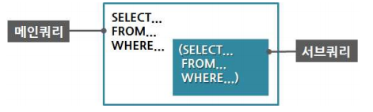
  - WHERE 절에 SELECT 절이 포함된 부속 질의어를 사용한 검색은 조인을 사용한 질의어보다 효율적이나 최종 검색 속성이 한 테이블에서만 나오게 됨
  - 부속 질의어 사용 시 주의 사항
    - 서브쿼리를 괄호로 감싸서 사용
    - 단일 행 비교 연산자는 서브쿼리의 결과가 반드시 1건 이하
    - 복수 행 비교 연산자는 서브쿼리의 결과 건수와 상관없음
    - 서브쿼리에서는 ORDER BY를 사용하지 못함
  - 반환되는 데이터의 형태에 따른 부속 질의문 분류
    - 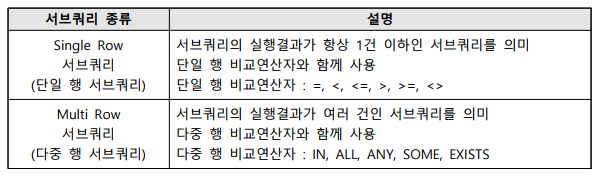
  - 다중 행 비교연산자
    - 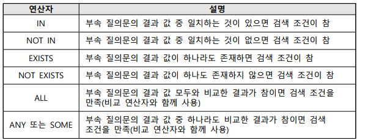
  - 다중 행 비교연산자
    - 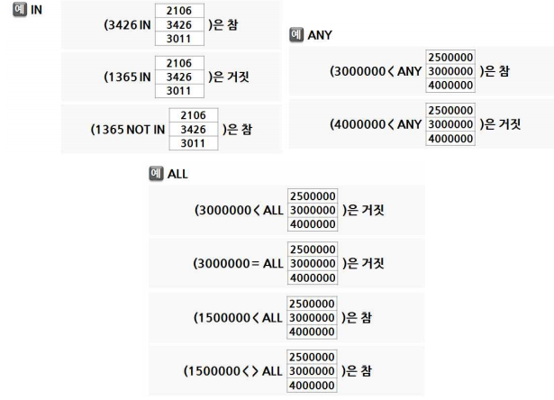
- 부속질의문 사용 예제(한 개의 애트리뷰트로 이루어진 릴레이션이 반환되는 경우)
  - 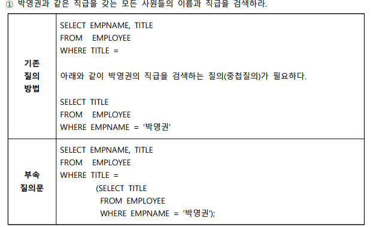
  - 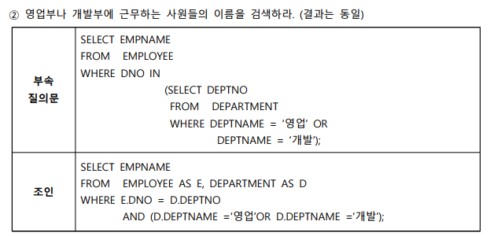
  - 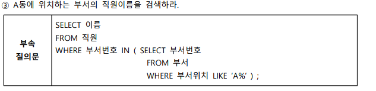
- 부속질의문 사용 예제(여러 애트리뷰트로 이루어진 릴레이션이 반환되는 경우)
  - 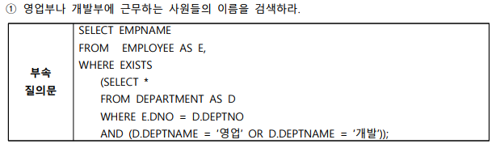

## LIKE, NULL을 이용한 검색

### LIKE를 사용하는 검색

- 특징
  - LIKE 프레디킷은 서브 스트링 패턴(substring pattern)을 비교하는 비교 연산자
    - % : % 문자는 어떤 길이의 어떤 문자 스트링도 관계없다는 뜻
    - _ : _ 문자는 어떠한 한 문자와 일치
  - 부분 매치 질의문은 ' = ' 대신 LIKE를 사용
  - 일치하지 않는 문자열에 대한 검색은 NOT LIKE 비교 연산자 사용
- LIKE 사용 예제
  - 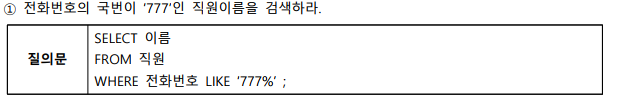
  - 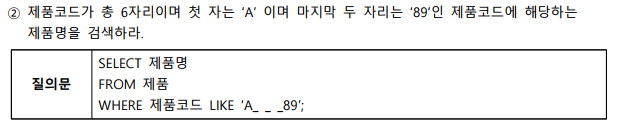

### NULL을 이용한 검색

- 특징
  - 일반적으로 NULL은 검색 조건에 명세할 때는 열\_이름 is [NOT] NULL 만 허용
  - 열\_이름 = NULL은 불법적인 것이며 허용되지 않음
- LIKE 사용 예제
  - 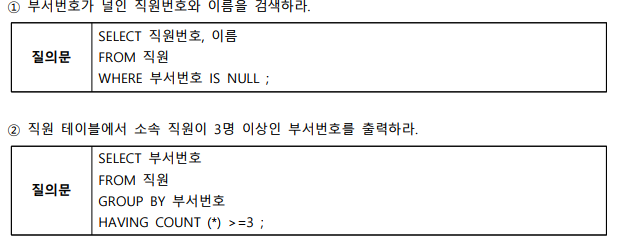

## 집합연산(UNION, INTERSECT, EXCEPT)

### 집합연산

- 특징
  - 집합 연산을 적용하려면 두 릴레이션이 합집합 호환성을 가져야 함
  - 릴레이션 결과 릴레이션에서 중복 튜플 배제
    - UNION(합집합)
    - EXCEPT(차집합)
    - INTERSECT(교집합)
  - 릴레이션 결과 릴레이션에서 중복 튜플 허용
    - UNION ALL(합집합)
    - EXCEPT ALL(차집합)
    - INTERSECT ALL(교집합)
  - 집합연산자 예시
    - 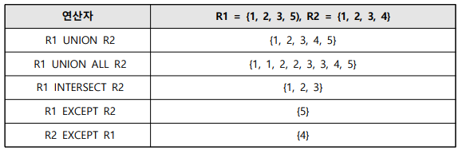
- NULL 사용 예제
  - 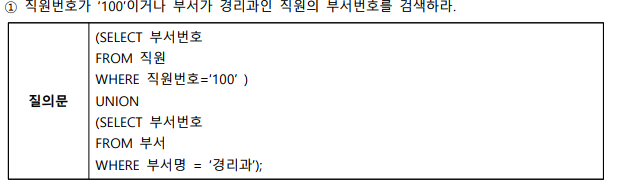

## INSERT, DELETE, UPDATE 명령어

### 삽입문 (INSERT)

- 데이터 삽입 규칙
  - 기존 테이블에 레코드 직접 삽입
    - 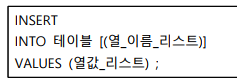
  - 부속 질의문을 이용한 레코드 삽입
    - 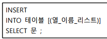
  - NULL 값을 입력 가능
  - 모든 열의 값을 입력할 때는 테이블 명 다음의 열 이름 생략
  - 하나의 INSERT 문으로 여러 행 삽입 가능(한 행에 해당하는 값들을 괄호로 묶어 표시)
  - 하나의 테이블만을 대상으로 하며, Order By 절은 포함시킬 수 없음
  - 입력하려는 속성에 NOT NULL이 지정되어 있다면 반드시 입력해야 함
  - 기본키로 지정된 속성에는 중복되는 값, 널 값은 입력 불가능
- INSERT 예제
  - 
  - 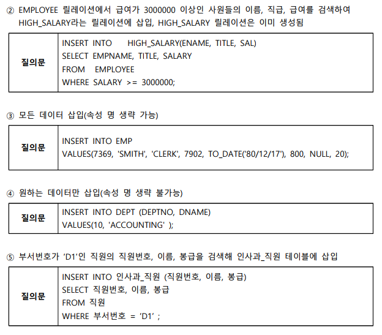

### 삭제문 (DELETE)

- 데이터 삭제 규칙
  - 기존 테이블의 행 삭제
  - DELETE문은 WHERE 절의 조건을 만족하는 레코드를 모두 삭제하는 명령어로서 모든 데이터가 삭제되더라도 데이터베이스의 테이블 구조 자체는 남아 있음
  - 테이블 제거 명령인 DROP문과는 다름
  - 만일 외래키를 가지고 있는 테이블이 있다면 그 테이블에서도 같은 삭제 연산이 이루어지거나 삭제가 거부되어야 참조 무결성을 유지할 수 있음
  - 하나의 테이블만을 대상
- DELETE 예제
  - 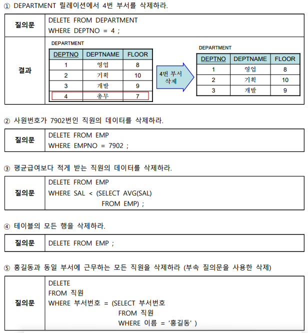

### 갱신문(UPDATE)

- 데이터 갱신 규칙
  - 기존 데이터의 열값 갱신
  - 하나의 테이블에 여러 개의 열 갱신 시 지정된 테이블에서 수정될 열 이름과 새로운 값의 쌍을 SET 절에 콤마(,)로 구분하여 나열
  - WHERE 절이 명시되면 조건을 만족하는 모든 레코드들이 SET절에 지시된 대로 변경
  - 하나의 테이블만을 대상
    - 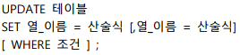
- UPDATE 예제
  - 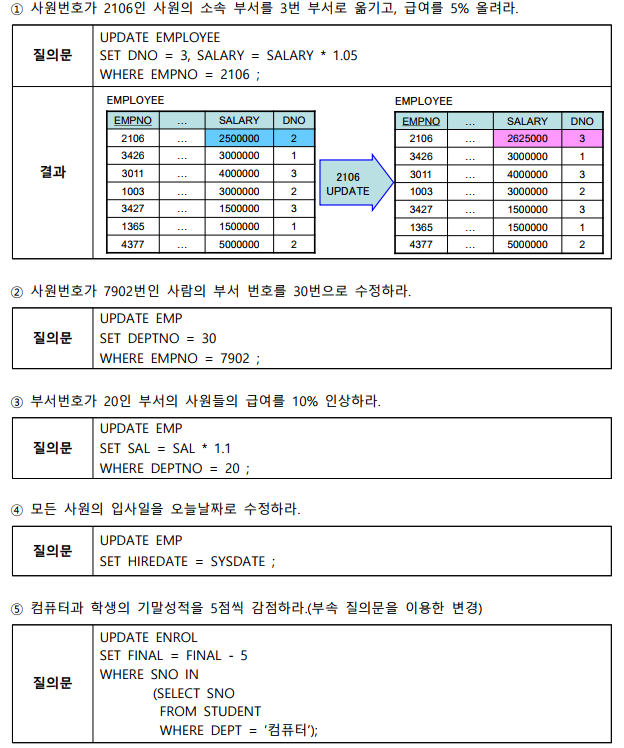

## 데이터 조작 시 무결성 유지 방법

### 무결성 유지 방법

- 규칙
  - 개체 무결성 유지 : 기본키는 유일한 값이고 널 값을 가질 수 없음
  - 참조 무결성 유지 : 외래키는 참조할 수 없는 키 값을 가질 수 없음
  - 도메인 무결성 유지 : 속성이 갖는 값의 범위를 벗어날 수 없음
