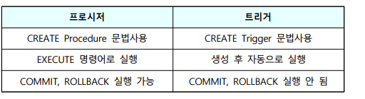

# SQL 고급 기능 활용

## VIEW의 특성 및 생성과 조작

### VIEW(뷰)의 특성

- 뷰는 다른 테이블로부터 유도된 노닐적 가상 테이블(virtual table)
- 기본 테이블(base table)은 물리적으로 구현되어 데이터가 실제로 저장되지만, 뷰는 반드시 물리적으로 구현되어 있는 것은 아님
  - 실체화된 뮤는 물리적으로 구현
- 뷰는 외부 스키마에 해당
- 삽입, 삭제, 갱신 연산은 제약이 따름
- 뷰의 정의는 시스템 가탈로그(SYSVIEWS)에 SELECT-FROM-WHERE의 형태로 저장
- 뷰는 실행시간에만 구체화되는 특수한 테이블
- 뷰 위에 또 다른 뷰를 정의할 수 있으며, 뷰가 정의된 기본 테이블이 제거되면, 뷰도 자동적으로 제거
- 데이터베이스의 선별된 부분만 표시하여 사용권한을 다양하게 설정
- 뷰에 대한 두 가지 중요한 원칙
  - 뷰를 실제로 정의한 사용자는 명백히 뷰 정의 구문에 대한 대응을 알고 있어야 함
  - 단순히 뷰가 존재하고 사용 가능하다는 것을 하는 사용자는 뷰 정의 구문에 대해 알고 있으면 안됨(보안 유지)

### 뷰의 생성/제거

- 뷰의 생성
  - CREATE 문 사용
    - 
  - AS SELECT 문은 일반 검색문과 같은데 UNION이나 ORDER BY를 사용할 수 없음
  - WITH CHECK OPTION 절은 이 뷰에 대한 갱신이나 삽입 연산을 실행할 때 뷰 정의 조건을 위반하면 실행이 거부된다는 것을 명세하는 것
  - 열 부분 집합 뷰
    - 프로젝션을 통해 생성된 뷰
  - 행 부분 집합 뷰
    - 셀렉션을 통해 생성된 뷰
  - 통계적 요약 뷰
    - 집단 함수를 이용해 통계 요약 정보를 반영한 뷰
  - 조인 뷰(join view)
    - 두 개이상의 테이블을 조인해서 생성된 뷰
- 뷰의 생성 예제
  - 
  - 
- VIEW의 제거
  - 뷰는 ALTER 문을 이용하여 변경 불가능
  - 필요시 DROP 문을 이용하여 제거 후 다시 생성
    - 
  - Propagated Destroys
    - 기본 테이블이 제거되면 그 위에 만들어진 인덱스나 뷰도 자동적으로 제거
- 뷰의 변경이 허용되지 않는 경우
  - 
  - 뷰의 열이 상수나, 산술 연산자 또는 함수가 사용된 산술식
  - 집계 함수(COUNT, SUM, AVG, MAX< MIN)가 관련되어 정의된 뷰
  - DISTINCT, GROUP BY 또는 HAVING이 사용되어 정의된 뷰
  - 두 개 이상의 테이블과 관련되어 정의된 뷰 -> 한 릴레이션에서 정의된 뷰에만 변경이 허용
  - 변경할 수 없는 뷰를 기초로 정의된 뷰
  - 동일한 테이블을 참조하는 중첩된 테이블(self-join) 표현을 가진 뷰
  - NOT NULL로 정의된 속성이 포함되지 않을 경우

### 뷰의 장단점

- 뷰의 장점
  - 데이터의 논리적 독립성 제공
    - 뷰가 정의된 기본 테이블이 확장된다든지 뷰가 속해 있는 데이터베이스에 테이블이 더 늘어난다고 하더라도 기존의 뷰를 사용하는 프로그램이나 사용자는 아무런 영향을 받지 않음
    - 확정 : 기존 객체에 새로운 속성을 추가하여 기존 릴레이션 변수 확장
    - 재구성 : 정보의 내용이 그대로 남아 있더라도, 논리적인 자료의 위치가 변화함으로써 데이터베이스를 재구성하는 것
  - 데이터의 접근을 제한함으로써 보안 제공
    - 뷰를 통해서만 데이터를 접근하게 하면 뷰에 나타나지 않는 데이터는 안전하게 보호
    - DBA는 보안 측면에서 뷰를 활용
  - 필요한 데이터만 뷰로 정의해서 사용하므로 사용자의 데이터 관리 간단
  - 하나의 테이블로 여러 개의 상이한 뷰를 정의하여 사용자의 요구에 따라 활용 가능
- 뷰의 단점
  - 뷰는 그 정의를 변경할 수 없음(ALTER문 사용 불가)
  - 뷰는 삽입, 삭제, 갱신 연산에 많은 제한을 가지고 있음
  - 독자적인 인덱스를 가질 수 없음
  - 질의 성능 저하를 가져올 수 있음

### 뷰의 구현 방식

- 질의 수정방식
  - 뷰에 대한 질의를 기본 테이블에 대한 질의로 재작성하여 수행
  - 뷰가 물리적인 저장장치를 차지하지 않는 가상 테이블이기 때문에 저장장치에 대한 추가 비용 없음
- 뷰 형성방법
  - 뷰에 대한 물리적 테이블을 형성
  - 질의 처리 시간이 상당히 단축되는 장점이 있음
  - 기본 테이블에 대한 변경이 잦은 경우 이를 반영하여 뷰를 적절히 유지해야 하는 비용 증대

## 삽입 SQL, 동적 SQL, 저장 프로시저의 개요

### 삽입 SQL

- 개요
  - 범용(호스트) 프로그래밍 언어로 작성되는 응용프로그램 속에 내장해서 사용
  - Host Program의 컴파일 시 DML 예비컴파일러에 의해 내장 SQL문은 분리되어 컴파일
- 삽입 SQL을 포함하는 응용 프로그램의 특성
  - 응용프로그램에서 삽입 SQL문은 명령문 앞에 'EXEC SQL'을 붙여 다른 호스트언어의 명령문과 쉽게 구별
  - 삽입 SQL문 끝은 세미콜론(;)과 같은 특별한 종료 심볼을 붙여 표시
  - SQL문 속에서 호스트 변수는 다른 SQL 필드 이름과 구별하기 위해 콜론(:)을 앞에 붙임
  - SQL문에 사용할 호스트 변수는 사용하기 전에 반드시 삽입 SQL선언부인 BEGIN/END DECLARE SECTION 속에서 선언
  - 모든 삽입 SQL 프로그램은 SQLSTATE 호스트 변수를 포함
  - SQL문이 실행되면 실행 상태(성공, 실패, 오류) 표시가 SQLSTATE 변수를 통해 프로그램에 전달
  - '000000' : 문장이 성공적으로 수행
  - '02000' : NOT FOUND (실행은 했지만 아무런 데이터도 검색하지 못했다는 것을 의미)
  - SQL CODE가 음수 : 에러
  - 삽입 SQL문의 호스트 변수의 데이터 타입은 이에 대응하는 데이터베이스 필드의 SQL 데이터 타입과 반드시 일치
  - 호스트 변수와 데이터베이스 필드의 이름은 달라도 됨
  - SELECT에 의한 검색 결과는 튜플로 구성된 테이블이지만 호스트 언어들은 한 번에 하나의 레코드만 취급하므로 SQL의 레코드 집합 단위 처리와 호스트 언어의 개별 레코드 처리 단위 사이에 교량시설이 요구되는데, 이를 CURSOR가 담당
- 삽입 SQL 예제
  - 

### 커서(CURSOR)

- 특징
  - 응용 프로그램의 삽입 SQL에만 사용되는 새로운 객체
  - SELECT 연산에서 얻은 레코드 집합에 있는 각 레코드를 한 번에 하나씩 지시할 수 있게 해서 그 레코드 전체를 처리할 수 있도록 하는 포인터
  - 단일 검색문의 경우와 삽입, 삭제, 갱신문의 경우에는 커서 불필요
  - 커서가 반드시 필요한 경우는 복수 레코드를 검색하는 SELECT문을 사용할 경우
- 커서 관련 문장
  - DECLARE : 커서와 관련된 SQL문을 정의
  - OPEN : 커서를 개방 <- 실행 가능
  - FETCH : 커서가 가리키는 결과 테이블의 한 튜플을 호스트 변수로 가져옴
  - CLOSE : 커서를 폐쇄 <- 작업이 종료됨
- 커서가 필요 없는 데이터 조작
  - 단일 레코드 검색
    - 
  - 갱신
    - 
  - 삭제
    - 
  - 삽입
    - 
- 커서를 이용한 데이터 조작
  - 복수 레코드 검색
    - 

### 동적(Dynamic) SQL

- 특징
  - 동적 SQL은 일반적으로 SQL문을 RDBMS에 보낼 때마다 데이터베이스 엔진에서 실행 가능한 내부 중간 코드로 번역하는 작업을 미리 수행
  - SQL 코드를 재사용하여, SQL 분석 오버헤드를 줄암
  - SQL 문을 소스 코드로 고정하지 않고 데이터베이스에 액세스할 때마다 구문을 다시 할 경우 유용
  - 기본적인 명령 : PREPARE와 EXCUTE
    - PREPARE문
      - 호스트 변수에 저장되어 있는 원SQL 문을 예비 컴파일하고 바인드해서 목적코드를 생성하여 변수에 저장
    - EXECUTE문
      - 목적 코드의 SQL문을 실제로 실행
    - 예제
      - 

### 저장 프로시저 (Stored Procedure)

- 특징
  - SQL은 모듈(module) 언어를 제공하는데, 이를 통해 SQL에서 프로시저를 정의함
  - for, while, if-then-else와 복합 SQL문(begin과 end 사이에 여러 개의 SQL문들)과 같은 절차적인(precedure) 구문 허용
  - 데이터베이스의 내부적인 상세내역을 공개하지 않고 액세스 권한을 별도로 지정할 수 있기 때문에 높은 보안성 제공(캡슐형 설계)
  - 대부분의 클라이언트에서 자주 사용되는 절차적 SQL블록을 통신량 감소를 위해 서버쪽에 저장
  - 저장 프로시저에 포함된 SQL 명령들은 최적화되어 있기 때문에 빠르게 동작
  - CREATE PROCEDURE 문으로 저장 프로시저 정의
  - 클라이언트는 EXECUTE 문으로 저장 프로시저 호출
  - 프로시저와 트리거의 차이점
    - 프로시저는 BEGIN ~ END 절 내에 COMMIT, ROLLBACK과 같은 트랜잭션 종료 명령어를 사용할 수 있지만, 데이터베이스 트리거는 BEGIN ~ END 절 내에 사용할 수 없음
      - 
- 저장 프로시저의 6가지 역할
  - 데이터 무결성의 시행
  - 복잡한 비즈니스 규칙과 제약의 강화
  - 캡슐형 설계
  - 유지 보수
  - 서버에 저장되어 있으므로 네트워크 트래픽을 감소시켜 보다 빠른 실행(컴파일을 하지 않음)
  - 보안 강화

## QUEL, QBE, DATALOG

### QUEL (QUEry Language)

- INGRES(INteractive Graphics and REtrieval System)라는 관계 데이터베이스 시스템을 지원하기 위해 데이터 언어
- QUEL은 튜플 관계해석(tuple relational calculus)을 기초로 한 데이터 언어
- 비절차적 특성

### QBE(Quey By Example)

- QBE는 도메인 관계해석(domain relational calculus)을 기초로 한 관계 데이터 언어
- 1975년 IBM의 Zloof에 의해 개발
- QBE는 명령문의 실행 결과가 테이블 형태로 표현

### Datalog

- Datalog는 논리 프로그래밍 언어(logic-programming language)인 Prolog에 기반을 둔 비절차식 질의어
- Datalog는 간단한 질의를 작성하기 쉽고, 질의 최적화를 쉽게 해줌
- Datalog 프로그램은 규칙(rule)들의 집합

### 관계 데이터베이스 언어 비교

- 특징 비교
  - 
