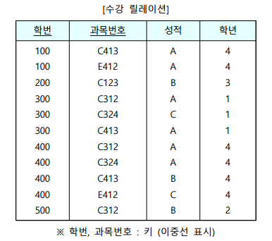
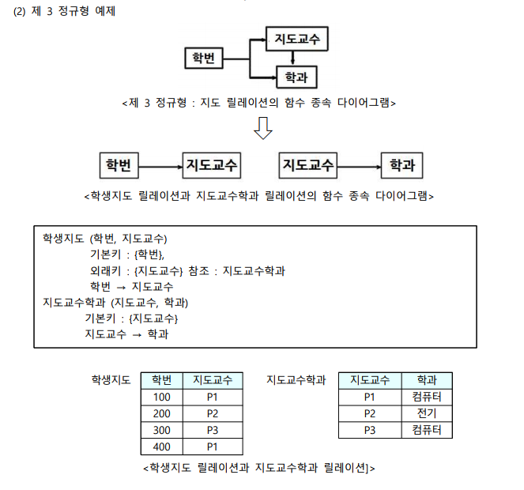
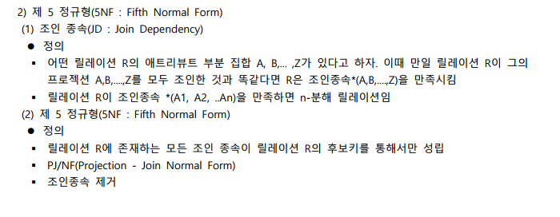
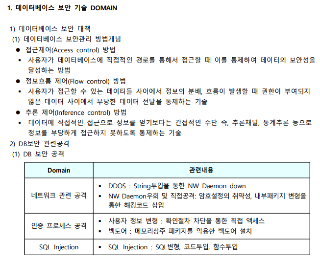
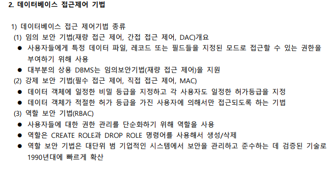
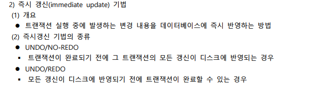
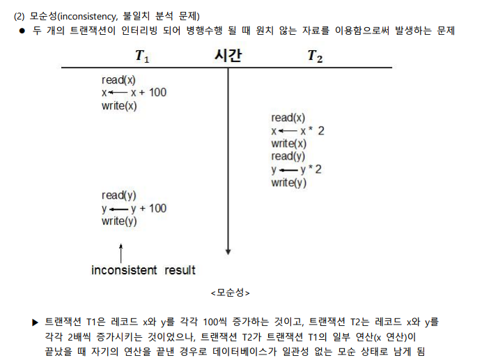
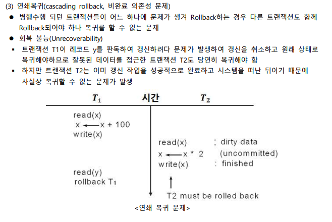
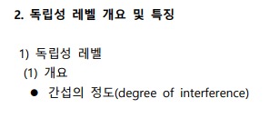

# 데이터의 논리적 표현과 함수적 종속성

# 정규화의 개념 및 종류

---

# 데이터베이스의 무결성 및 보안의 개념

# 데이터베이스 접근제어 기법 및 보안 구현

---

# 질의어 처리 단계 및 최적화 과정

# 데이터베이스 성능향상을 위한 튜닝기법

- Cost-Based 옵티마이저를 사용할 경우만 Hash Join
  
  
  
  
  
  

---

# 트랜잭션 개요 및 장애와 회복

# 데이터베이스 고급 회복 기법

---

# 병행제어 개요 및 로킹 기법

# 고급 병행제어 기법

---

# 분산 데이터베이스와 객체지향 데이터베이스

# 최신 데이터베이스 활용

---

# 정리

## 데이터의 논리적 표현과 함수적 종속성

- 이상(anomaly)현상이란 관계 스킴의 설계가 잘못되면 데이터의 불필요한 중복이 발생하거나 데이터 처리 시 다양한 문제점이 발생하는 것을 말한다.
- 이상현상의 종류로는 삭제 이상, 삽입 이상, 갱신 이상 등이 있다.
- 스키마 변환의 원리에는 정보의 무손실 표현, 데이터 중복성 감소, 분리의 원칙, 종속성 보존이 있다.
- 함수적 종속성은 어떤 릴레이션 R에서 애트리뷰트 X의 값 각각에 대해 애트리뷰트 Y의 값이 하나만 연관되는 것을 의미한다.
- 정규화란 애트리뷰트 간 종속성을 분석해서 하나의 종속성이 하나의 릴레이션으로 표현되도록 분해하는 과정이다.

## 정규화의 개념 및 종류

- 제 1정규형(1NF : Fist Normal Form)은 어떤 릴레이션 R에 속한 모든 도메인이 원자값만으로 구성되어 있으나 기본키에 부분함수 종속된 애트리뷰트가 존재하는 정규형이다.
- 제 2정규형(2NF : Second Normal Form)은 어떤 릴레이션 R이 1NF이고 키(기본)에 속하지 않은 애트리뷰트 모두가 기본키에 완전함수 종속(부분함수 종속 제거)되어 있으나 이행적 함수종속이 존재하는 정규형이다.
- 제 3정규형(3NF: Third Normal Formal)은 어떤 릴레이션 R이 2NF이고 키(기본)에 속하지 않은 모든 애트리뷰트들이 기본키에 이행적 함수종속이 아닌 경우를 말한다.
- 보이스/코드 정규형(BCNF: Boyce Codd Normal Form)은 릴레이션 R의 모든 결정자(determinant)가 후보키(candidate key)인 경우를 말한다.
- 제 4정규형(4NF, Fourth Normal Form)은 릴레이션 R에서 MVD A -> B 가 존재할 때 R의 모든 애트리뷰트들이 A에 함수 종속(FD)인 경우를 말한다.
- 제 5정규형(5NF, Fifth Normal Form)은 릴레이션 R에 존재하는 모든 조인 종속이 릴레이션 R의 후보키를 통해서만 성립하는 경우를 말한다.

## 데이터베이스의 무결성 및 보안의 개념

- 보안은 승인되지 않은 사용자로부터 데이터를 보호하는 것을 의미하고, 무결성은 승인된 사용자로부터 데이터를 보호하는 것을 의미한다.
- 무결성 제약 조건이란 데이터베이스 연산들이 수행될 때 만족해야 할 조건을 표현하여 이 조건을 위반한 연산들이 수행되지 못하게 한다.
- 트리거란 조건이 만족될 때 수행할 작업을 명시하여 자동적으로 지정된 작업을 수행하게 만드는 일종의 프로시저이다.
- 보안 위협요소에는 데이터의 노출(disclose), 데이터의 부적절한 수정(Modification), 서비스의 거부 등이 있다.

## 데이터베이스 접근제어 기법 및 보안 구현

- 데이터베이스 보안관리 방법에는 접근제어(Access Control) 방법, 정보흐름 제어(Flow Control)방법, 추론 제어(Inferenece) 방법이 있다.
- DB보안 공격에는 네트워크 관련 공격, 인증 프로세스 공격, SQL Injection 등이 있다.
- 보안 기법에는 임의 보안 기법, 강제 보안 기법, 역할 보안 기법이 있다.
- GRANT는 권한 부여 명령어이며 REVOKE는 권한 회수 명령어이다.

## 질의어 처리 단계 및 최적화 과정

- 최적화 수행 순서는 검사기 -> 파서 -> 질의어 최적기 -> 질의어 코드 생성기 -> 런타임 데이터베이스 처리기 순이다.
- 질의어 최적화 과정의 4단계는 질의문의 내부표현으로 변환 -> 효율적 내부 형태로 변환 -> 후보 프로시저 선정 -> 실행 계획의 비용 평가 및 선정 순이다.
- 질의문 트리 변환 알고리즘의 핵심은 셀렉트 연산, 프로젝트 연산을 먼저 수행하여 연산에 참여하는 튜플수를 줄이는 것이다.

## 데이터베이스 성능향상을 위한 튜닝기법

- 조인 연산의 구현방법에는 정렬 병합 조인(Sort Merge Join), 중첩 루프 조인(Nested Loop Join), 해시 조인(Hash Join)이 있다.
- 질의 실행 비용의 구성요소에는 보조 기억장치의 접근 비용, 저장 비용, 계산 비용, 메모리 사용 비용, 통신 비용 등이 있다.
- 튜닝의 3단계에는 가장 낮은 단계(하드웨어 단계), 두 번째 단계(버퍼 크기나 검사점(checkpoint)의 간격 등 데이터베이스 인자로 구성), 가장 상위 단계(스키마, 인덱스, 트랜잭션을 포함하고 시스템에 독립적)로 구성된다.
- 데이터 품질 관리는 조직이 운영하는 정보시스템을 활용하는 이용자의 기대를 만족시키기 위하여 수행하는 데이터 관리 활동으로 데이터 값 진단, 데이터 구조 진단, 데이터 관리 프로세스 진단 등이 있다.

## 트랜잭션 개요 및 장애와 회복

- 트랜잭션이란 하나의 논리적 기능을 수행하기 위한 작업의 단위, 한꺼번에 모두 수행되어야 할 일련의 데이터베이스 연산들, 병행 제어 및 회복 작업의 논리적 단위이다.
- 트랜잭션의 ACID는 원자성(Atomicity), 일관성(Consistency), 격리성/독립성(Isolation), 영속성(Durability)이다.
- 트랜잭션의 흐름도는 활동(active), 부분완료(partially committed), 실패(failed), 철회(aborted), 완료(committed)로 구성된다.
- 지연 갱신(deferred update) 기법은 트랜잭션이 부분 완료될 때까지 모든 output 연산을 지연시킴과 동시에 데이터베이스에 대한 변경을 로그에 전부 기록하며 회복 시 UNDO 연산이 불필요하며 즉시갱신(immediate update) 기법은 트랜잭션 실행 중에 발생하는 변경 내용을 데이터베이스에 즉시 반영하는 방법이다.

## 데이터베이스 고급 회복 기법

- 로그 우선 기록 규약(WAL : Write-Ahead Logging)이란 실 레코드 저장 전에 로그 파일을 우선 저장함으로서 트랜잭션의 원자성을 보장하는 기법이다.
- 체크포인트(checkpoint)란 로그를 그대로 유지하면서 일정한 시간 간격으로 만들어 놓을 것으로서 회복 시간을 단축시키는 장점이 있다.
- 그림자 페이징 기법(NO-UNDO/NO-REDO기법)은 그림자 페이지 테이블을 비휘발성 저장 장치에 저장하고, 현재 페이지 테이블을 주기억 장치에 저장하며 장애가 발생할 경우 트랜잭션 시작 시 최초의 내용을 저장하고 있는 그림자 페이지를 이용하여 회복한다.
- ARIES 기법은 UNDO를 할 때에도 로깅을 함으로써 회복을 수행하는 도중에 실패하여 회복을 다시 시작할 때에 이미 완료된 UNDO연산은 반복하지 않는다.

## 병행제어 개요 및 로킹 기법

- 무제어 동시공용의 문제점은 갱신분실(lost update), 모순성(inconsistency, 불일치 분석 문제), 연쇄복귀(cascading rollback, 비완료 의존성 문제)이다.
- 직렬 가능 스케줄(serializable schedule)은 두 개 이상의 트랜잭션이 동시에 수행되어 산출한 결과와 직렬 스케줄로 수행되어 산출된 결과가 항상 같은 스케줄이다.
- 2단계 로킹 규약(2PLP: Two Phase Locking Protocol)은 트랜잭션은 lock만 수행할 수 있고 unlock은 수행할 수 없는 단계인 확장 단계와 unlock만 수행할 수 있고 lock은 수행할 수 없는 단계인 축소 단계로 구성된다.
- 로킹 단위가 클 경우 로킹 오버헤드가 감소(병행 제어 기법 간단)되고 데이터베이스 공유도 저하되며 동시성 정도가 감소된다.

## 고급 병행제어 기법

- 교착상태(deadloc)의 4가지 필요충분조건은 상호 배제, 점유와 대기, 비선점, 환형 대기이다.
- SQL 표준의 4가지 독립성 레벨은 READ UNCOMMITTED, READ COMMITTED, REPEATABLE READ, SERIALIZABLE이다.
- 타임스탬프(Time Stamp)란 트랜잭션간의 수행 순서를 결정할 목적으로 타임스탬프를 이용하여 수행 순서를 미리 선택하는 방법이다.
- 낙관적 병행 제어(optimistic concurrency control)는 확인기법(validation scheme)이라고 하며 판독 단계(R) >> 확인 단계(V) >> 기록 단계(W) 순으로 처리한다.

## 분산 데이터베이스와 객체지향 데이터베이스

- 분산 데이터베이스는 지리적(물리적)으로 분산된 데이터베이스 시스템을 사용자가 마치 하나의 중앙 집중 데이터베이스 시스템과 같이 사용할 수 있는 시스템이다.
- 2단계 완료 규약(2PC)은 준비 단계와 Commit Phase로 구성되며 3단계 완료 규약(3PC)은 예비 완료 결정 단계가 추가된다.
- 객체 지향 데이터 모델(object-orented data model)은 객체 지향 개념을 지원하는 데이터 모델이며 객체 식별자(OID: object identifier)는 객체를 식별하기 위한 유일한 값으로 OID는 시스템이 지정하며 변경 불가 및 재사용이 불가하다.
- 객체관계 데이터 모델은 관계 데이터베이스 시스템의 편리한 사용성에 객체지향 개념을 접목한 것이다.

## 최신 데이터베이스 활용

- 데이터웨어하우스란 의사결정 지원을 위한 주체지향의 통합적이고 영속적이면서 시간에 따라 변하는 데이터의 집합이다.
- OLAP(On Line Analytical Processing)은 OLTP에 상대되는 개념으로 최종 사용자가 다차원 정보에 직접 접근하여 대화식으로 정보를 분석하고 의사결정에 활용하는 과정이다.
- 데이터 마이닝이란 대용량 데이터로부터 패턴 인식, 통계적 기법, 인공지능 기법 등을 이용하여 데이터간의 상호 관련성, 패턴, 경향 등 유용한 정보를 추출하여 의사결정에 적용하는 과정
- 빅데이터란 대량(수십 테라바이트)의 정형 또는 심지어 데이터베이스 형태가 아닌 비정형의 데이터 집합조차 포함한 데이터로부터 가치를 추출하고 결과를 분석하는 기술
