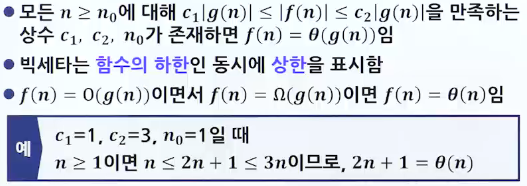

# 자료구조의 개요

## 알고리즘

### 일상생활에서의 자료구조 이해

- 일상생활에서의 사물의 조직화(책 쌓기, 대기 줄, 네비게이션)
- 일상생활과 자료구조의 비교

| 일상생활에서의 예         | 해당하는 자료구조 |
| ------------------------- | ----------------- |
| 그릇을 쌓아서 보관하는 것 | 스택              |
| 마트 계산대의 줄          | 큐                |
| 버킷 리스트               | 리스트            |
| 영어 사전                 | 사전(정렬)        |
| 지도                      | 그래프            |
| 컴퓨터의 디렉토리 구조    | 트리              |

### 자료구조와 알고리즘

- 배열과 단계
- 
- 알고리즘의 조건
  - 입력 : 0개 이상의 입력이 존재하여야 함
  - 출력 : 1개 이상의 출력이 존재하여야 함(0개 이상)
  - 명백성 : 각 명령어의 의미는 모호하지 않고 명확해야 함
  - 유한성 : 한정된 수의 단계 후에는 반드시 종료되어야 함
  - 유효성 : 각 명령어들은 실행 가능한 연산이어야 함
- 알고리즘의 개념
  - 알고리즘(Algorithm) : 컴퓨터로 문제를 풀기 위한 단계적인 절차
- 알고리즘의 기술 방법
  - 영어, 한국어와 같은 자연어
  - 흐름도(Flow Chart)
  - 의사 코드(Pseudo-code)
  - 프로그래밍 언어

### 알고리즘의 다양한 표현

1. 자연어
   - 인간이 읽기 쉬운 반면, 자연어의 단어들을 정확하게 정의하지 않으면 의미 전달이 모호해질 우려가 있음(명백성)
   - 
2. 흐름도
   - 직관적이고 이해하기 쉬운 알고리즘 기술 방법이지만, 복잡한 알고리즘의 경우 상당히 복잡해짐(그림의 한계)
   - 
3. 유사코드
   - 알고리즘 기술에 가장 많이 사용
   - 프로그램을 구현할 때의 여러 가지 문제들을 감출 수 있음
     - 알고리즘의 핵심적인 내용에만 집중 가능
   - 
4. C
   - 알고리즘의 가장 정확한 기술 가능
   - 실제 구현 시, 많은 구체적인 사항들이 알고리즘의 핵심적인 내용에 대한 이해를 방해할 수 있음
   - ```c
       #define MAX_ELEMENTS 100 // 구체적인 사항
       int  score[MAX_ELEMENTS]; // 구체적인 사항
       int find_max_score(int n)
       {
           int i, tmp;
           tmp=score[0];
           for(i=1;i<n;i++){
               if( score[i] > tmp) {
                   tmp = score[i];
               }
           }
           return tmp;
       }
     ```

## 추상 데이터 타입

### 자료형(Data type)

- 자료형의 개념
  - 데이터의 종류임
  - 데이터의 집합과 연산의 집합을 말함
  - 정수, 실수, 문자열 등이 기초적인 자료형임
- 자료형의 구분
  - 
- int 자료형
  - 데이터 : {-INT_MIN, ... , -2, -1, 0, 1, 2, ... , INT_MAX}
  - 연산 : +, -, \*, /, %, ==, >, <

### 추상 데이터 타입(ADT)

- 추상 데이터 타입의 개념
  - ADT는 Abstract Data Type의 약자임
  - 데이터 타입을 추상적(수학적)으로 정의한 것
  - 데이터, 연산이 무엇인가(What)는 정의되지만, 어떻게(How) 컴퓨터 상에서 구현할 것인지는 정의되지 않음
- 추상 데이터 타입의 유래(객체 지향)
  - 
  - 추상화란: 사용자에게 중요 정보 강조 및 중요하지 않은 구현 세부 사항 제거하는 것
  - 
- 추상 데이터 타입의 정의
  - 
  - 객체 : 추상 데이터 타입에 속하는 객체가 정의
  - 연산 : 객체들 간의 연산이 정의되는데, 추상 데이터 타입과 외부를 연결하는 인터페이스의 역할을 함
  - 추상 데이터 타입의 예
    - 자연수
      - 
      - 
  - 추상 데이터 타입과 TV
    - TV의 인터페이스가 제공하는 특정한 작업만을 할 수 있음
    - 사용자는 TV의 내부를 볼 수 없음
    - TV의 내부에서 무엇이 일어나고 있는지를 몰라도 이용할 수 있음
    - 사용자는 ADT가 제공하는 연산만을 사용할 수 있음
    - 사용자는 ADT 내부의 데이터를 접근할 수 없음
    - 사용자는 ADT가 어떻게 구현되는지 모르더라도 ADT를 사용할 수 있음

## 복잡도 분석

### 알고리즘의 성능 분석

- 수행 시간 측정
  - 2개의 알고리즘의 실제 수행 시간을 측정하는 것
  - 실제로 구현하는 것이 필요
  - 동일한 하드웨어를 사용해야 함
- 알고리즘의 성능 분석
  - 직접 구현하지 않고서도 수행 시간을 분석하는 것
  - 알고리즘이 수행하는 연산의 횟수를 측정하여 비교
  - 일반적으로 연산의 횟수는 n의 함수

### 프로그램의 효율성이 중요한 이유

- 

### 수행 시간 측정

- 방법 : 알고리즘을 프로그래밍 언어로 작성하여 실제 컴퓨터상에서 실행시킨 후 그 수행시간을 측정
- 

### 시간복잡도

> 알고리즘을 이루고 있는 연산들이 몇 번이나 수행되는지를 숫자로 표시한 것

```c

largest<-scores[0] // 대입
for i <-1 to M-1 do // 대입
    if scores[i] > largest // 비교
        then largest <-scores[i] // 대입
return largest

```

### 복잡도 분석의 종류와 고려사항

- 복잡도 분석의 종류
  - 시간 복잡도(Time complexity)
  - 공간 복잡도(Space complexity)
- 입력 개수 고려
  - 
  - 

### 그래프

- 알고리즘의 비교(연산의 구현 비용)

|              | 알고리즘A | 알고리즘B | 알고리즘C |
| :----------: | :-------: | :-------: | :-------: |
|  대입 연산   |     1     |     n     |   n\*n    |
|  덧셈 연산   |           |     n     |   n\*n    |
|  곱셈 연산   |     1     |           |           |
| 나눗셈 연산  |           |           |           |
| 전체 연산 수 |     2     |    2n     |    2n²    |

<br>
<br>

- 그래프로 표현하는 연산 수


### 표기법

- 빅오 표기법
  - 자료 개수가 많은 경우에는 차수가 가장 큰 항이 가장 영향을 크게 미치고 다른 항들은 상대적으로 무시될 수 있음(단, n은 입력의 개수라고 가정)
  - 
  - 연산의 횟수를 대략적(점근적)으로 표기한 것
  - 
  - 
  - 
  - 
  - 
  - 
  - 
- 빅오메가 표기법
  - 
- 빅세타 표기법
  - 
- 

### 알고리즘의 수행 시간의 최선/평균/최악

- 알고리즘의 수행시간은 입력 자료 집합에 따라 다를 수 있음

  - 최선의 경우(Best case) : 수행 시간이 가장 빠른 경우
    - 의미가 없는 경우가 많음
  - 평균의 경우(Average case) : 수행시간이 평균적인 경우
    - 계산하기 상당히 어려움
  - 최악의 경우(Worst case) : 수행 시간이 가장 늦은 경우
    - 가장 널리 사용됨(계산하기 쉬워 응용에 중요한 의미를 가질 수 있음 - ex. 비행기 관제업무, 게임, 로보틱스)
  - 비교 그래프
    - 

- 수행 시간 비교
  - 순차 탐색 시 최선
    - 찾고자 하는 숫자가 맨 앞에 있는 경우(O(1))
      - 
  - 순차탐색 시 최악
    - 찾고자 하는 숫자가 맨 뒤에 있는 경우(O(n))
      - 
  - 순차탐색 시 평균
    - 각 요소들이 균일하게 탐색된다고 가정했을 때
      - 
