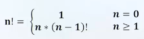
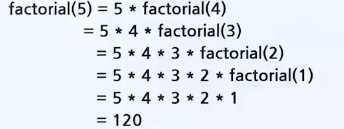
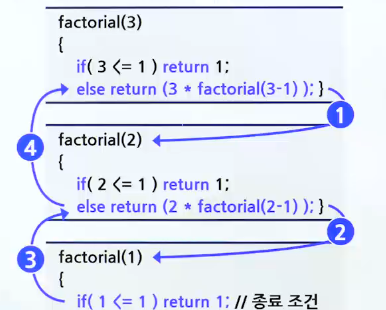
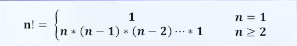
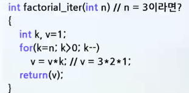
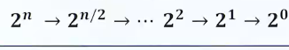
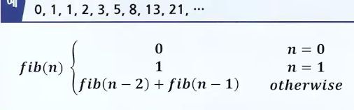
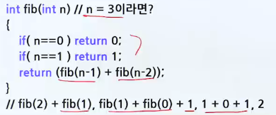
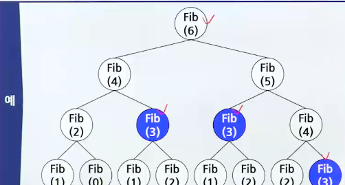
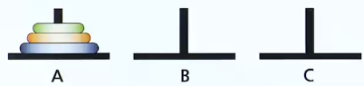

# 순환

## 팩토리얼

### 순환(Recursion)

- 순환 기법
  - 알고리즘, 함수가 수행 중에 자기 자신을 다시 호출하여 문제를 해결하는 기법(재귀 호출)
  - 정의 자체가 순환적으로 되어 있는 경우 적합함

### 팩토리얼 프로그래밍

- 정의
  - 
- 예시

  - ```c
      int factorial(int n)
      {
          if(n <= 1) return(1);
          else return (n*factorial_n_1(n-1)); // 안 좋은 예
      }

      int factorial(int n)
      {
          if(n <= 1) return(1);
          else return (n * factorial(n-1)); // 좋은 예
      }
    ```

  ```

  ```

### 팩토리얼 함수의 호출 순서 (LIFO)

- 
- 

> 순환 호출을 멈추는 부분이 없다면, 시스템 오류 발생 시까지 무한정 호출하게 된다.

- **대부분의 순환은 반복으로 바꾸어 작성할 수 있다.**

### 팩토리얼의 반복적 구현

- 예시
  - 
  - 

### 거듭제곱 값 프로그래밍

- 순환적인 방법이 더 효율적인 예제 : 숫자 x의 n제곱 값을 구하는 문제 : xⁿ
- 반복적인 방법
  - ```c
      double slow_power(double x, int n) // x = 3, n = 3이라면?
      {
          int i;
          double result = 1.0;
          for(i=0;i<n;i++)
              result = result * x; // result = 3*3*3
          return(result);
      }
    ```
- 순환적인 방법(순환적인 알고리즘)
  - ```c
      double power (double x, int n) // x = 3, n = 3이라면?
      {
          if n==0
              then return 1;
          else if n%2==0 // n이 짝수라면?
               return power(x², n/2)
          else return x*power (x², (n-1)/2);
      }
      // x*power(x², 1), x*x²*power(x⁴, 0), x*x²*1
    ```

<br>
<br>

#### 거듭제곱 값 프로그래밍 분석

- 순환적인 방법의 시간 복잡도
- 만약 n이 2의 제곱이라고 가정하면 문제의 크기가 줄어듦
- 

<br>

- 반복적인 방법과 순환적인 방법의 비교

|                | 반복적인 함수<br>(Slow power) | 순환적인 함수<br>(power) |
| :------------: | :---------------------------: | :----------------------: |
|  시간 복잡도   |             O(n)              |         O(log n)         |
| 실제 수행 속도 |            7.17초             |          0.47초          |

- 순환 호출 사용 시 비효율적인 예 : 피보나치 수열
  - 
  - 
- 같은 항이 중복해서 계산됨
  - ex. fib(6)을 호출하게 되면 fib(3)이 3번 중복 계산됨
  - 같은 항이 중복해서 계산되는 현상은 n이 커질수록 심해짐
  - 

## 하노이 탑



- 한 번에 하나의 원판만 이동할 수 있음
- 맨 위에 있는 원판만 이동할 수 있음
- 크기가 작은 원판 위에 큰 원판이 쌓일 수 없음
- 중간 막대를 임시적으로 이용할 수 있으나 앞 조건들을 지켜야 함

```c
// 막대 from에 쌓여있는 n개의 원판을 막대 tmp를 사용하여 막대 to로 옮긴다.

void hanoi_tower(int n, char fron, char tmp, char to)
{
    if (n==1){
        from에서 to로 원판을 옮긴다. // 종료 조건
    }
    else {
        hanoi_tower(n-1, from, to, tmp); // n-1, A -> B
        from에 있는 한 개의 원판을 to로 옮긴다. // n, A -> C
        hanoi_tower(n-1, tmp, from, to); //  n-1, B -> C
    }
}

// ∴

#include <stdio.h>
void hanoi_tower(int n, char from, char tmp, char to)
{
    if(n==1) printf("원판 1을 %c에서 %c으로 옮긴다.\n",from, to);
    else {
        hanoi_tower(n-1, tmp, from, to); // n-1, B -> C
        printf("원판 %d을 %c에서 %c으로 옮긴다.\n",n, from, to);
        hanoi_tower(n-1, tmp, from, to); // n-1, B -> C
    }
}

int main(void)
{
    hanoi_twoer(4, "A","B","C");
    return0 ;
}

```
