# 배열

## 배열

> 같은 형의 변수를 여러 개 만드는 경우에 사용(index 주의)

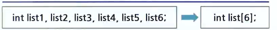

- 배열의 선언
  - int grade[10];
  - 자료형(int): 배열 원소들이 int 형이라는 것을 의미(4byte)
  - 배열 이름(grade) : 배열을 사용할 때 사용하는 이름이 grade(배열의 시작주소)
  - 배열 크기(10) : 배열 원소의 개수가 10개(40byte)
  - 인덱스(첨자)는 항상 0부터 시작함(비용, 포인터)
  - ex. `c int score[60]; float cost[12]; char name[50] `
- 잘못된 인덱스 문제
  - 인덱스가 배열의 크기를 벗어나게 되면 프로그램에 치명적인 오류를 발생시킴
  - C에서는 프로그래머가 인덱스가 범위를 벗어나지 않았는지를 확인하고 책임을 져야 함
  - int grade[5]; ...; grade[5] = 60; // 치명적인 오류
  - 존재하지 않는 곳에 데이터를 저장하면 안됨
  - access violation!

### 배열 ADT

- ADT Array
  - 객체
    - <인덱스, 값> 쌍의 집합
  - 연산
    - create(size) ::= size 개의 요소를 저장할 수 있는 배열 생성
    - get(A, i) ::= 배열 A의 i번째 요소 반환
    - set(A, i, v) ::= 배열 A의 i번째 위치에 값 v 저장
  - 1차원 배열
    - 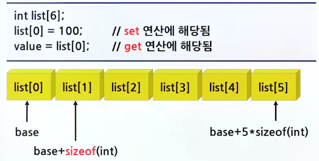
  - 2차원 배열
    - int list[3][5]; // 행우선, 열우선
    - 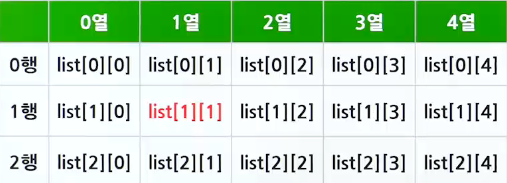
    - 2차원 배열의 선언
      - itn A[row][col];
      - 시작주소 = A[0][0];
      - 요소크기 = int = 4bytes;
    - 행 우선 순위
      - A[i][j]의 주소 = 시작주소 + (i\*col + j)\*요소크기;
    - 열 우선 순위
      - A[i][j]의 주소 = 시작주소 + (j\*col + i)\*요소크기;

## 구조체

> 구조체(Structure): 타입이 다른 데이터를 하나로 묶는 방법(클래스)

> 배열(Array) : 타입이 같은 데이터들을 하나로 묶는 방법

- 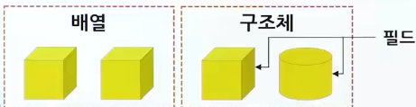

### 구조체의 필요성

- 학생에 대한 데이터 등 한 명의 학생에 대한 데이터가 여러 종류의 타입을 가질 때와 같이 다양한 변수들을 하나로 묶을 수 있다.(매개변수)

### 구조체의 사용 예

- 구조체의 선언과 구조체 변수의 생성
- ```c

    struct studentTag {
        char name[10]; // 문자배열로 된 이름
        int age; // 나이를 나타내는 정수 값
        double gpa; // 평균평점을 나타내는 실수 값
    }

    struct studentTag s1;

    strcpy(s.name, "kim"); // buffer overflow
    s.age = 20; // .을 이용한 접근
    s.gpa = 4.3;

  ```

- 구조체 선언이 변수 선언은 아님
- 구조체를 정의하는 것은 틀을 정의하는 것과 같음
- 구조체를 실제로 만들기 위해서는 구조체 변수를 선언해야 함
- 참고 : 같은 구조체 변수끼리 대입은 가능하지만 비교는 불가
- 재정의 (typedef)

  - ```c
      typedef studentTag {
          char name[10]; // 문자열로 된 이름
          int age; // 나이를 나타내는 정수 값
          double gpa; // 평균평점을 나타내는 실수 값
      } student;

      student s;
      student s = { "kim", 20, 4.3 } // 초기화
    ```

- typedef를 사용하면 구조체 생성을 더 단순하게 할 수 있다.

  - 예제

    - ```c

        #include <stdio.h> // printf, scanf 함수

        typedef struct studentTag {
            char name[10]; 문자배열로 된 이름
            int age; // 나이를 나타내는 정수 값
            double gpa; // 평균평점을 나타내는 실수 값
        } student;

        int main(void)
        {
            student a = { "kim", 20, 4.3 };
            student b = { "park", 21, 4.2};
            return 0;
        }
      ```

## 배열의 응용

### 다항식

- 다항식의 일반적인 형태
  - 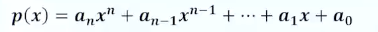
- 프로그램에서 다항식을 처리하려면?
  - 다항식을 위한 자료구조가 필요함 : 배열, 연결 리스트

### 다항식 표현 방법

- 배열을 사용한 2가지 방법

  - 다항식의 모든 항을 배열에 저장하는 방법

    - 모든 차수에 대한 계수값을 배열로 저장
    - 하나의 다항식을 하나의 배열로 표현
    - 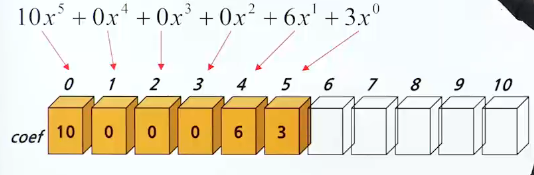
    - ```c

        #define MAX_DEGREE 101 // 다항식의 최대차수 + 1
        typeddef struct {
            int degree;
            float coef[MAX_DEGREE];
        } polynomial;
        polynomial a = { 5, {10, 0, 0, 0, 6, 3} }

      ```

    - 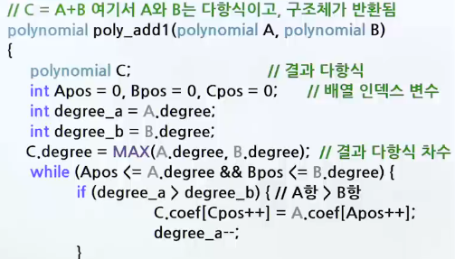
    - 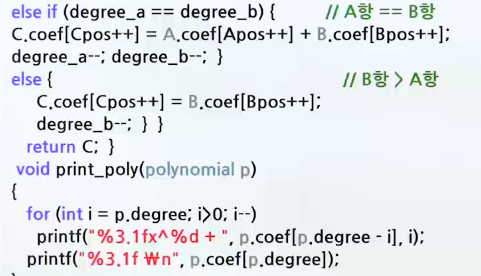
    - 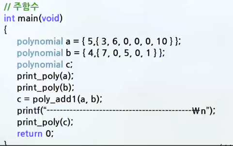
    - 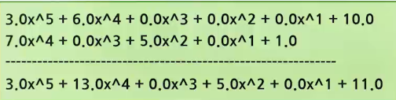

  - 다항식의 0이 아닌 항만을 배열에 저장하는 방법

    - (계수, 차수) 형식으로 배열에 저장
      - ex.
        - 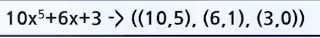
    - ```c
        #define MAX_TERMS 101
        struct {
            float coef;
            int expon;
        } terms[MAX_TERMS];
        int avail;
      ```
    - 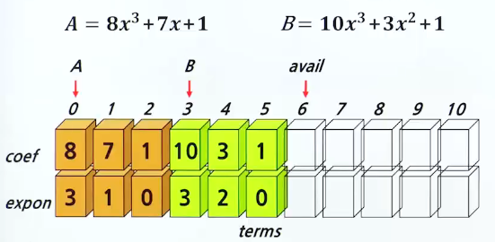
    - 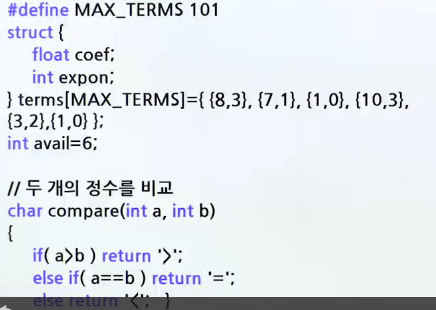
    - 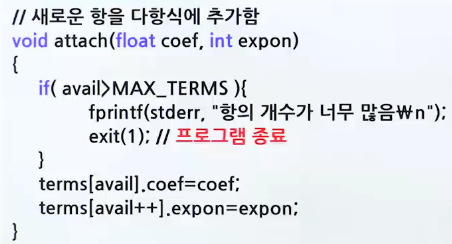
    - 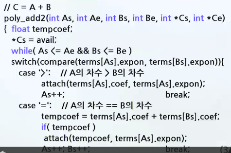
    - 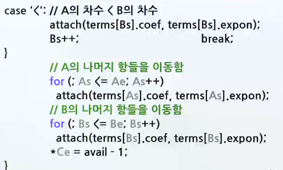
    - 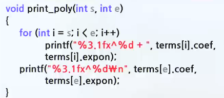
    - 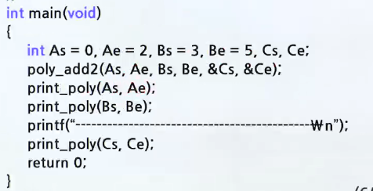
    - 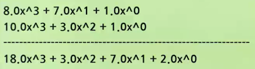
