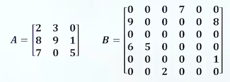
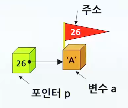
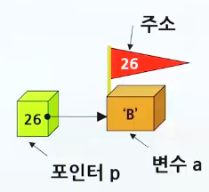
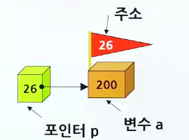
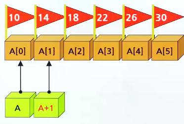

# 집합

## 희소행렬

> 대부분의 항들이 '0'인 행렬



### 희소행렬 표현방법

- 배열을 이용하여 행렬(Matrix)을 표현하는 2가지 방법

  - 2차원 배열을 이용하여 배열의 **전체 요소**를 저장하는 방법

    - 장점 : 행렬의 연산들을 간단하게 구현할 수 있음
    - 단점 : 대부분의 항들이 0인 희소 행렬의 경우 많은 메모리 공간 낭비
    - ```c
        #include <stdio.h>
        #define ROWS 3
        #define COLS 3

        // 행렬 전치 함수
        void matrix_transpose(int A[ROWS][COLS], int B[ROWS][COLS])
        {
            for(int r = 0; r<ROWS; r++)
                for(int c = 0; c<COLS; C++)
                    B[c][r] = A[r][c]; // A에서 B로 전치
        }

        void matrix_print(int A[ROWS][COLS])
        {
            printf("=================\n");
            for(int r = 0; r<ROWS; r++){
                for(int c = 0;c<COLS; C++)
                    printf("%d", A[r][c]);
                printf("\n");
            }
            printf("========================\n");
        }

        int main(void)
        {
            int array1[ROWS][COLS] = {
                {2,3,0},
                {8,9,1},
                {7,0,5}
            }
            int array2[ROWS][COLS];
            matrix_transpose(array1, array2); // array1 -> array2
            matrix_print(array1);
            matrix_print(array2);
            return 0;

        }

      ```

  - **'0'이 아닌 요소들**만 저장하는 방법

    - 장점 : 희소 행렬의 경우, 메모리 공간의 절약
    - 단점 : 각종 행렬 연산들의 구현이 복잡해짐
    - ```c
        typedef struct {
            int row;
            int col;
            int value;
        } element;

        typedef struct SparseMatrix {
            element data[MAX_TERMS];
            int rows; // 행의 개수
            int cols; // 열의 개수
            int terms; // 항의 개수
        } SparseMatrix;

        SparseMatrix matrix_transpose2(SparseMatrix a)
        { // 구조체 매개변수
            SparseMatrix b;
            int bindex; // 행렬 b에서 현재 저장 위치
            b.rows = a.rows;
            b.cols = a.cols;
            b.terms = a.terms;

            if(a.terms > 0) {
                bindex = 0;
                for(int c = 0; c<a.cols; c++) { // a.rows
                    for (int i = 0; i<a.terms; i++) {
                        if (a.data[i].col == c) { // a.data[i].row
                            b.data[bindex].row = a.data[i].col;
                            b.data[bindex].col = a.data[i].row;
                            b.data[bindex].value = a.data[i].value;
                            bindex++;
                        }
                    }
                }
                return b;
            }
        }

        void matrix_print(SparseMatrix a)
        {
            printf("==================\n");
            for(int i = 0;i<a.terms; i++){
                printf("(%d, %d, %d) \n", a.data[i].row, a.data[i].col, a.data[i].value);
            }
            printf("================\n")
        }


        int main(void)
        {
            SparseMatrix m = {
                {
                    {0,3,7} , {1,0,9} , {1,5,8} , {3,0,6} , {3,1,5} , {4,5,1} , {5,2,2}
                },
                6,
                6,
                7
            };

            SparseMatrix result;
            result = matrix_transpose2(m); // 구조체 대입
            matrix_print(result);
            return 0;
        }

      ```

## 포인터

> 다른 변수의 주소를 가지고 있는 변수

```c
// pointer ex
char a = "A";
char *p;
p = &a;
```



- 포인터가 가리키는 내용의 변경

```c
*p = "B";
```



### 포인터와 관련된 연산자

- & 연산자 : 변수의 주소 추출(&a)
- \*연산자 : 포인터가 가리키는 곳의 내용 추출(\*p)



### 다양한 포인터(포인터 자체의 크기 = 4byte)

- int \*p;
  - p는 int형 변수를 가리키는 포인터(+4byte)
- float \*pf;
  - pf는 double형 변수를 가리키는 포인터(+4byte)
- char \*pc;
  - pc는 char형 변수를 가리키는 포인터(+1)

### 함수의 매개변수로 포인터 사용하기

> 함수 안에서 매개변수로 전달된 포인터를 이용하여 외부 변수의 값 변경 가능 (call-by-value or reference)

```c

#include <stdio.h>
viod swap(int *px, int *py)
{
    int tmp;
    tmp = *px;
    *px = *py;
    *py = tmp;
}

int main(void)
{
    int a = 1, b = 2;
    printf("swap을 호출하기 전: a=%d, b=%d\n",a,b);
    swap(&a, &b); // call-by-reference
    printf("swap을 호출한 다음: a=%d, b=%d\n",a,b);
        return 0
}


```

### 배열과 포인터

- 배열의 이름 : 사실상의 포인터와 같은 역할

  - 
  - 예제

    ```c
        #include <stdio.h>
        #define SIZE 6
        void get_integers(int list[])
        {
            printf("6개의 정수를 입력하시오: ");
            for(int i = 0; i<SIZE; ++i){
                // scanf("%d", &list[i]); // call-by-reference

                // 값 자동 할당
                printf("%d",i);
                int *pa;
                pa  = &list[i];
                *pa = i;
            }
        }

        int cal_sum(int list[])
        {
            int sum = 0;
            for(int i = 0; i<SIZE; ++i){
                sum += *(list + i);
            }
            return sum;
        }

        int main(void)
        {
            int list[SIZE];
            get_integers(list); // call-by-reference
            printf("합 = %d\n", cal_sum(list));
            return 0;
        }
    ```

## 동적 메모리 할당

> 동적 메모리 할당 : 프로그램의 실행 도중에 메모리를 할당 받는 것

- 필요한 만큼만 할당을 받고 또 필요한 때에 사용하고 반납
- 메모리를 매우 효율적으로 사용 가능
- 
- 전형적인 동적 메모리 할당 코드(realloc)

  - ```c
      main()
      {
          int *pi;
          pi = (int *)malloc(sizeof(int)); // 동적 메모리 할당
          ...
          ...  // 동적 메모리 사용

          ...
          free(pi); // 동적 메모리 반납
      }

    ```

  - ```c
      #include <stdio.h>
      #include <stdlib.h>
      #include <malloc.h>
      #define SIZE 10
      int main(void)
      {
          int *p;
          p = (int *)malloc(SIZE * sizeof(int)); // type-casting

          if(p == NULL){
              printf("메모리가 부족해서 할당할 수 없습니다.\n");
              exit(1);
          }
          for(int i = 0; i<SIZE; i++)
              p[i] = i;
          for(int i = 0; i<SIZE; i++)
              printf("%d", p[i]);
          free(p); // free를 안 하면 => Memory leakage
          return 0;
      }

      //// 0 1 2 3 4 5 6 7 8 9

    ```

### 구조체와 포인터

> (\*ps).i 보다 ps->i

```c
#include<stdio.h>
#include<stdlib.h> // malloc함수
#include<string.h> // strcpy 함수

typedef struct studentTag {
    char name[10]; // 문자배열로 된 이름
    int age; // 나이를 나타내는 정수 값
    double gpa; // 평균평점을 나타내는 실수 값
} student;

int main(void)
{
    student *p;
    p = (student *)malloc(sizeof(student));
    if(p == NULL) {
        printf(stderr, "메모리가 부족해서 할당할 수 없습니다.\n");
        exit(1);
    }
}

strcpy(p->name, "Park"); // buffer overflow
p->age = 20; // (*p).age = 20;
free(s);
return 0;

```
