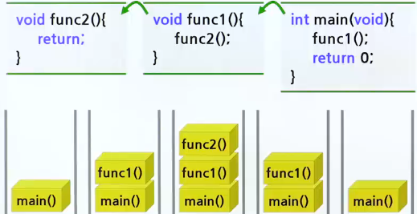
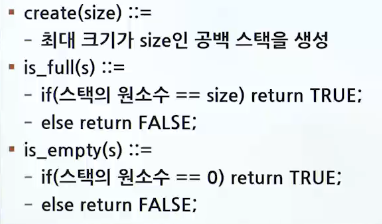
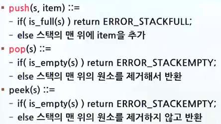
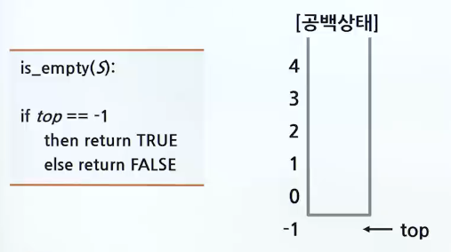
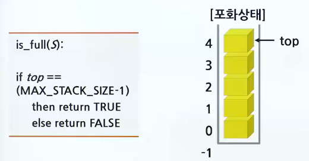
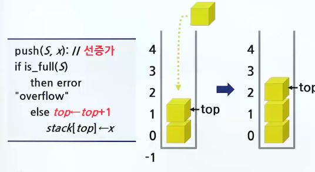
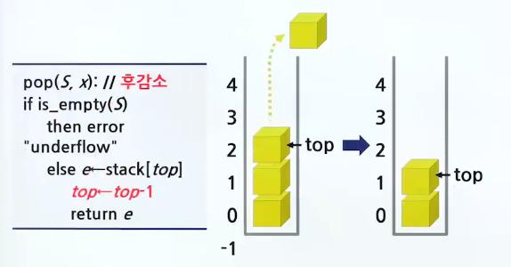

# 스택의 구현

## 스택 연산

### 스택

> 스택 : 쌓아놓은 더미(LIFO vs FIFO)

- 후입선출(LIFO, Last-in Fist-Out)
  - 가장 취근에 들어온 데이터가 가장 먼저 나감

### 시스템 스택을 이용한 함수 호출 예제(복귀 주소)

- 

### 보안 이슈

- 컴퓨터의 주기억장치에도 스택 영역이 존재
- 스택 영역의 주소는 위에서 아래로 감소하면서 증가
- strcpy와 같은 함수를 사용하면 버퍼 오버플로우 공격이 가능
- 버퍼 오버플로우 공격이란 함수 호출의 복귀 주소를 변경하여 공격자가 원하는 코드를 실행하는 공격 기법
- 이를 해결하기 위해서는 strncpy와 같은 함수를 사용해야 하고, 이를 시큐어 코딩(Secure coding)이라고 함

### 스택 추상 데이터 타입(ADT)

- 객체 : 0개 이상의 원소를 가지는 유한 선형 리스트
- 연산
  - 
  - 

### 스택의 연산

- push() : 스택에 데이터 추가
- pop() : 스택에서 데이터 삭제
- is_empty(s) : 스택의 공백상태 여부 검사
- is_full(s) : 스택의 포화상태 여부 검사
- create() : 스택 생성
- peek(s) : 요소를 삭제하지 않고 보기만 하는 연산
- pop 연산은 요소를 스택에서 완전히 삭제하면서 가져옴

## 배열 스택

### 배열을 이용한 스택의 구현

- 1차원 배열 stack[]
  - 스택에서 가장 최근에 입력되었던 자료를 가리키는 top 변수(stack pointer)
  - 가장 먼저 들어온 요소는 stack[0]에 저장
  - 가장 최근에 들어온 요소는 stack[top]에 저장
  - 스택이 공백상태이면 top은 -1
    - 단, 시험 문제의 설정을 상이할 수 있기 때문에 전제조건을 잘 파악하는 것이 중요
- is_empty, is_full 연산의 구현
  - 
  - 
- push, pop 연산
  - 
  - 

### 전역 변수로 구현하는 방법

- 방법 1

```c
#include <stdio.h> // printf, fprintf 함수
#include <stdio.h> // exit 함수

#define MAX_STACK_SIZE 100 // 스택의 최대 크기
typedef int element; // 데이터의 자료형
element stack[MAX_STACK_SIZE]; // 1차원 배열
int top = -1; // 방법 -1

// 공백 상태 검출 함수
int is_empty() {
    return (top == -1);
}

// 포화 상태 검출 함수
int is_full() {
    return (top == (MAX_STACK_SIZE - 1 ));
}

// 삽입 함수
void push(element item) {
    if(is_full()) {
        fprintf(stderr, "스택 포화 에러\n");
        return;
    } else stack[++top] = item; // 선증가
}

// 삭제 함수
element pop() {
    if(is_empty()) {
        fprintf(stderr, "스택 공백 에러\n");
        exit(1);
    } else return stack[top--]; // 후감소
}

int main(void){
    push(1);
    push(2);
    push(3);
    printf("%d\n", pop()); // LIFO
    printf("%d\n", pop());
    printf("%d\n", pop());
    return 0;

}

/////// return
// 3
// 2
// 1

```

- 방법 2

```c

#include <stdio.h> // printf, fprintf 함수
#include <stdio.h> // exit 함수

#define MAX_STACK_SIZE 100 // 스택의 최대 크기
typedef int element; // 데이터의 자료형
element stack[MAX_STACK_SIZE]; // 1차원 배열
int top = 0; // 방법 -2

// 공백 상태 검출 함수
int is_empty() {
    return (top == 0);
}

// 포화 상태 검출 함수
int is_full() {
    return (top == MAX_STACK_SIZE);
}

// 삽입 함수
void push(element item) {
    if(is_full()) {
        fprintf(stderr, "스택 포화 에러\n");
        return;
    } else stack[top++] = item; // 후증가
}

// 삭제 함수
element pop() {
    if(is_empty()) {
        fprintf(stderr, "스택 공백 에러\n");
        exit(1);
    } else return stack[--top]; // 선감소
}

int main(void){
    push(1);
    push(2);
    push(3);
    printf("%d\n", pop()); // LIFO
    printf("%d\n", pop());
    printf("%d\n", pop());
    return 0;

}

/////// return
// 3
// 2
// 1

```

### 구조체 배열 사용

```c

#define MAX_STACK_SIZE 100 // preprocessor
typedef int element;
typedef struct {
    element data[MAX_STACK_SIZE]; // 배열의 요소는 element 타입으로 선언
    int top;
} StackType;

// 스택 초기화 함수
void init_stack(StackType *s) { // 관련 데이터를 구조체로 묶어 함수의 파라미터로 전달
    s->top = -1 // s-> top = 0;
}

// 공백 상태 검출 함수
int is_empty(StackType *s) {
    return (s->top == -1);
}

// 포화 상태 검출  함수
int is_full(StackType *s) {
    return (s->top == (MAX_STACK_SIZE -1))
}

// 삽입 함수
void push(StackType *s, element item) {
    if(is_full(s)) {
        fprintf(stderr,"스택 포화 에러\n");
        return;
    } else s->data[++(s->top)] = item; // 선증가
}

// 삭제 함수
element pop(StackType *s) {
    if(is_empty(s)) {
        fprintf(stderr, "스택 공백 에러\n");
        exit(1);
    } else return s->data[(s->top)--]; // 후감소
}

int main(void) {
    StackType s;
    init_stack(&s); // 초기화 함수
    push(&s, 1);
    push(&s, 2);
    push(&s, 3);
    printf("%d\n", pop(&s)); // LIFO
    printf("%d\n", pop(&s));
    printf("%d\n", pop(&s));
}

/////// return
// 3
// 2
// 1

```

## 동적 스택

- malloc()
  - malloc()을 호출하여서 실행 시간에 메모리를 할당 받아서 스택을 생성함
- realloc()
  - realloc()을 호출하여 스택 배열을 동적으로 확장함
- 예제 프로그램

  - ```c
      typedef int element;
      typedef struct {
          element *data; // data는 포인터로 정의됨
          int capacity; // 현재 크기
          int top;
      } StackType;

      // ...

      int main(void) {
          StackType *s;
          s = (StackType *)malloc(sizeof(StackType));
          init_stack(s); // s->top = -1; s->capacity = 1;
          push(s,1); // 포화상태이면 realloc
          push(s,2);
          push(s,3);
          print("%d\n", pop(s)); // LIFO
          print("%d\n", pop(s));
          print("%d\n", pop(s));
          free(s); // memory leakage
      }

      void push(StackType *s, element item) {
          if(is_full(s)) { // 포화 상태
              s->capacity *= 2; // 2배 확장
              s->data = (element *)realloc(s->data, s->capacity * sizeof(element));
          }
          s->data[++(s->top)] = item; // 선증가
      }

    ```
