# 스택의 응용

## 괄호 검사

- 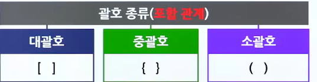
- 괄호의 조건
  - 왼쪽 괄호의 개수와 오른쪽 괄호의 개수가 같아야 함
  - 같은 괄호에서 왼쪽 괄호는 오른쪽 괄호보다 먼저 나와야 함
  - 괄호 사이에는 포함 관계만 존재함(대괄호>중괄호>소괄호)
  - 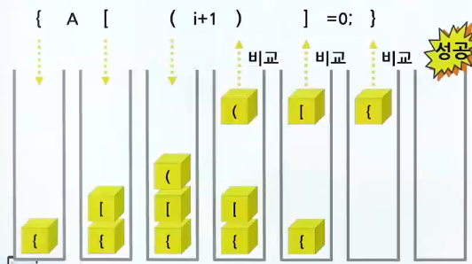
  - 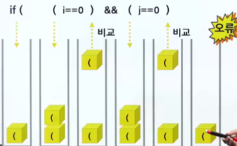

### 알고리즘

- 알고리즘의 개요
  - 문자열에 있는 괄호를 차례대로 조사하면서 왼쪽 괄호를 만나면 스택에 삽입하고, 오른쪽 괄호를 만나면 스택에서 top 괄호를 삭제한 후 오른쪽 괄호와 짝이 맞는지를 검사함
  - 스택이 비어 있으면 조건 1 또는 조건 2 등을 위배하게 되고 괄호의 짝이 맞지 않으면 조건 3 등에 위배됨
  - 마지막 괄호까지를 조사한 후에도 스택에 괄호가 남아 있으면 조건 1에 위배되므로 0(거짓)을 반환하고, 그렇지 않으면 1(참)을 반환함
- 수도 코드
  - 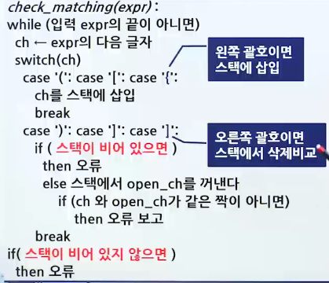
- 프로그램 예시

  - ```c
      int check_matching(const char * in) { // 포인터 = 배열
          StackType s;
          char ch, open-ch;
          int i, n = strlen(in); // n = 문자열의 길이
          init_stack(&s); // 스택의 초기화

          for (i=0;i<n;i++){
              ch = in[i]; // ch = 다음 문자
              switch (ch) {
                  case "(": case "[": case"{":
                      push(&s, ch);
                      break;
                  case ")": case "]": case"}":
                      if(is_empty(&s)) return 0; // 스택이 비었으면 오류
                      else {
                          open_ch = pop(&s);
                          if((open_ch == "(" && ch != ")")
                              || (open_ch == "[" && ch != "]")
                              || (open_ch == "{" && ch != "}")
                          ) {
                              retun 0; // 짝이 맞지 않으면 오류
                          }
                          break;
                      }
              }
          }
          if(!is_empty(&s)) return 0; // 스택에 남아있으면 오류
              return 1;
      }

      int main(void) {
        char *p = "{ A[(i+1)]=0; }";
        if(check_matching(p) == 1)
            printf("%s 괄호검사성공\n", n);
        else
            printf("%s 괄호검사실패\n", n);
        return 0;
      }

      ////////// result
      // { A[(i+1)]=0; } 괄호검사성공
    ```

## 수식 계산

### 수식의 표기방법

- 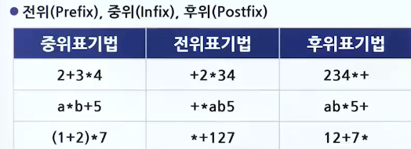

### 컴퓨터에서의 수식 계산 순서

- 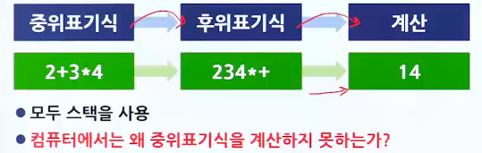

### 후위표기식의 계산법

- 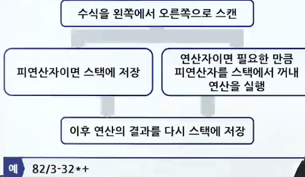
- 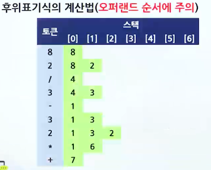
- 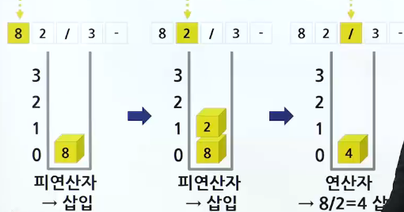
- 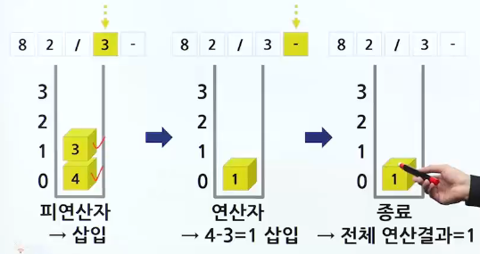

### 후위표기식 계산 알고리즘

- 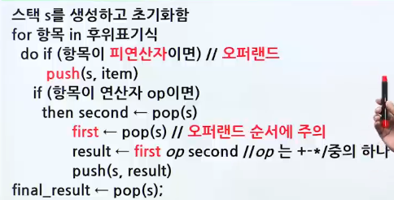

### 후위표기식 계산 프로그램

```c

#include <stdio.h> // printf 함수
#include <stdlib.h> // strlen 함수
#define MAX_STACK_SIZE 100

// 구조체 배열 사용 스택 코드 추가
typedef char element; // 교체
// ...
// 구조체 배열 사용 스택 코드 추가 끝

// 후위표기 수식 계산 함수
int eval(char exp[]) {
    int op1, op2, value, i = 0;
    int len = strlen(exp); // 수식의 길이
    char ch;
    StackType s;

    init_stack(&s);
    for (i = 0; i<len;i++){
        ch = exp[i];

        if(ch != "+" && ch!= "-" && ch != "*" && ch != "/") {
            value = ch - "0"; // 입력이 피연산자이면
            push(&s, value); // 문자를 숫자로 바꿈
        } else { // 연산자이면서 피연산자를 스택에서 제거
            op2 = pop(&s);
            op1 = pop(&s); // 순서 주의
            switch (ch) { // 연산을 수행하고 스택에 저장
                case "+": push(&s, op1 + op2); break;
                case "-": push(&s, op1 - op2); break;
                case "*": push(&s, op1 * op2); break;
                case "/": push(&s, op1 / op2); break;
            }
            return pop(&s)
        }
    }
}

int main(void) {
    int result;
    printf("후위표기식은 82/3-32*+\n");
    result = eval("82/3-32*+");
    printf("결과값은 %d\n", result);
    return 0
}


//// result
// 후위표기식은 82/3-32*+
// 결과값은 7

```

### 중위표기식 -> 후위표기식

- 중위표기와 후위표기
  - 중위표기법과 후위표기법의 공통점
    - 피연산자의 순서는 동일
  - 연산자들의 순서만 다름(우선순위 순서)
    - 연산자만 스택에 저장했다가 출력하면 됨(괄호 주의)
  - 2+3\*4 -> 234\*+
  - 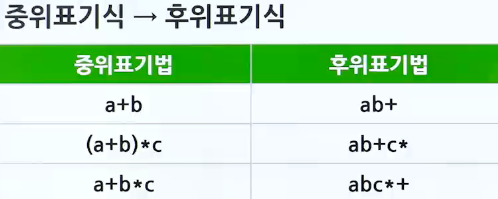
- 알고리즘
  - 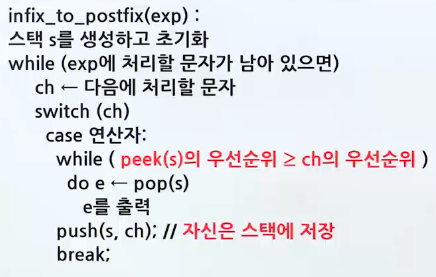
  - 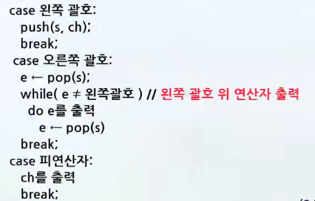
  - 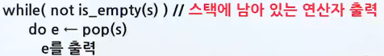
- 프로그램

  - ```c
      #include <stdio.h> // printf 함수
      #include <stdlib.h> // strlen 함수
      #define MAX_STACK_SIZE 100

      // 구조체 배열 사용 스택 코드 추가
      typedef char element; // 교체
      // ...
      // 구조체 배열 사용 스택 코드 추가 끝

      // 연산자의 우선순위를 반환함
      int prec(char op) {
          switch (op) {
              case "(": case ")": return 0;
              case "+": case "-": return 1;
              case "*": case "/": return 2;
          }
          return -1;
      }

      // 중위표기 수식 -> 후위표기 수식
      void infix_to_postfix(char exp[]) {
          int i = 0;
          char ch, top_op;
          int len = strlen(exp);
          StackType s;

          init_stack(&s); // 스택 초기화
          for (i = 0; i<len; i++) {
              ch = exp[i];
              switch (ch) {
                  case "+": case "-": case "*": case "/": // 연산자

                  // 스택에 있는 연산자의 우선순위가 더 크거나 같으면 출력
                  while (!is_empty(&s) && (prec(ch) <= prec(peek(&s))))
                      printf("%c",pop(&s));
                      push(&s, ch); // 자신은 스택에 저장
                      break;

                  case "(": // 왼쪽 괄호
                      push(&s, ch);
                      break;
                  case ")" // 오른쪽 괄호
                      top_op = pop(&s);
                      // 왼쪽 괄호를 만날 때까지 출력
                      while (top_op != "(") {
                          printf("%c", top_op);
                          top_op = pop(&s);
                      }
                      break
                  default: // 피연산자
                       printf("%c", ch);
                       break;
              }
          }

          while (!is_empty(&s)) // 스택에 저장된 연산자들 출력
              printf("%c", pop(&s));
      }

      int main(void) {
          char *s = "(2+3)*4+9";
          printf("중위표시수식 %s \n",s);
          printf("중위표시수식 ");
          infix_to_postfix(s);
          printf("\n");
          return 0;
      }

      ///////////////// result
      // 중위표시수식 (2+3)*4+9
      // 후위표시수식 23+4*9+
    ```

## 미로 탐색

- 체계적인 방법 필요
  - 현재의 위치에서 가능한 방향을 스택에 저장해놓았다가 막다른 길을 만나면 스택에서 다음 탐색 위치를 꺼냄
  - 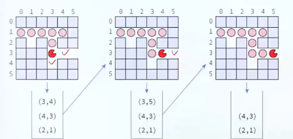
- 미로 탐색 알고리즘
  - 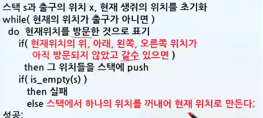
- 미로 탐색 프로그램
  - 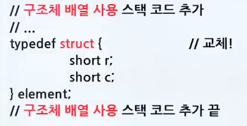
  - 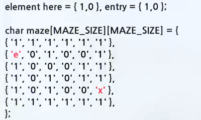
  - 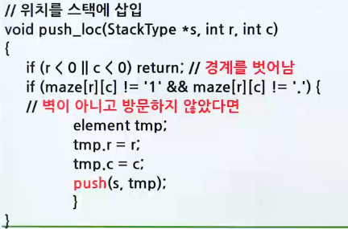
  - 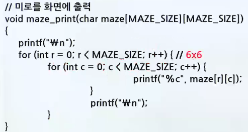
  - 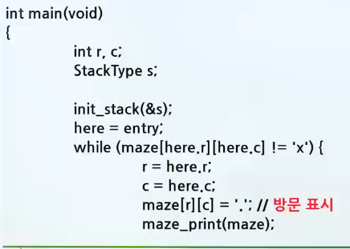
  - 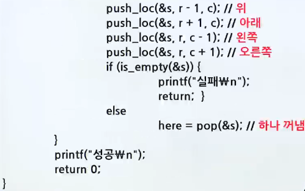
  - reuslt
    - 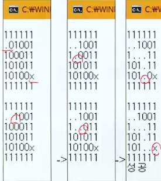
