# 큐의 구현

## 큐 연산

> 큐(Queue) : 먼저 들어온 데이터가 먼저 나가는 자료구조

- 선입선출(FIFO, First-In First-Out)
  - ex. 매표소의 대기열, 일방통행

### 큐 ADT

- 연산
  - 객체: 0개 이상의 요소들로 구성된 선형 리스트
  - 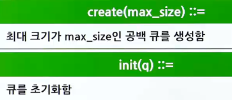
  - 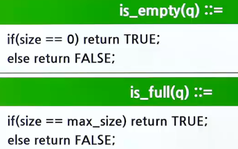
  - 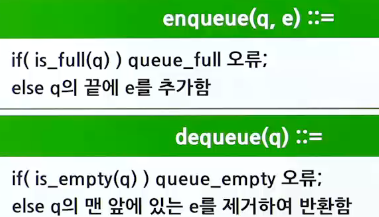
  - 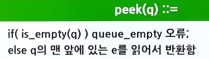

## 큐의 삽입, 삭제 연산

### 큐의 삽입 연산

- 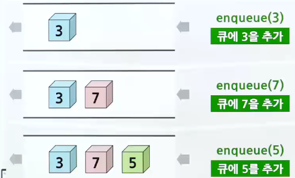

### 큐의 삭제 연산

- 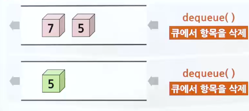

### 큐의 응용

- 직접적인 응용
  - 시뮬레이션의 대기열
    - 공항에서의 비행기들, 은행에서의 대기열
  - 통신에서의 데이터 패킷들의 모델링에 이용
  - 컴퓨터와 프린터 간의 버퍼링(스풀링)
- 간접적인 응용
  - 스택과 마찬가지로 프로그래머의 도구
  - 많은 알고리즘에서 사용됨
  - 프로세스 스케줄링
- 배열을 선형으로 사용하여 큐를 구현
  - 삽입을 계속하기 위해 요소들을 이동시켜야 함
  - 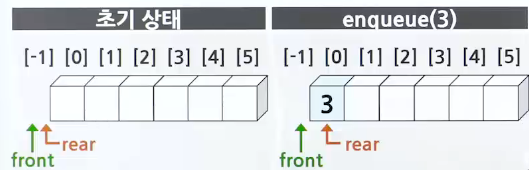
  - 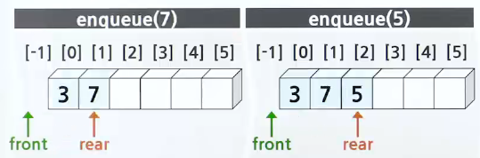
  - 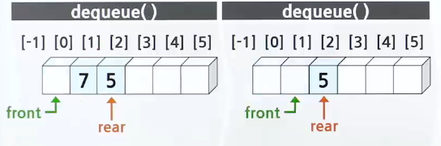

## 선형 큐

### 선형 큐의 응용

- 작업 스케줄링(프로세스 스케줄링)
  - 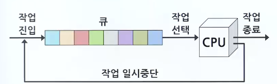
  - 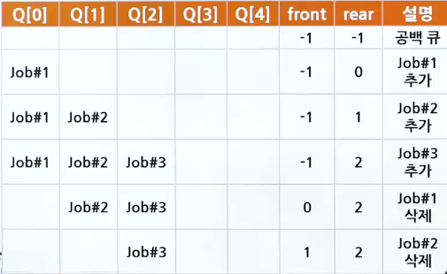

## 원형 큐

- 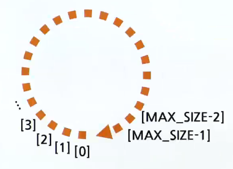

### 개요

- 큐의 전단과 후단을 관리하기 위해 필요한 2개의 변수
  - front : 첫 번째 요소의 하나 앞 인데스
  - rear : 마지막 요소의 인덱스
  - 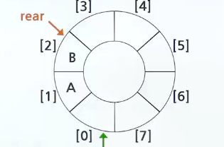
  - 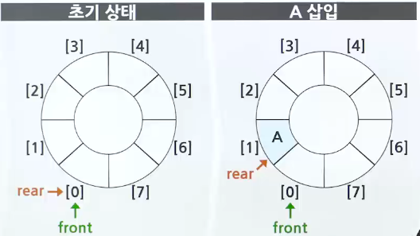
  - 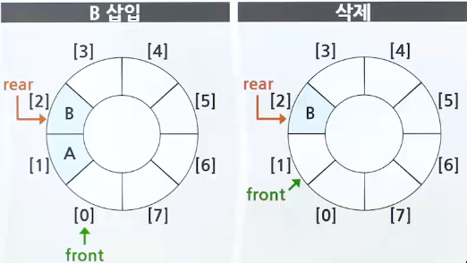
  - 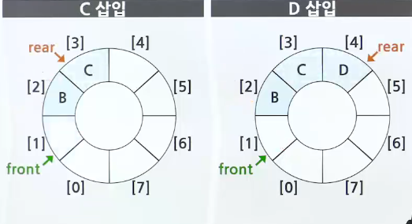

### 공백상태와 포화상태

- 공백상태
  - front == rear
- 포화상태
  - front == (rear+1) % M
- 공백상태와 포화상태의 구별을 위해 항상 비워두는 하나의 공간
  - 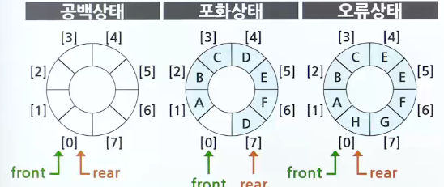
