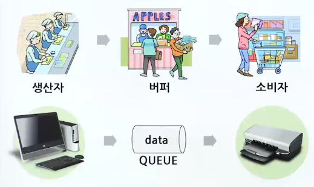
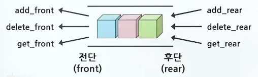
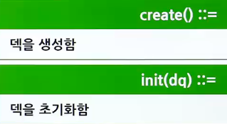
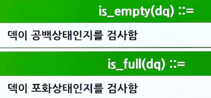
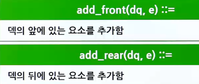
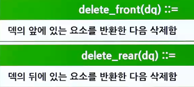
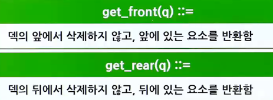
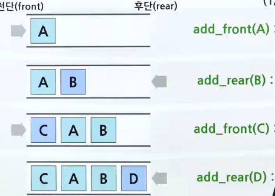
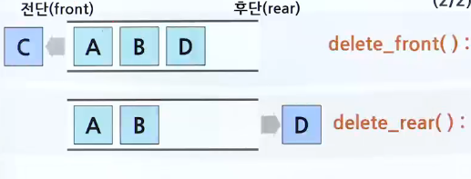
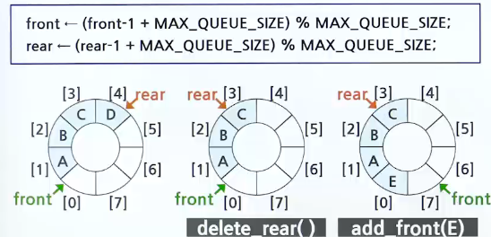

# 큐의 응용

## 버퍼

- 

## 덱

> 덱(DEQUE) : Double-ended queue의 줄임말로, 큐의 전단(front)와 후단(rear)에서 모두 삽입과 삭제가 가능한 큐

- 

### 덱 ADT

- 연산
  - 객체: n개의 element형으로 구성된 요소들의 순서 있는 모임
  - 
  - 
  - 
  - 
- 연산(peek)
  - 

### 덱의 연산

- 
- 

### 배열을 이용한 덱의 구현(음수 방지)

- 

## 시뮬레이션

> 큐잉모델 : 고객에 대한 서비스를 수행하는 서버와 서비스를 받는 고객들로 이루어짐

- 은행에서 고객이 들어와서 서비스를 받고 나가는 과정을 시뮬레이션
  - 고객들이 기다리는 평균시간을 계산

### 개요

- 시뮬레이션은 하나의 반복 루프
  - 현재 시각을 나타내는 clock이라는 변수를 하나 증가시킴
  1. is_customer_arrived 함수룰 호출
     - is_customer_arrived 함수는 랜덤 숫자를 생성
     - 시뮬레이션 파라미터 변수인 arrival_prev와 비교하여 작으면 새로운 고객이 들어왔다고 판단
  2. 고객의 아이디, 도착시간, 서비스 시간 등의 정보를 만들어 구조체에 복사하고 이 구조체를 파라미터로 하여 큐의 삽입 함수 enqueue()를 호출함
  3. 고객이 필요로 하는 서비스 시간은 역시 랜덤 숫자를 이용하여 생성됨
  4. 지금 서비스하고 있는 고객이 끝났는지를 검사
     - 만약 service_time이 0이 아니면 지금 어떤 고객이 서비스를 받고 있는 중임을 의미함
  5. clock이 하나 증가했으므로 service_time을 하나 감소시킴
  6. 만약, service_time이 0이면 현재 서비스 받는 고객이 없음을 의미함
     - 따라서, 큐에서 고객 구조체를 하나 꺼내 서비스를 시작함
