# 단순연결리스트

## 리스트 연산

### 일상생활에서 리스트

- 투두 리스트, 버킷 리스트, 요일들, 카드 한 벌의 값 등

### 리스트의 기본 연산

- 
  - 리스트에 새로운 항목을 추가함
    - 삽입 연산
  - 리스트에서 항목을 삭제함
    - 삭제 연산
  - 리스트에서 특정한 항목을 찾ㅇ므
    - 탐색 연산

### 리스트 ADT

- 연산
  - 객체 : n개의 element 형으로 구성된 순서 있는 모임
  - insert(list, pos, item) ::=
    - pos 위치에 요소를 추가함
  - insert_last(list, item) ::=
    - 맨 끝에 요소를 추가함
  - insert_first(list, item) ::=
    - 맨 처음에 요소를 추가함
  - delete(list, pos) ::=
    - pos 위치의 요소를 제거함
  - clear(list) ::=
    - 리스트의 모든 요소를 제거함
  - get_entry(list, post) ::=
    - pos 위치의 요소를 반환함(peek)
  - get_length(list) ::=
    - 리스트의 길이를 구함
  - is_empty(list) ::=
    - 리스트가 비었는지를 검사함
  - is_full(list) ::=
    - 리스트가 꽉 찼는지를 검사함
  - print_list(list) ::=
    - 리스트의 모든 요소를 표시함

### 리스트 구현 방법

- 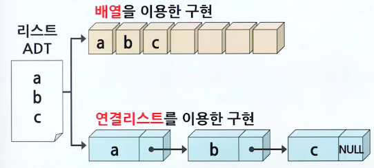

## 배열 리스트

### 배열로 구현된 리스트

- 리스트의 순차적 표현(Sequential representation)
  - 배열을 이용하여 리스트를 구현하면 순차적인 메모리 공간이 할당되므로, 이를 리스트의 순차적 표현이라고 함
  - 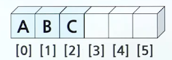

### ArrayListType의 구현

- 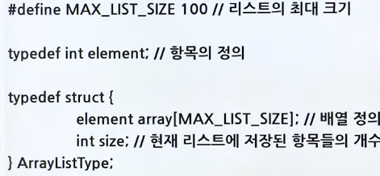
- 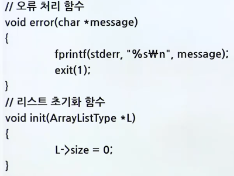
- 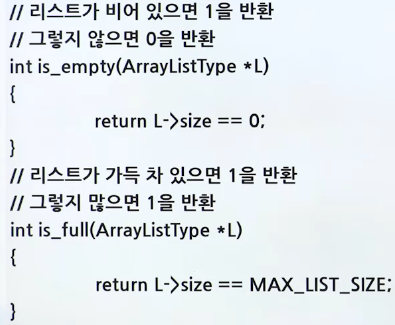
- 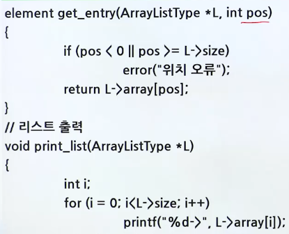
- 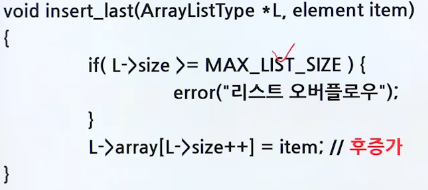
- 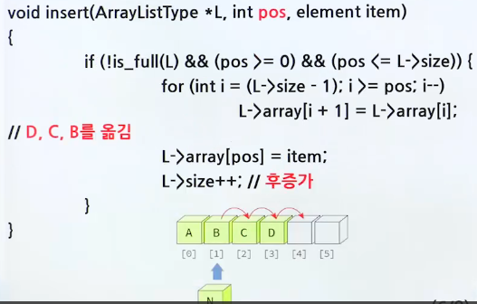
- 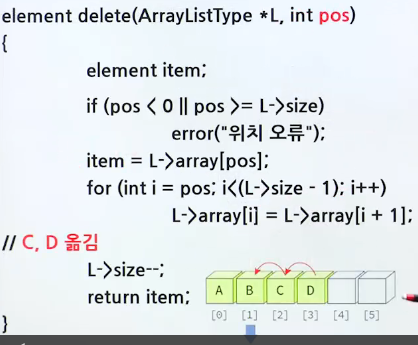
- 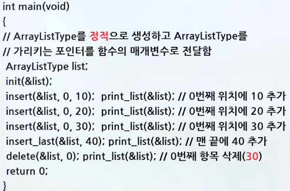

## 연결 리스트

> 리스트의 항목들을 노드(Node)라고 하는 곳에 분산하여 저장

- 노드는 데이터 필드와 링크 필드로 구성
  - 데이터 필트
    - 리스트의 원소, 즉 데이터 값을 저장하는 곳
  - 링크 필드
    - 다른 노드의 주소 값을 저장하는 장소(포인터)

### 삽입과 삭제

- 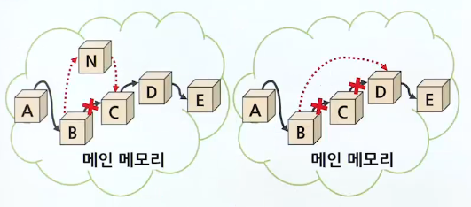

### 연결된 표현의 장단점

- 장점
  - 삽입, 삭제하기에 보다 용이함
  - 연속된 메모리 공간이 필요 없음(linearity)
  - 크기 제한 없음
- 단점
  - 구현이 어려움
  - 오류 발생하기 쉬움

### 노드의 구조

> 노드 = 데이터 필드 + 링크 필드

- 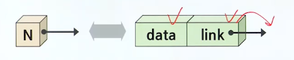

### 헤드 포인터와 노드의 생성

- 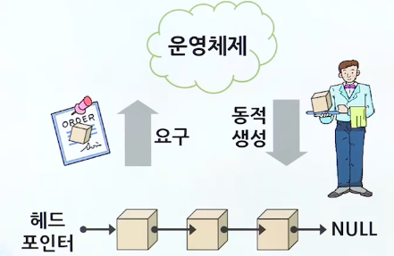

### 연결 리스트의 종류

- 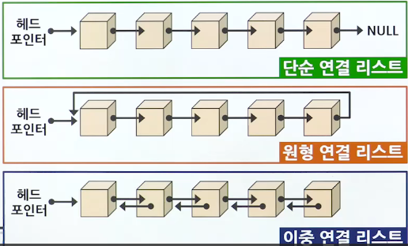

 

1. 단순 연결 리스트
   - 하나의 링크 필드를 이용하여 연결
   - 마지막 노드의 링크 값은 NULL
   - 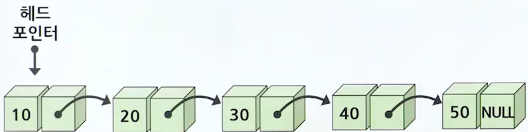
   - 노드의 정의
     - 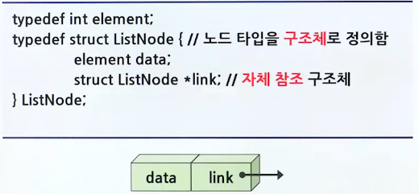
   - 리스트의 생성
     - 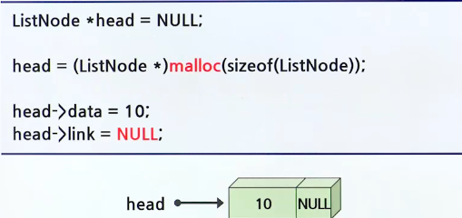
   - 2번째 노드 생성
     - 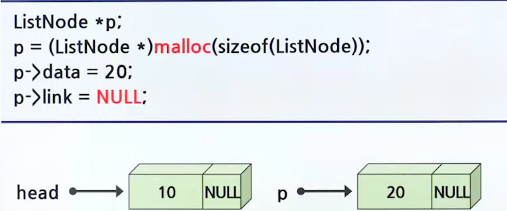
   - 노드의 연결
     - 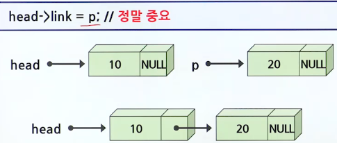
   - 단순 연결 리스트의 연산
     - insert_first()
       - 리스트의 시작 부분에 항복을 삽입하는 함수
       - 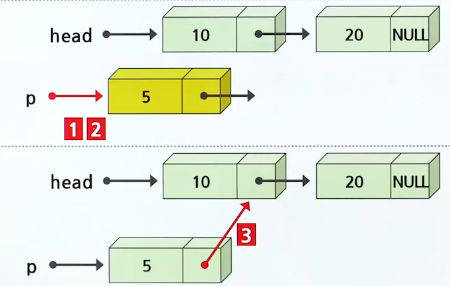
       - 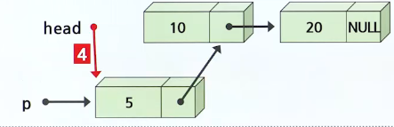
       - 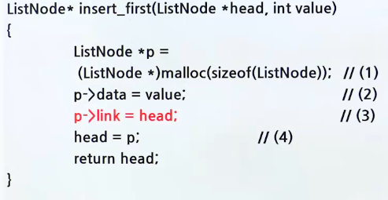
     - insert()
       - 리스트의 중간 부분에 항목을 삽입하는 함수
       - 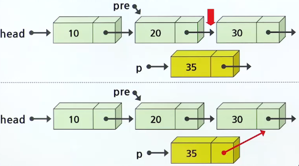
       - 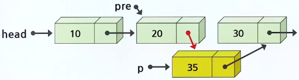
       - 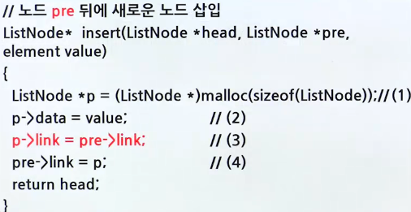
     - delete_first()
       - 리스트의 첫 번째 항목을 삭제하는 함수
       - 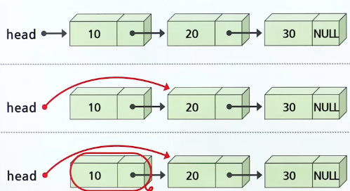
       - 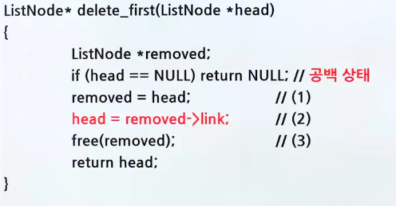
     - delete()
       - 리스트의 중간 항목을 삭제하는 함수
       - 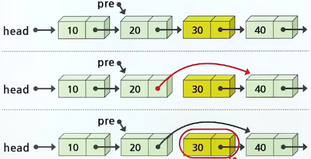
       - 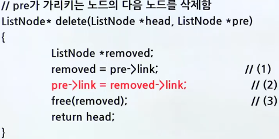
     - print_list()
       - 리스트를 방문하여 모든 항목을 출력하는 함수
