# 연결리스트의 응용

## 단어 저장

### 단어들을 저장하고 있는 연결리스트

- 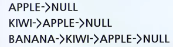
- 예제
  - 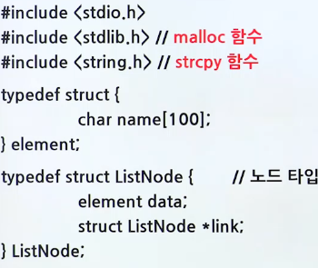
  - 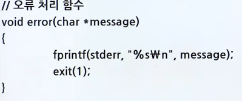
  - 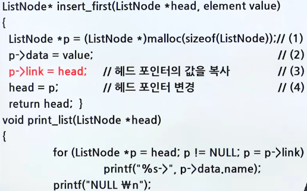
  - 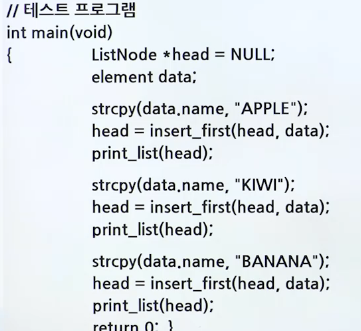

## 다항식

### 개요

- 다항식을 컴퓨터로 처리하기 위한 자료구조
  - 다항식의 덧셈, 뺄셈, ...
- 하나의 다항식을 하나의 연결리스트로 표현
  - 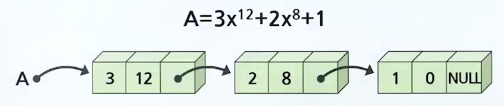
- 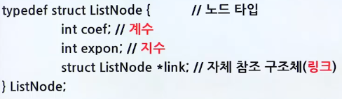
- 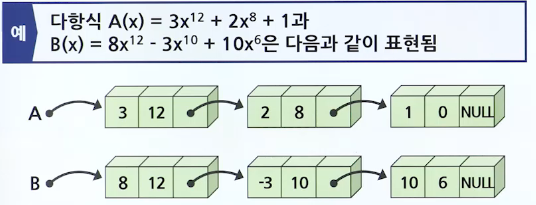

### 다항식의 덧셈 구현

- 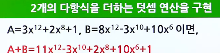

<br>

1. p와 q가 가리키는 항들의 지수가 같으면 계수를 더함
   - 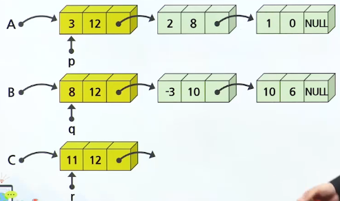
2. q가 가리키는 항의 지수가 높으면 그대로 C로 옮김
   - 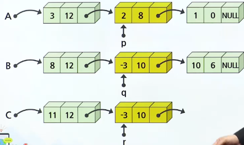
3. p가 가리키는 항의 지수가 높으면 그대로 C로 옮김
   - 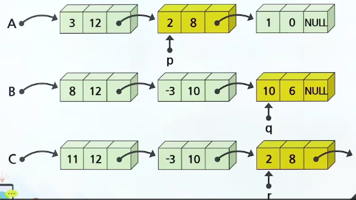

#### 헤더 노드의 개념

- 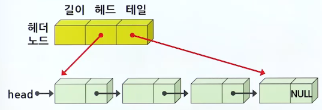
- 예제
  - 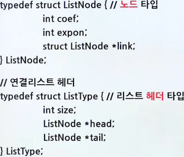
  - 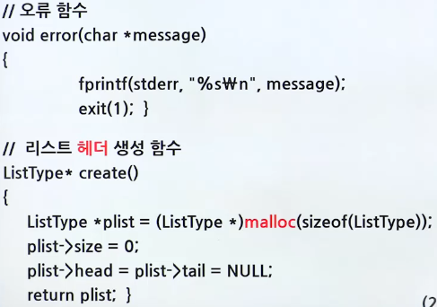
  - 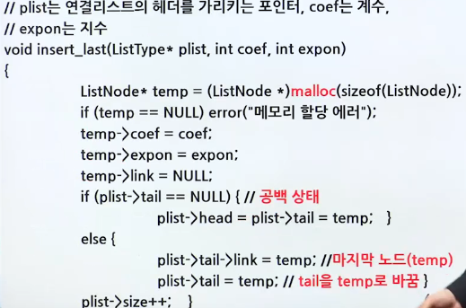
  - 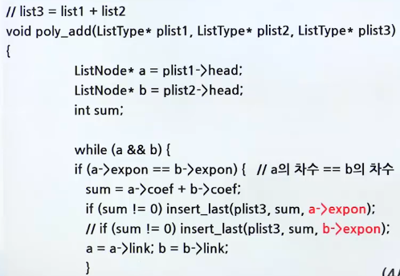
  - 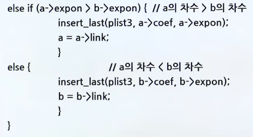
  - 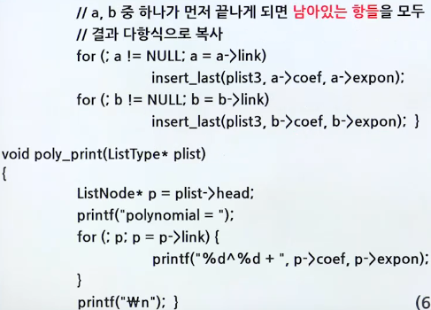
  - 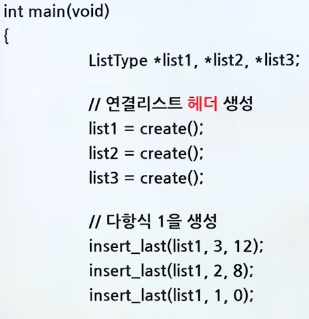
  - 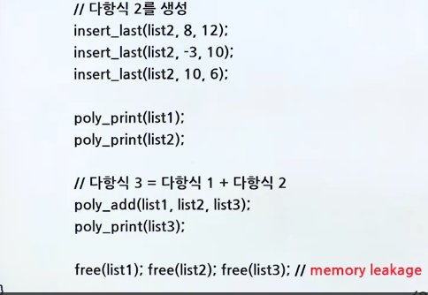
  - 실행 결과
    - 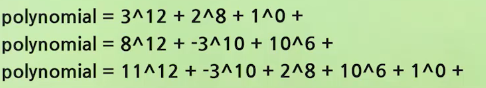

## 방문 연산

### 방문 연산 코드

- 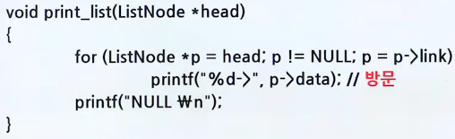

### 테스트 프로그램

```c
int main(void) {
    ListNode *head = NULL;

    for (int i = 0; i < 5; i++){
        head = insert_first(head, i);
        print_list(head);
    }
    for (int i = 0; i < 5; i++){
        head = delete_first(head);
        print_list(head);
    }
    return 0
}

```

- 실행결과
  - 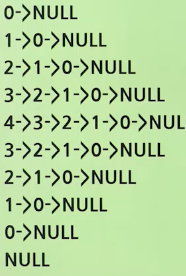

## 특정 값 탐색

### 특정한 값을 탐색하는 함수

- 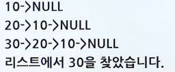
- 예제

  - ```c
      ListNode* search_list(LostNode *head, element x) {
          ListNode *p = head;

          while(p != NULL) {
              if(p->data == x) return p; // 탐색 성공
              p = p->link;
          }
          return NULL; //탐색 실패
      }

      // 테스트 프로그램
      int main(void){
          ListNode *head = NULL;
          head = insert_first(head, 10);
          print_list(head);
          head = insert_first(head, 20);
          print_list(head);
          head = insert_first(head, 30);
          print_list(head);
          if( search_list(head, 30) != NULL)
              printf("리스트에서 30을 찾았습니다. \n")
          else
              printf("리스트에서 30을 찾지 못했습니다. \n");
          return 0;
      }
    ```

## 합침과 역순

### 2개의 리스트를 합하는 함수

- 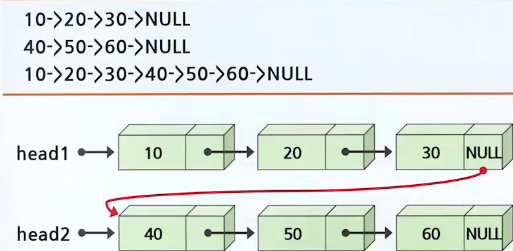

<br>

- 예제
  - 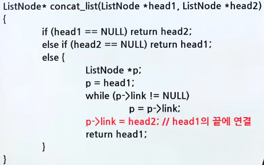

### 리스트를 역순으로 만드는 연산

- 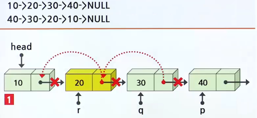

<br>

- 역순 예제
  - 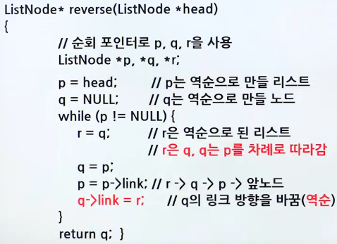
