# 원형연결리스트

## 원형의 삽입과 삭제

> 원형연결리스트: 마지막 노드의 링크가 첫 번째 노드를 가리키는 리스트

- 한 노드에서 다른 모든 노드로의 접근 가능
- 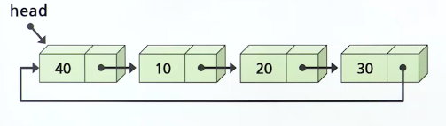

 

- 보통 헤드 포인터가 마지막 노드를 가리키게 구성하면 리스트의 처음 또는 마지막에 노드를 삽입하는 연산이 단순연결 리스트에 비해 용이함
- 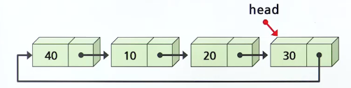

### 원형연결리스트의 처음에 삽입한 경우

- 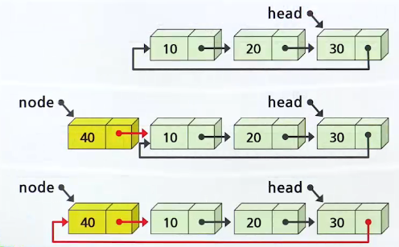
- 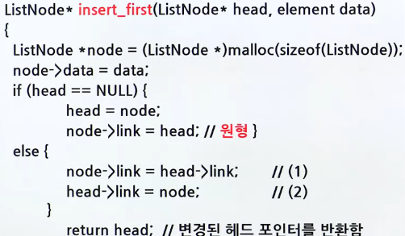

### 원형연결리스트의 끝에 삽입한 경우

- 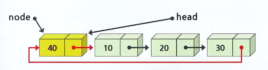
- 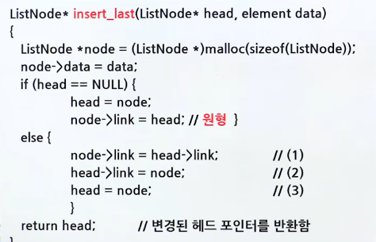

### 테스트 프로그램

- 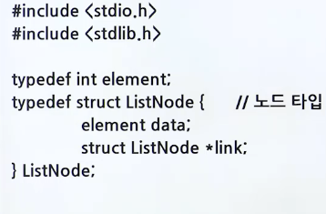
- 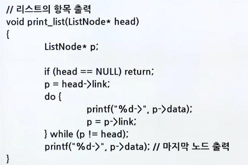
- 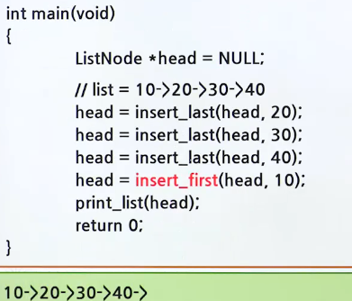

### 원형연결리스트의 응용

- 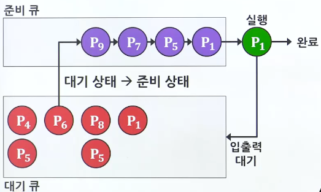

#### 배열을 이용한 원형 큐

- 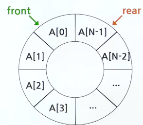

#### 연결 리스트를 이용한 원형 큐

- 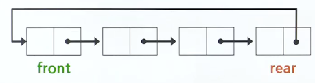

### 원형연결리스트의 삭제

- 노드 삭제 알고리즘
  - 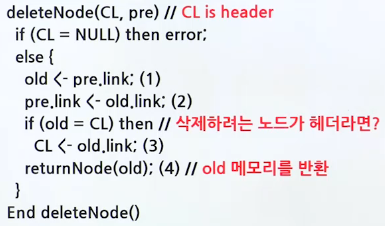
- 노드를 삭제하는 과정
  - 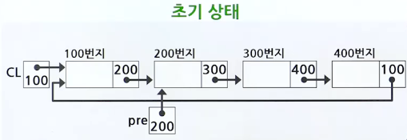
  - 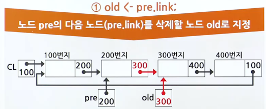
  - 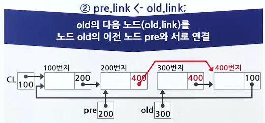
  - 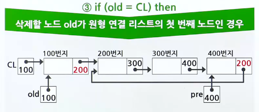
  - 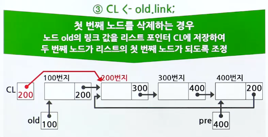
  - 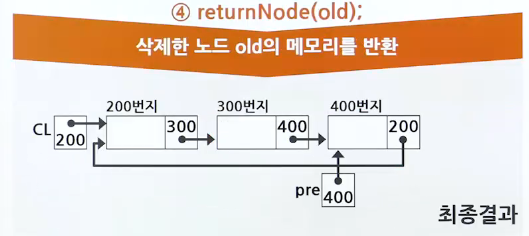

## 멀티 플레이어

### 출력 결과

- 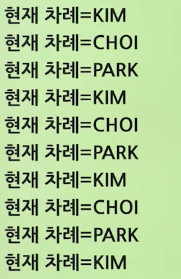
- 예제 프로그램
  - 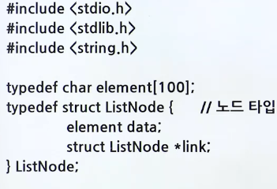
  - 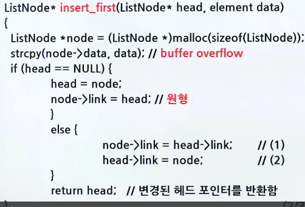
  - 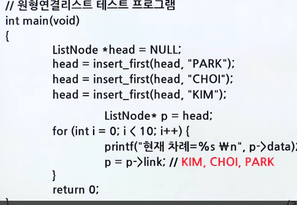

## 연결 리스트 스택

- 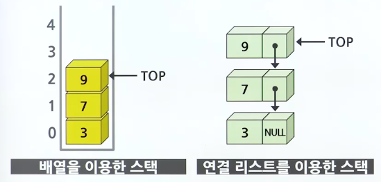

### 삽입과 삭제

- 삽입 연산
  - 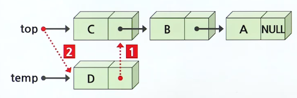
- 삭제 연산
  - 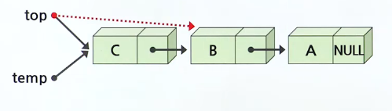
- 예제 프로그램
  - 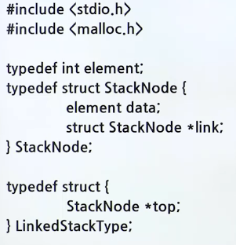
  - 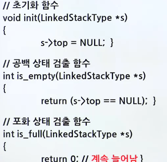
  - 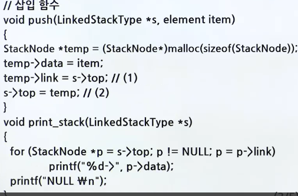
  - 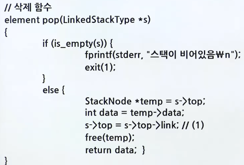
  - 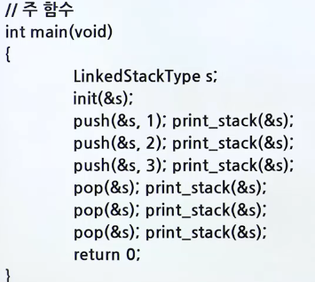
  - 출력 결과
    - 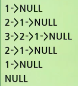
