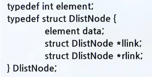

# 이중연결리스트

## 이중 삽입과 삭제

> 단순 연결 리스트의 문제점 : 선행 노드를 찾기가 힘듦

- 

### 이중 연결 리스트

> 하나의 노드가 선행 노드와 후속 노드에 대한 두 개의 링크를 가지는 리스트

- 공간을 많이 차지하고 코드가 복잡하다는 단점이 있음
- 
- 리스트 week의 이중연결리스트
  - 
- 리스트 week의 이중원형연결리스트
  - 

### 노드의 구조

- 헤드 노드(Head node)
  - 데이터를 가지지 않고 단지 삽입, 삭제 코드를 간단하게 할 목적으로 만들어진 노드
  - 헤드 포인터와의 구별 필요
  - 공백상태에서는 헤드 노드만 존재
  - 

#### 이중연결리스트에서의 노드의 구조

- 

### 삽입과 삭제

- 삽입 연산
  - 
  - 
- 삭제 연산
  - 
  - 
- 테스트 프로그램

  - ```c
      #include <stdio.h>
      #include <stdlib.h>

      typedef int element;
      typedef struct DListNode { // 이중연결 노드 타입
          element data;
          struct DListNode* llink;
          struct DlistNode* rlink;
      } DListNode;

      // 이중연결리스트를 초기화
      void init(DListNode* phead) {
          phead->llink = phead;
          phead->rlink = phead;
      }

      // 이중연결리스트의 노드를 출력
      void print_dlist(DlistNode* phead){
          DListNode* p;
          for (p = phead->rlink; p != phead; p=p->rlink) {
              printf("<-||%d||->", p->data);
          }
          printf("\n");
      }

      // 새로운 데이터를 노드 before의 오른쪽에 삽입
      void dinsert(DListNode* before, element data) {
          DListNode *newnode = (DListNode*)malloc(sizeof(DListNode));
          strcpy(newnode->data, data); // buffer overflow
          newnode->llink = before; // (1)
          newnode->rlink = before->rlink; // (2)
          before->rlink->llink = newnode; // (3)
          before->rlink = newnode; // (4)
      }

      // 노드 removed를 삭제함
      void ddelete(DListNode* head, DListNode* removed){
          if(removed == head) return;
          removed->llink->rlink = removed->rlink; // (1)
          removed->rlink->llink = removed->llink; // (2)
          free(removed);
      }

      // 이중연결리스트 테스트 프로그램
      int main(void){
          DListNode* head = (DListNode*)malloc(sizeof(DListNode));
          init(head);
          printf("추가 단계\n");
          for (int i = 0; i < 5;i++){
              // 헤드 노드의 오른쪽에 삽입
              dinsert(head, i);
              print_dlist(head);
          }

          printf("\n삭제 단계\n ");
          for (int i = 0; i < 5; i++){
              print_dlist(head);
              // 헤드 노드의 오른쪽에서 삭제
              ddelete(head, head->rlink);
          }
          free(head);
          return 0;
      }

    ```

  - 실행 결과
    - 

## MP3 재생

- 

### 출력 결과

- 

### 테스트 프로그램

```c
#include <stdio.h>
#include <stdlib.h>
#include <string.h>

typedef char element[100];
typedef struct DListNode { // 이중연결 노드 타입
    element data;
    struct DListNode* llink;
    struct DListNode* rlink;
} DListNode;

DListNode* current;

// 이중연결리스트를 초기화
void init(DListNode* phead) {
    phead->llink = phead;
    phead->rlink = phead;
}

// 이중연결리스트 테스트 프로그램
int main(void) {
    char ch;
    DListNode* head = (DListNode*)malloc(sizeof(DListNode));
    init(head);
    dinsert(head, "Mamamia");
    dinsert(head, "Dancing Queen");
    dinsert(head, "Fernando");

    current = head->rlink;
    print_dlist(head);

    do {
        printf("\n명령어를 입력하시우(<,>,q): ");
        ch = getchar();
        if(ch == "<"){
            current = current->llink;
            if(current == head) // 빈 노드
                current = current->llink;
        }
        else if(ch == ">") {
            current = current->rlink;
            if (current == head) // 빈 노드
                current = current->rlink;
        }
        print_dlist(head);
        getchar();
    } while (ch != 'q');
    free(head);
}

```

## 연결 리스트 큐

- 
- 
- 
- 

### 삽입 연산

- 
- 

### 삭제 연산

- 
- 
- 

### 프로그램

- 
- 
