# 이진 트리

## 트리의 용어

### 개요

- 선형 구조 : 리스트, 스택, 큐 등
- 트리 : 계층적인 구조를 나타내는 자료구조
  - 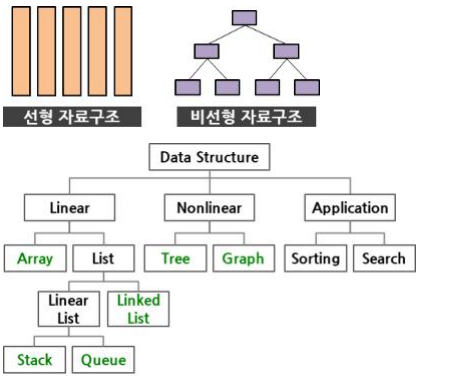
- 트리는 부모-자식 관계의 노드들로 이루어짐
- 응용분야
  - 계층적인 조직 표현
  - 컴퓨터 디스크의 디렉토리 구조
  - 인공지능에서의 결정 트리(Decision tree)
- 전위 순회
  - 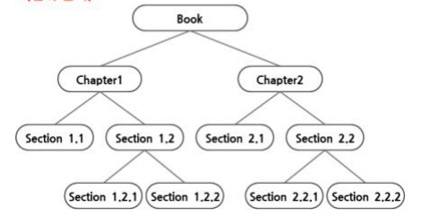
- 후위 순회
  - 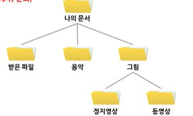
- ex. 골프에 대한 결정 트리 (인공 지능)
  - 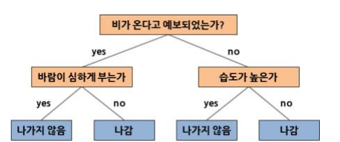

### 용어

- 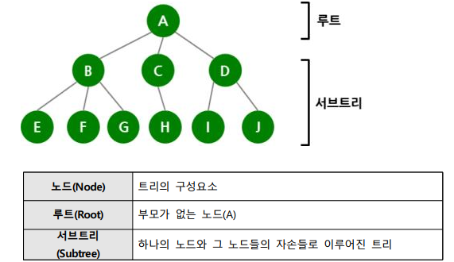
- 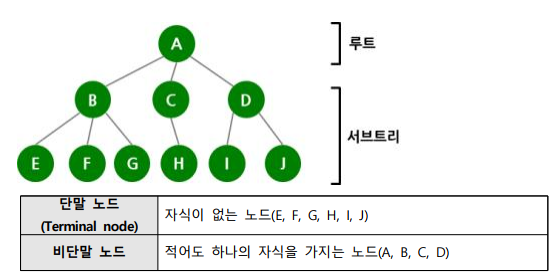
- 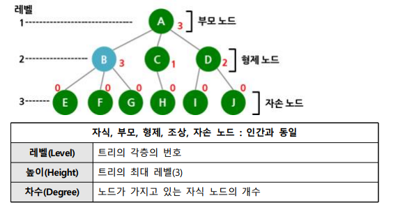
- 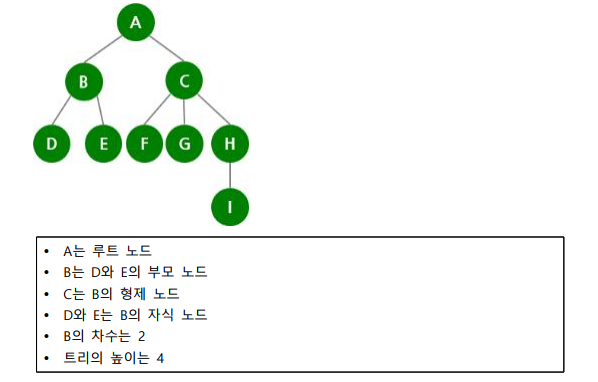
- 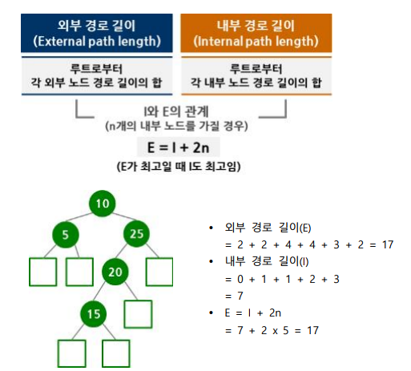

### 종류

- 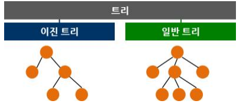
- B-트리 (B-tree, 일반트리)
  - 데이터베이스와 파일 시스템에서 널리 사용되는 트리 자료구조의 일종
  - 이진 트리를 확장해 하나의 노드가 가질 수 있는 자식 노드의 최대 숫자가 2보다 큰 트리 구조
  - 방대한 양의 저장된 자료를 검색해야 하는 경우 검색어와 자료를 일일이 비교하는 방식은 비효율적
  - 자료를 정렬된 상태로 보관하고 대수 시간으로 삽입 및 삭제 가능
  - 대부분의 이진 트리는 항목이 삽입될 때 하향식으로 구성되는 데 반해, B-트리는 일반적으로 상향식으로 구성

## 이진 트리의 성질

- 이진 트리(Binary tree)는 모든 노드가 2개의 서브트리를 가지고 있는 트리
  - 서브트리는 공집합일 수 있음
- 이진 트리의 노드에는 최대 2개까지의 자식 노드가 존재
- 모든 노드의 차수가 2 이하가 됨(구현하기가 편리함)
- 이진 트리에는 서브트리 간의 순서가 존재
  - 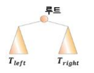
  - 
- 이진 트리는 공집합이거나 루트와 왼쪽 서브트리, 오른쪽 서브트리로 구성된 노드들의 유한 집합으로 정의됨
- 이진 트리의 서브트리들은 모두 이진 트리어야 함

### 성질

- 노드의 개수가 n개이면 간선의 개수는 n-1 (ex. 수식 트리)
  - 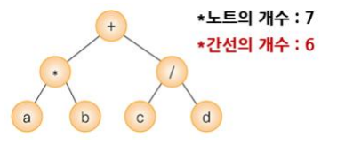
- 높이가 h인 이진 트리의 경우, 최소 h개의 노드를 가지며 최대 2\*\*h-1개의 노드를 가짐
  - 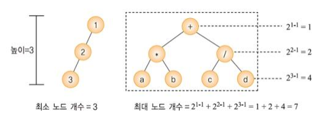
- n개의 노드를 가지는 이진 트리의 높이
  - 최대 n
  - 최소 [log 2 (n+1)]
  - 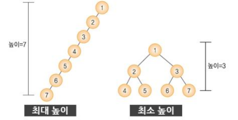

### 분류

- 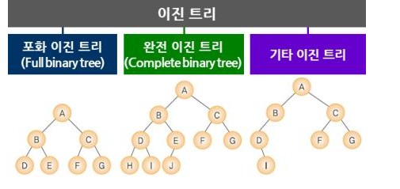
- 포화 이진 트리는 용어 그대로 트리의 각 레벨에 노드가 꽉 차있는 이진 트리를 의미
- 전체 노드 개수
  - 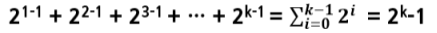
- 포화 이진 트리에는 각 노드에 번호를 붙일 수 있음
  - 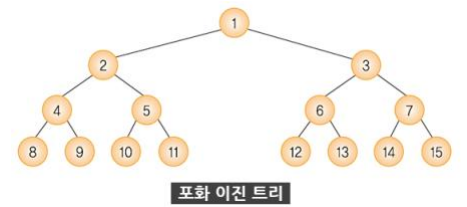
- 완전 이진 트리는 레벨 1부터 k-1까지는 노드가 모두 채워져 있고 마지막 레벨 k에서는 왼쪽부터 오른쪽으로 노드가 순서대로 채워져 있는 이진 트리(힙에서 사용)
- 포화 이진 트리와 노드 번호가 일치

## 이진 트리 표현

- 이진 트리를 표현하는 2가지 방법
  - 배열을 이용
  - 포인터를 이용

### 배열 표현법

- 배열 표현법은 모든 이진 트리를 포화 이진 트리라고 가정하고 각 노드에 번호를 붙여 그 번호를 배열의 인덱스로 삼아 노드의 데이터를 배열에 저장하는 방법(힙에서 사용)
  - 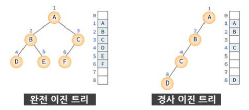
- 부모와 자식 인덱스 관계
  - 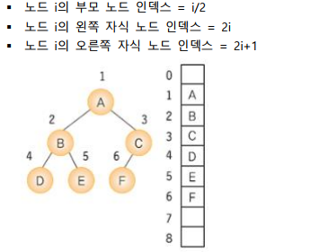

### 링크 표현법

- 링크 표현법은 포인터를 이용하여 부모 노드가 자식 노드를 가리키게 하는 방법
  - 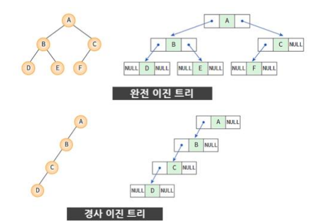
- 링크의 구현
  - 노드는 구조체로 표현
  - 링크는 포인터로 표현
  - 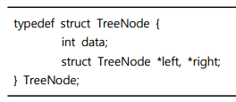

### 프로그램 예제

- 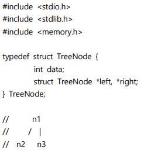
- 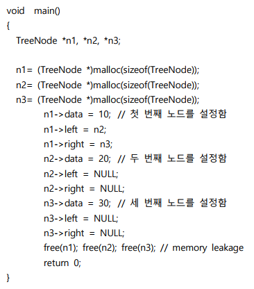
