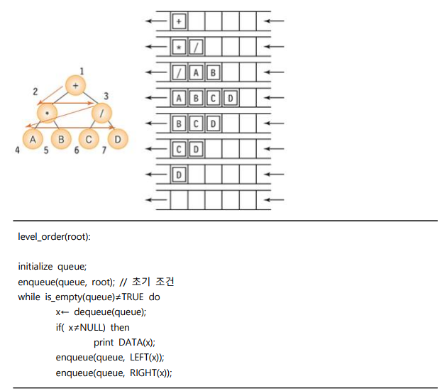

# 순회

## 전위 순회

- 기본적으로 이진 트리도 데이터를 저장하기 위한 자료 구조
- 데이터는 노드의 데이터 필드를 이용하여 저장
- 이진 트리를 순회한다는 것은 이진트리에 속하는 모든 노드를 한 번씩 방문하여 노드가 가지고 있는 데이터를 목적에 맞게 처리하는 것을 의미
- 트리를 사용하는 목적은 트리의 노드에 자료를 저장하고 필요에 따라 이 자료를 처리하기 위함(순회 사용)
- 트리가 가진 자료를 순차적으로 순회하는 것은 이진 트리에서 중요한 연ㅅ나
- 스택, 큐 등의 자료구조는 대개 데이터를 선형으로 저장하고 있음
  - 트리는 그렇지 않음
  - 트리는 여러 가지 순서로 노드가 가지고 있는 자료에 접근할 수 있음(여러 가지 순회 방법이 존재)
- 순회(Traversal)는 트리의 노드들을 체계적으로 방문하는 것
  - 

### 알고리즘

- 순환 호출을 이용(스택)
  - 
  - 노드 x가 NULL이면 더 이상 순환 호출을 하지 않음
  - x의 데이터를 출력함(root)
  - x의 왼쪽 서브트리를 순환 호출하여 방문함
  - x의 오른쪽 서브트리를 순환 호출하여 방문함

### 응용

- ex. 구조화된 문서출력
  - 

## 중위 순회

- 

### 알고리즘

- 순환 호출을 이용(스택)
  - 
  - 노드 x가 NULL이면 더 이상 순환 호출을 하지 않음
  - x의 왼쪽 서브트리를 순환 호출하여 방문함
  - x의 데이터를 출력함(root)
  - x의 오른쪽 서브트리를 순환 호출하여 방문함

### 응용

- ex. 수식 트리
  - 

## 후위 순회

- 

### 알고리즘

- 순환 호출을 이용(스택)
  - 
  - 노드 x가 NULL이면 더 이상 순환 호출을 하지 않음
  - x의 왼쪽 서브트리를 순환 호출하여 방문함
  - x의 오른쪽 서브트리를 순환 호출하여 방문함
  - x의 데이터를 출력함(root)

### 응용

- ex. 디렉토리 용량 계산
  - 

### 프로그램

- 

## 정리

### 프로그램

- 
- 
- 
- 

### 반복적인 순회

- 
- 
- 
- 

### 레벨 순회

- 레벨 순회(Level order)는 각 노드를 레벨 순으로 검사하는 순회 방법
- 지금까지의 순회법이 스택을 사용했던 것에 비해 레벨 순회는 큐를 사용하는 순회법임
- 

### 레벨 순회 프로그램

- 

### 어떤 순회를 선택해야 하는가

- 트리를 순회하기만 하면 해결되는 문제가 많음
- 만일 순서가 중요치 않고 노드를 전부 방문해도 된다면 아무 것이나 사용해도 됨
  - 자식 노드를 처리한 다음 부모 노드를 처리해야 한다면 : 후위 순회
  - 부모 노드를 처리한 다음 자식 노드를 처리해야 한다면 : 전위 순회
  - 디렉토리의 용량을 계산하려면 : 후위 순회 - 하위 디렉토리의 용량이 계산되어야만 현재 디렉토리 용량을 계산할 수 있기 때문
