# 트리의 응용

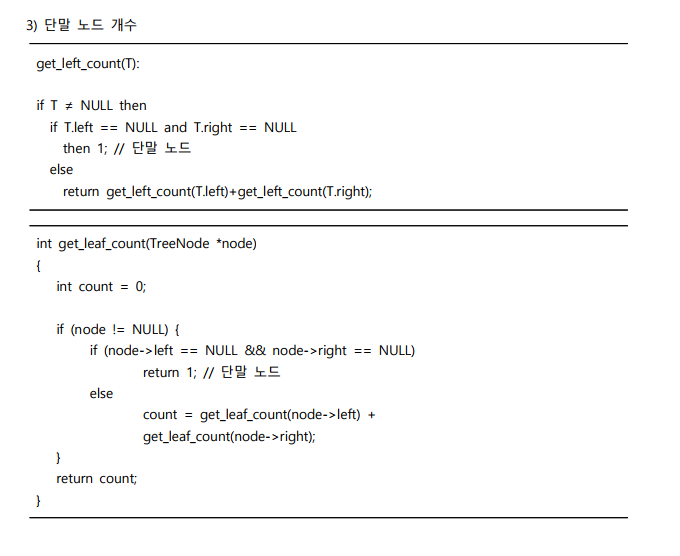

# 이진 탐색 트리

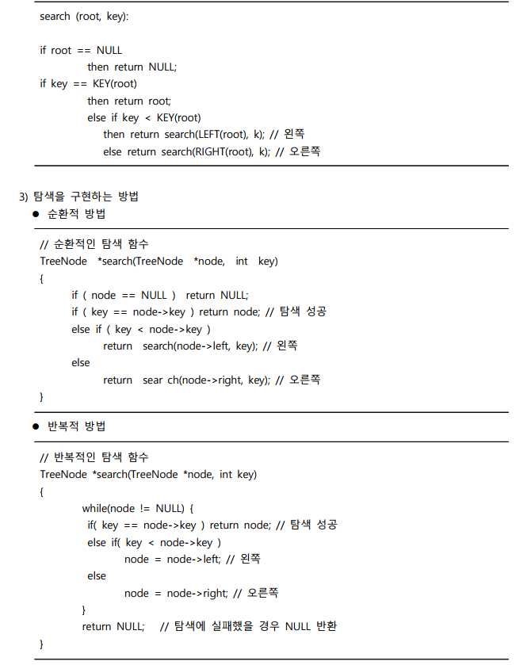

---

# 힙(Heap)

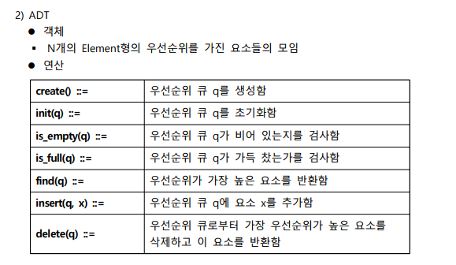

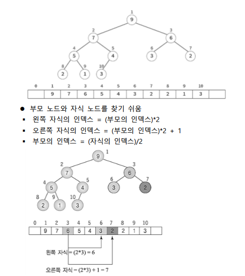

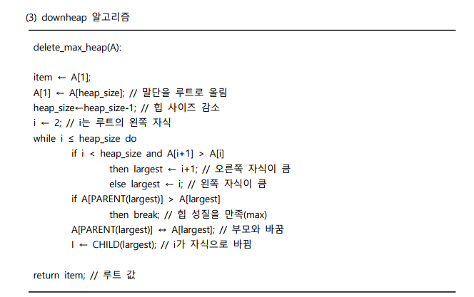

# 힙 정렬

---

# 그래프 표현

# 그래프 탐색

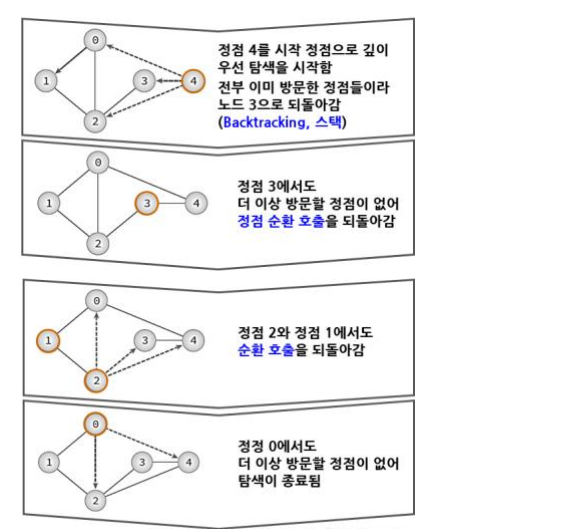

---

# 신장트리

# 최단경로

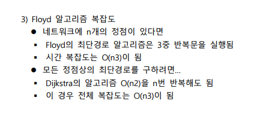

---

# 비효율적인 정렬

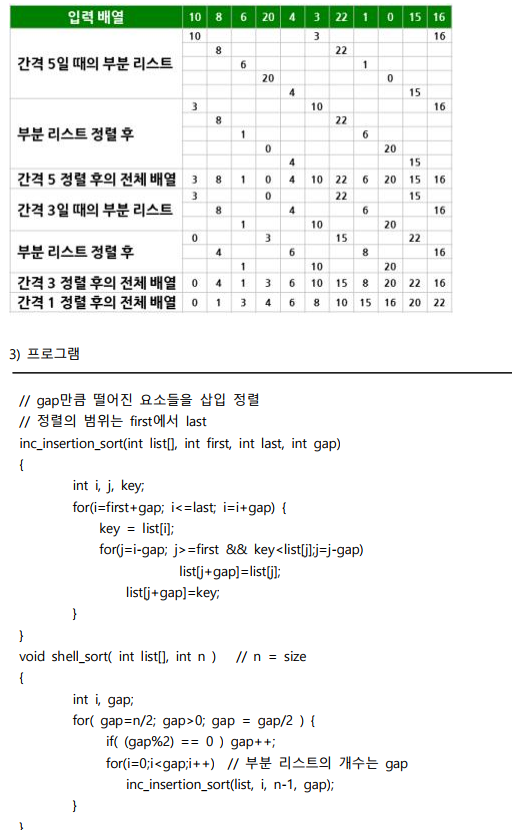

# 효율적인 정렬

---

# 탐색

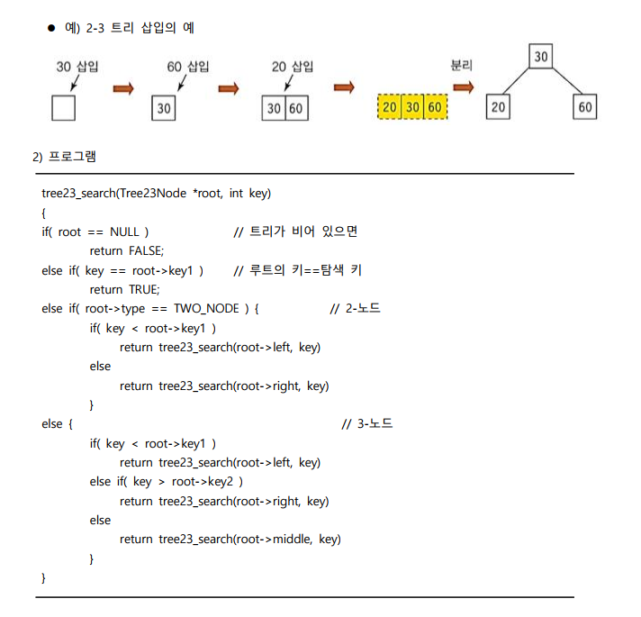

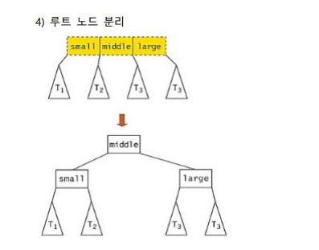

# 테이블

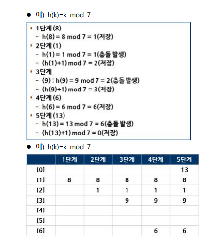

---

# 정리

## 트리의 응용

- 수식트리는 산술식 트리형태로 표현한 것이다.
- 수식트리는 후위순회를 사용한다.
- 디렉토리의 용량의 계산하는데 후위 트리 순회를 사용한다.
- 스레드 이진 트리는 이진트리의 NULL 링크를 이용하여 순환 호출 없이도 트리의 노드들을 순회한다.

## 이진 탐색 트리

- 이진 탐색 트리는 왼쪽 서브트리가 루트노드보다 같거나 작고, 또 루트노드보다는 오른쪽 서브트리가 같거나 크다는 성질을 가진다.
- 이진 탐색 트리에 원소를 삽입하기 위해서는 먼저 탐색을 수행하는 것이 필요하고, 탐색에 실패한 위치가 바로 새로운 노드를 삽입하는 위치이다.

## 힙

- 우선순위 큐는 우선순위를 가진 항목들을 저장하는 큐이다.
- 우선순위 큐는 2가지로 크게 최소 우선순위 큐와 최대 우선순위 큐로 구분한다.
- 힙에 있어서 삽입 연산은 회사에서 신입 사원이 들어오면 일단 말단 위치에 앉힌 다음에, 신입 사원의 능력을 봐서 위로 승진시키는 것과 비슷하다.
- 삭제 연산은 회사에서 사장의 자리가 비게 되면 먼저 제일 말단 사원을 사장 자리로 올린 다음에, 능력에 따라 강등시키는 것과 비슷하다.

## 힙 정렬

- 힙 정렬은 먼저 정렬해야 할 n개의 요소들을 최대 힙에 삽입하고, 한 번에 하나씩 요소를 힙에서 삭제하여 저장하면 된다.
- 머신 스케줄링은 LPT 방법을 사용한다.
- 이진 트리는 각 글자의 빈도가 알려져 있는 메시지의 내용을 압축하는데 사용될 수 있는데, 이런 종류의 이진트리를 허프만 코딩 트리라고 부른다.

## 그래프 표현

- 그래프는 연결되어 있는 객체 간의 관계를 표현하는 자료구조이다.
- 네트워크는 간선에 비용이나 가중치가 할당된 그래프이다.
- 차수는 하나의 정점에 연결된 다른 정점의 수이다.
- 그래프는 인접 행렬 또는 인접 리스트로 구현할 수 있다.

## 그래프 탐색

- 그래프 탐색은 하나의 정점으로부터 시작하여 차례대로 모든 정점들을 한 번씩 방문하는 것이다.
- 깊이 우선 탐색은 한 방향으로 갈 수 있을 때까지 가다가 더 이상 갈 수 없게 되면 가장 가까운 갈림길로 돌아와서 이곳으로부터 다른 방향으로 다시 탐색을 진행한다.
- 너비 우선 탐색은 시작 정점으로부터 가까운 정점을 먼저 방문하고 멀리 떨어져 있는 정점을 나중에 방문하는 순회 방법이다.

## 신장트리

- 신장트리는 그래프내의 모든 정점을 포함하는 트리이다.
- MST는 네트워크에 있는 모든 정점들을 가장 적은 수의 간선과 비용으로 연결한다.
- 크루스컬 알고리즘은 각 단계에서 최선의 답을 선택하는 과정을 반복함으로써 최종적인 해답에 도달한다.
- 프림 알고리즘은 시작 정점에서부터 출발하여 신장트리 집합을 단계적으로 확장해나간다.

## 최단경로

- 최단경로는 네트워크에서 정점 u와 정점v를 연결하는 경로 중에서 간선들의 가중치 합이 최소가 되는 경로이다.
- 다익스트라 알고리즘은 하나의 시작 정점에서 다른 정점까지의 최단경로를 계산한다.
- 프로이드 알고리즘은 모든 정점에서 다른 모든 정점까지의 최단경로를 계산한다.
- 위상 정렬은 방향 그래프 정점들의 선행 순서를 위배하지 않으면서 모든 정점을 나열한다.

## 비효율적인 정렬

- 선택 정렬은 초기에 왼쪽 리스트는 비어 있고, 정렬할 숫자들은 모두 오른쪽 리스트에 존재한다.
- 삽입 정렬은 정렬되어 있는 부분에 새로운 레코드를 옳은 위치에 삽입하는 과정을 반복한다.
- 버블 정렬은 인접한 2개의 레코드를 비교하여 순서대로 되어 있지 않으면 서로 교환한다.
- 쉘 정렬은 전체 리스트를 일정 간격의 부분 리스트로 나누고, 나누어진 각각의 부분 리스트를 삽입 정렬한다.

## 효율적인 정렬

- 합병 정렬은 리스트를 두 개의 균등한 크기로 분할하고 분할된 부분리스트를 정렬하고, 정렬된 두 개의 부분 리스트를 합하여 전체 리스트를 정렬한다.
- 퀵 정렬은 리스트를 2개의 부분리스트로 비균등 분할하고, 각각의 부분리스트를 다시 퀵 정렬한다.
- 기수 정렬은 버켓에 넣어다 빼는 것으로 낮은 자리수로 먼저 분류한 다음, 순서대로 읽어서 다시 높은 자리수로 분류한다.

## 탐색

- 순차 탐색은 정렬되지 않은 배열을 처음부터 마지막까지 하나씩 검사하는 방법이다.
- 이진 탐색은 정렬된 배열의 중앙에 있는 값을 조사하여 찾고자 하는 항목이 왼쪽 또는 오른쪽 부분 배열에 있는지를 알아내어 탐색의 범위를 반으로 줄여가며 탐색을 진행한다.
- AVL 트리는 모든 노드의 왼쪽과 오른쪽 서브트리의 높이 차가 1이하인 이진 탐색 트리이다.

## 테이블

- 해싱은 키 값에 대한 산술적 연산에 의해 테이블의 주소를 계산하여 항목에 접근한다.
- 해시 함수에는 제산, 폴딩, 중간제곱, 비트추출, 숫자분석 방법이 존재한다.
- 충돌 해결책에는 선형조사법과 체이닝이 존재한다.
