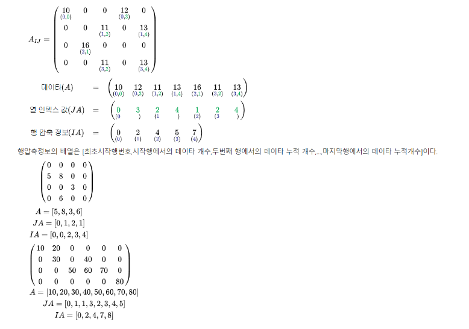

# 희소행렬

> 희소행렬(sparse matrix)은 행렬의 값이 대부분 0인 경우를 가리키는 표현이다.

## 희소행렬의 자료구조 저장법

- Dictionary of keys (DOK)
  - 사전식 키(Dictionary of keys, DOK) 방법은 행렬을 매핑된 연관 배열로 저장한다. 이때 키는 (행번호,열번호 .{인덱스})가 되며, 그에 대응하는 값은 행렬의 해당 값이 된다. 이때 행렬값이 0인 키는 저장하지 않는다. 일반적으로 이 형식으로 행렬을 구성한 다음 처리를 위해 보다 효율적인 다른 형식으로 변환하는 것이 가능하다.
- List of lists (LIL)
  - List of lists(LIL) 는 링크드 리스트 알고리즘을 이용한 저장 기법으로, 내용의 추가와 삭제가 용이하지만 CSR과 CSC에 비해 메모리가 낭비 되는 단점이 있다.
- Corrdinate list (COO)
  - 좌표리스트(Coordinate list, COO)는 (행, 열, 값)의 튜플 목록으로 저장된다. 이상적으로 이러한 튜플목록의 항목들은 임의 액세스 시간을 향상시키기 위해 (행 index 다음에 열 index별로) 정렬될 수 있다. 이는 점진적 행렬 구성에 유용한 또 다른 형식이다.
- Compressed Aparse Row (CSR or CRS)
  - 가로의 순서대로 재정렬하는 방법으로 행에 관여하여 정리 압축한 것을 CSR이라고 한다.
  - 
- Compressed sparse column (CSC or CCS)
  - 가로와 세로의 순서대로 재정렬하는 방법으로 행에 관여하여 정리한 것을 CSR 열에 관하여 정렬한 것을 CSC라고 명한다. 저장 알고리즘은 동일하다. LIL에 비해 메모리를 70% 이상 줄일 수 있는 장점이 있고, 단점으로는 추가와 삭제가 용이하지 않다는 점이 있다.

### Compression 행렬 만들기

|       | col 0 | col 1 | col 2 | col 3 | col 4 | col 5 |
| :---: | :---: | :---: | :---: | :---: | :---: | :---: |
| row 0 |  15   |   0   |   0   |  22   |   0   |  -15  |
| row 1 |   0   |  11   |   3   |   0   |   0   |   0   |
| row 2 |   0   |   0   |   0   |  -6   |   0   |   0   |
| row 3 |   0   |   0   |   0   |   0   |   0   |   0   |
| row 4 |  91   |   0   |   0   |   0   |   0   |   0   |
| row 5 |   0   |   0   |  28   |   0   |   0   |   0   |

위의 희소행렬을 아래의 Compression 행렬에 저장하기

|                                   | row | col | value |
| :-------------------------------: | :-: | :-: | :---: |
|   [0] - 압축 전 행렬의 행과 열    |  6  |  6  |   8   |
| [1] - 이하 0이 아닌 행렬의 인덱스 |  0  |  0  |  15   |
|                [2]                |  0  |  3  |  22   |
|                [3]                |  0  |  5  |  -15  |
|                [4]                |  1  |  1  |  11   |
|                [5]                |  1  |  2  |   3   |
|                [6]                |  2  |  3  |  -6   |
|                [7]                |  4  |  0  |  91   |
|                [8]                |  5  |  2  |  28   |

#### 압축 결과

```javascript
// before
let A = [
  [15, 0, 0, 22, 0, -15],
  [0, 11, 3, 0, 0, 0],
  [0, 0, 0, -6, 0, 0],
  [0, 0, 0, 0, 0, 0],
  [91, 0, 0, 0, 0, 0],
  [0, 0, 28, 0, 0, 0],
];

// after
let compressedA = [
  [6, 6, 8],
  [0, 0, 15],
  [0, 3, 22],
  [0, 5, -15],
  [1, 1, 11],
  [1, 2, 3],
  [2, 3, -6],
  [4, 0, 91],
  [5, 2, 28],
];
// or
let compressedA_D1 = [
  { row: 6, col: 6, value: 8 },
  { row: 0, col: 0, value: 15 },
  { row: 0, col: 3, value: 22 },
  { row: 0, col: 5, value: -15 },
  { row: 1, col: 1, value: 11 },
  { row: 1, col: 2, value: 3 },
  { row: 2, col: 3, value: -6 },
  { row: 4, col: 0, value: 91 },
  { row: 5, col: 2, value: 28 },
];
```
