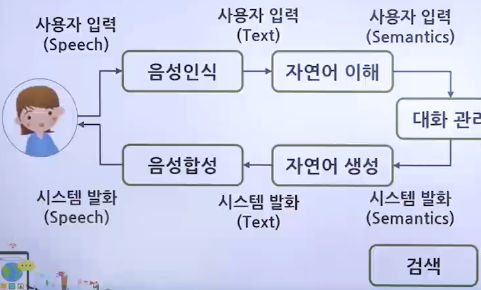
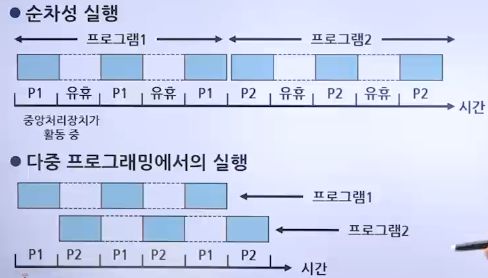
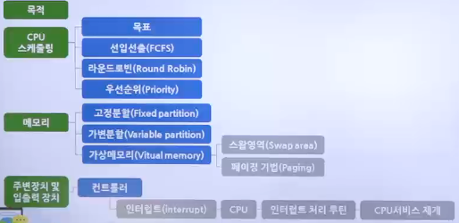

# 운영체제의 발전과정

## 운영체제 (Operating System)

- 일반 컴퓨터, 노트북, 스마트폰의 전원을 켜면 가장 먼저 만나게 되는 소프트웨어
- ex. Linux, FreeBSD, winOS, MacOS, android, iOS

### 임베디드 운영체제

- CPU의 성능이 낮고 메모리 크기도 작은 시스템에 내장하도록 만든 운영체제
- 임베디드 운영체제의 기계는 기능을 계속 향상할 수 있음

## 운영체제의 발전과정

| 년대 | 처리 방식                 | 특징                                                                                                                                                                                                                                                           |
| ---- | ------------------------- | -------------------------------------------------------------------------------------------------------------------------------------------------------------------------------------------------------------------------------------------------------------- |
| 1940 | 초기 전자식 디지털 컴퓨터 | - 운영체제 없음   - 단순한 기계적인 스위치에 의존                                                                                                                                                                                                           |
| 1950 | 단순 순차처리             | - 한 번에 하나의 일만 처리   IBM701용 운영체제 개발(GM)                                                                                                                                                                                                     |
| 1960 | 다중 프로그래밍           | - 1964년 IBM S/360 운영체제 개발 - 멀티 프로그래밍, 시분할, 멀티 프로세싱 개념 대두   - 멀티 모드 시스템 보편화                                                                                                                                          |
| 1970 | 다중모드 시분할           | - 일괄 처리, 시분할 처리, 실시간 처리 방식의 보편화   - 근거리 지역네트워크 이더넷 표준에 의해 실용화   - 정보보안 문제와 암호의 필요성 대두                                                                                                             |
| 1980 | 분산 네트워크             | - 각종 응용프로그램 개발 및 데이터베이스 활용 확대   - 네트워크를 기반으로 클라이언트/서버 모델의 확대                                                                                                                                                      |
| 1990 | 병렬계산/분산계산         | - 중앙집중이 아닌 분산으로 발전   - 네트워크와 멀티미디어 처리 기술의 발달   - 그래픽 사용자 인터페이스(GUI)의 강화   - 선점형, 멀티태스킹, 멀티스레딩, 가상 메모리 보편화   - PC용 운영체제(윈도우, Mac)와 서버용 운영체제(유닉스, 리눅스) 보편화 |
| 2000 | 모바일 및 임베디드        | - 시스템이 초고속화, 고기능화, 초경량화 방향으로 발전   - 통신망 확대와 개방형 시스템의 발달  - PDP,PMP 등 모바일 장치와 가전제품을 위한 모바일 및 임베디드 운영체제의 보편화   -64비트 CPU에 호환되는 64비트 운영체제                                |

### 초창기 컴퓨터 (1940년대)

- 에니악
  - 백열전구 같은 모양의 진공관이라는 소자를 사용하여 진공관이 켜지면 1, 꺼지면 0이라고 판단
  - 전선을 연결하여 논리회로를 구성하는 '하드와이어링' 방식으로 동작
  - 운영체제가 없음

### 일괄 작업 시스템(1950년대)

- 천공카드 시스템
  - 천공카드 리더를 입력장치로, 라인 프린터를 출력장치로 사용
  - 프로그램을 구성한 후 카드에 구멍을 뚫어 컴퓨터에 입력하면 프로그램이 실행되는 구조로서 프로그램의 실행 결과가 라인 프린터를 통해 출력
- 일괄 작업 시스템
  - 천공카드리더기(입력)와 라인프린터(출력) 사용
    - 모든 작업을 한꺼번에 처리하고 프로그램 실행 중간에 사용자가 데이터를 입력/수정하는 것이 불가능한 시스템
  - 운영체제 사용
    - 메인 메모리가 운영체제의 상주 영역과 사용자의 영역으로 나뉨
  - 일괄처리 과정
    1. 원시 데이터 수집
    2. 분류 및 처리
    3. 컴퓨터
    4. 보고서
    5. 파일

### 대화형 시스템(1960년대 초반)

- 모니터와 키보드의 등장
  - 프로그램 진행 중에 사용자로부터 입력을 받을 수 있어 입력 값에 따라 작업의 흐름을 바꾸는 것이 가능한 시스템
  - 대화형 시스템의 등장으로 문서 편집기, 게임과 같은 다양한 종류의 응용 프로그램을 만들 수 있게 됨
  - 대화형 시스템 구성
    - 

### 시분할 시스템(1960년대 후반)

- 다중 프로그래밍
  - 하나의 CPU로 여러 작업을 동시에 실행하는 기술
  - 한 번에 하나의 작업만 가능한 일괄 적업 시스템에 비해 효율성이 뛰어남
  - 시간을 분할하는 방법 때문에 여러 작업이 동시에 실행되는 것처럼 보임
  - CPU 사용 시간을 아주 잘게 쪼개어 여러 작업에 나눠줌
- 시분할 시스템
  - CPU 사용 시간을 잘개 쪼개어 작업에 나누어줌으로써 모든 작업이 동시에 처리되는 것처럼 보임
  - 잘게 나뉜 시간 한 조각을 타임 슬라이스 또는 타임 퀀텀이라고 함
  - 오늘날의 컴퓨터에는 대부분 시분할 시스템이 사용됨
  - 

### 분산 시스템(1970년대 후반)

- 개인용 컴퓨터와 인터넷이 보급되면서 값이 싸고 크기가 작은 컴퓨터를 하나로 묶어서 대형 컴퓨터의 능력에 버금가는 시스템을 만들 수 있게 됨
- 네트워크 상에 분산되어 있는 여러 컴퓨터로 작업을 처리하고 그 결과를 상호 교환하도록 구성하는 시스템

### 클라이언트 및 서버 시스템(1990년대~현재)

- 작업을 요청하는 클라이언트와, 이에 응답하여 요청 받은 작업을 처리하는 서버의 이중구조로 나뉨
- 웹 시스템이 보급된 이후 일반인들에게 알려짐

### P2P 시스템(2000년대 초반~현재)

- 클라이언트/서버 구조의 단점인 서버 과부하를 해결하기 위해 만든 시스템
- 서버를 거치지 않고 사용자와 사용자를 직접 연결
- 냅스터(mp3 공유 시스템)에서 시작하여 현재는 메신저, 토렌트 시스템에서 사용
- 사용예시
  - 메신저
    - P2P 기술은 불법 소프트웨어 기술 규제 때문에 발전하지 못하다가 메신저 프로그램에 도입되어 큰 발전을 이룸
    - 수만 명이 동시에 채팅을 하고 파일을 주고받는 메신저 시스템은 P2P 기술을 이용하면 서버의 부하 없이 구현할 수 있음
  - 파일 공유
    - 10명에게 데이터를 받는다면 1명에게 데이터를 받을 때보다 속도가 10배 빠를 뿐 아니라, 데이터를 받는 도중 1-2명이 프로그램을 중단해도 다른 사람에게 나머지를 받을 수 있음

### 기타 컴퓨팅 환경(2000년대 초반~현재)

- 그리드 컴퓨팅
  - 필요한 기간만큼만 컴퓨터를 사용하고 사용한 금액만큼만 돈을 지불할 수 있는 컴퓨팅 환경
  - 서로 다른 기종의 컴퓨터들을 묶어 대용량의 컴퓨터 풀을 구성하고 이를 원격지와 연결하여 대용량 연산을 수행하는 컴퓨팅 환경
  - 그리드가 하드웨어적인 컴퓨팅 환경의 통합이라고 한다면 SaaS(Software as a Service)는 사용자가 필요한 소프트웨어 기능만을 필요할 때 이용하고, 이용한 기능만큼만 비용을 지불하는 개념
  - CPU 관리, 저장소 관리, 보안 조항, 데이터 이동, 모니터링과 같은 서비스를 위한 표준 규약 생성에 기여
- 클라우드 컴퓨팅
  - 언제 어디서나 응용 프로그램과 데이터를 자유롭게 사용할 수 있는 컴퓨팅 환경으로 그리드 컴퓨팅과 SaaS를 합쳐놓은 형태
  - PC, 핸드폰, 스마트 기기 등을 통해 인터넷에 접속하고, 다양한 작업을 수행하며 데이터 또한 기기들 사이에서 자유롭게 이동이 가능함
  - 하드웨어를 포함한 시스템이 구름에 가려진 것처럼 사용자에게 보이지 않는 컴퓨팅 환경이라는 의미
- 사물 인터넷(IoT, Internet of Thing)
  - 사물에 센서와 통신 기능을 내장, 인터넷에 연결하는 기술
    - 전철, 버스의 도착 예정 시간 표시
    - 각종 전자제품의 스마트 폰 제어, 알림 문자 등의 서비스
  - 커넥트 카, 에너지를 제어하는 스마트 그리드, 공공기물을 관리하는 스마트 시티, 사물인터넷을 응용한 재난 방지 시스템 등 다양한 분야에 적용
  - 인터넷으로 연결된 사물들이 데이터를 주고받아 스스로 분석하고 학습한 정보를 사용자에게 제공하거나 새로운 서비스를 창출

## 운영체제의 정의

> 운영체제란, 응용 프로그램, 사용자에게 컴퓨터 자원을 사용할 수 있는 인터페이스를 제공하고 그 결과를 돌려주는 시스템 소프트웨어이다.

- 응용 프로그램이나 사용자에게 모든 컴퓨터 자원을 숨기고 정해진 방법으로만 컴퓨터 자원을 사용할 수 있도록 제한한다.

## 운영체제의 역할

### 프로세스 관리

- 프로세스(Process)는 일반적으로 수행 중인(Executing) 프로그램을 의미
- '수행 중(Executing)'은 프로그램이 컴퓨터 시스템에 입력되어 운영체제에 등록되어 있음을 의미함 => 실행(Running)됨을 의미하는 것이 아님
- 프로세스는 실행 상태(Running state), 실행 준비상태(Ready state), 대기 상태(Blocked state)로 구분됨
- 운영체제는 시스템 내 각 프로세스들이 어떤 상태로 있는지, 특정 상태에 있는 프로그램들이 어떤 요구를 하였고 어떤 사건(Event)을 기다리고 있는지, 지금까지의 총 실행 시간이 얼마인지 등을 기억하고 있음

### 프로세서 관리

- 프로세서는 프로그램을 실행시키는 컴퓨터의 핵심적인 자원으로, 프로세서의 효율적인 관리는 매우 중요함
- CPU가 여러 개 있는 병렬처리 시스템에서 각 프로세스들을 어느 프로세서에 배당하여 처리하도록 할 것인지를 결정하는 것이 중요하며 스케줄러(Scheduler)가 담당함

### 입출력장치 관리

### 기억장치 관리

- 사용자가 프로그램을 실행하기 위해서는 해당 프로그램을 보조기억장치로부터 읽어 주 기억장치에 적재해야 함
- 주 기억장치는 용량이 작고 가격이 비싸기 때문에 실행하고자 하는 모든 프로그램들과 데이터를 주 기억장치에 적재하는 것을 불가
- 최근 주기억장치 하드웨어의 가격이 낮아지고 그 용량이 증대하고 있으나 응용 프로그램의 크기도 증가하므로 모든 프로그램을 주 기억장치에 적재하는 것은 아직 이름
- 주 기억장치의 용량이 아무리 증가해도 응용 프로그램의 크기가 함께 증가할 것이므로 영원히 모든 프로그램들을 주 기억장치에 상주시키지는 못함

### 자원 관리

- 크게 소프트웨어 관리와 하드웨어 관리로 구분
- 

## 운영체제의 목표

| 역할                     | 목표   |
| ------------------------ | ------ |
| 자원 관리                | 효율성 |
| 자원 보호                | 안정성 |
| 하드웨어 인터페이스 제공 | 확장성 |
| 유저 인터페이스 제공     | 편리성 |

- 효율성
  - 자원을 효율적으로 관리하는 것
  - 같은 자원을 사용하여 더 많은 작업량을 처리하거나, 같은 작업량을 처리하는데 보다 적은 자원을 사용하는 것
- 안정성
  - 작업을 안정적으로 처리하는 것
  - 사용자와 응용 프로그램의 안전 문제와 하드웨어적인 보안 문제 처리
  - 시스템에 문제가 발생했을 때 이전으로 복구하는 결함 포용 기능 수행
- 확장성
  - 다양한 시스템 자원을 컴퓨터에 추가하거나 제거하기 편리한 것
- 편리성
  - 사용자가 편리하게 작업할 수 있는 환경을 제공하는 것
