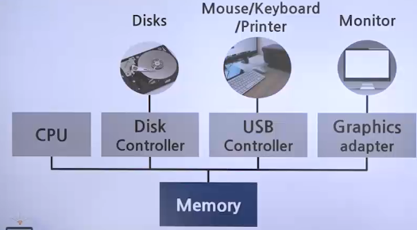
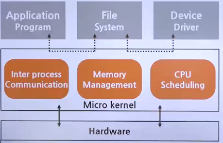
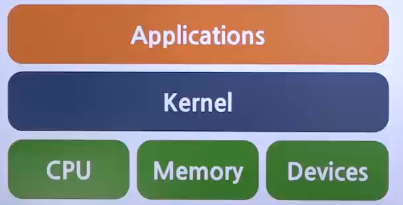
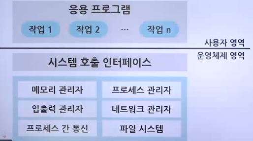
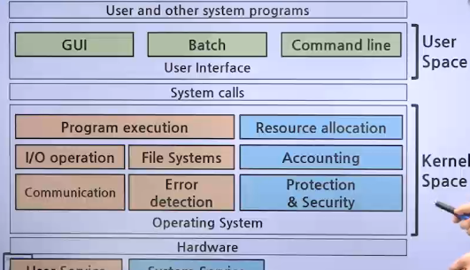

# 운영체제의 구조

## 현대의 컴퓨터 환경

### 커널과 인터페이스

- 커널
  - 프로세스 관리, 메모리 관리, 저장장치 관리와 같은 운영체제의 핵심적인 기능을 모아놓은 것
- 인터페이스
  - 커널에 사용자의 명령을 전달하고 실행 결과를 사용자에게 알려주는 역할
  - GUI(graphical User Interface): 그래픽을 사용한 인터페이스
- 사용자 인터페이스(UI)
  - 

### 시스템 호출과 디바이스 드라이버

- 시스템 호출
  - 커널이 자신을 보호하기 위해 만든 인터페이스
  - 커널은 사용자, 응용 프로그램으로부터 컴퓨터 자원을 보호하기 위해 자원에 직접 접근하는 것을 차단
  1. 직접 접근
     - 두 응용 프로그램이 자기 마음에 드는 위치에 데이터를 저장하려고 함
     - 다른 사람의 데이터를 지울 수도 있고 내 데이터가 다른 사람에 의해 지워질 수도 있음
  2. 시스템 호출을 통한 접근
     - 응용 프로그램이 직접 하드디스크에 데이터를 저장하지 않고 커널이 제공하는 write() 함수를 사용하여 데이터를 저장하라고 요청
     - 커널이 데이터를 가져오거나 저장하는 것을 전적으로 책임지기 때문에 컴퓨터 자원 관리가 수월
  3. 시스템 호출 정리
     - 시스템 호출은 커널이 제공하는 시스템 자원의 사용과 연관된 함수
     - 응용 프로그램이 하드웨어 자원에 접근하거나 운영체제가 제공하는 서비스를 이용하려 할 때는 시스템 호출을 상요해야 함
     - 운영체제는 커널이 제공하는 서비스를 시스템 호출로 제한하고 다른 방법으로 커널에 들어오지 못하게 막음으로써 컴퓨터 자원을 보호
     - 시스템 호출은 커널이 제공하는 서비스를 이용하기 위한 인터페이스이며, 사용자가 자발적으로 커널 영역에 진입할 수 있는 유일한 수단임
- 디바이스 드라이버
  - 커널과 하드웨어의 인터페이스를 담당
  - 마우스 같은 간단한 제품은 드라이버를 커널이 가지고 있으나, 그래픽 카드 같은 복잡한 하드웨어의 경우 제작자가 드라이버를 제공
  - 마이크로 커널 구조
    - 

### 커널의 구성

1. 단일형 구조 커널
   - 초창기의 운영체제 구조
   - 커널의 핵심 기능을 구현하는 모듈들이 구분 없이 하나로 구성
   - 
   - 장점
     - 모듈 간의 통신 비용 감소로 효율적인 운영 가능
   - 단점
     - 모든 모듈이 하나로 묶여 있기 때문에 버그, 오류 처리가 어려움
     - 운영체제의 여러 기능이 서로 연결되어 있어 상호 의존성이 높기 때문에 기능상의 작은 결함이 시스템 전체로 확산될 수 있음
     - 다양한 환경의 시스템에 적용하기 어려움
     - 현대의 운영체제는 매우 크고 복잡하기 때문에 완전 단일형 구조의 운영체제를 구현하기가 어려움
2. 계층형 구조 커널
   - 비슷한 기능을 가진 모듈을 묶어 하나의 계층으로 만들고 계층 간의 통신을 통해 운영체제를 구현하는 방식
   - 
3. 마이크로 구조 커널
   - 프로세스 관리, 메모리 관리, 프로세스 간 통신 관리 등 가장 기본적인 기능만 제공
   - 커널의 각 모듈은 세분화되어 존재하고 모듈 간의 정보 교환은 프로세스 간 통신을 이용하여 이루어짐
4. 가상 머신
   - 운영체제와 응용 프로그램 간에 작동하는 프로그램
   - 가상 머신을 설치하면 응용 프로그램이 모두 동일한 환경에서 작동하는 것처럼 보임
   - JAVA는 Unix와 Window에서 작동하는 다양한 가상머신을 만들어 배포하는데, 이를 자바 가상머신(JVM, Java Virtual Machine)이라고 함

## 유닉스와 리눅스 (Unix - Linux)

- 유닉스의 개발과 확산
  - 1969 켄 톰프슨의 새로운 운영체제 구현 시도
    - AT&T 연구원으로서 멀틱스 프로젝트에 참가하던 켄 톰프슨은 사무실에서 안 쓰던 PDP-7 컴퓨터에 멀틱스와 비슷한 개념의 운영체제를 구현하려 함
  - 멀틱스에서 유닉스로의 새로운 탄생
    - 멀틱스 프로젝트 진행이 수월하지 않던 차에 흥미를 느낀 데니스 리치와 피터 뉴만도 함께 하며, 운영체제의 이름을 단순하다는 의미의 '유닉스'로 지음
  - 유닉스의 인기
    - 이식하기 쉬웠던 탓에 유닉스는 인기를 얻음
  - 소스코드 공개를 통한 확산
    - 개발 후 소스코드가 공개되자, 계속해서 다른 기종의 컴퓨터에 이식되었고 여러 기업과 대학에서 이를 이용한 연구가 진행되어 다양한 기능이 추가됨
- 리눅스의 개발
  - 1991년 리누스 토르발스가 PC에서 동작하는 유닉스 호환 커널을 작성하여 GPL로 배포
  - 소스코드도 공개한 것이 리눅스의 시작

## 모바일 운영체제

### 스마트폰의 등장

- 애플의 스마트폰 시장 작악
- 타 회사 또한 스마트폰 개발에 주력
- 구글이 모바일용 운영체제인 안드로이드 개발
  - 현재 아이폰을 제외한 대부분의 스마트폰은 안드로이드 운영체제를 사용

### 안드로이드의 특징

- GNU의 리눅스 커널을 사용하여 제작되었기 때문에 GPL 따름
- 누구나 무료로 사용 가능
- 새로운 버전과 동시에 소스코드도 공개하기 때문에 누구나 수정/배포할 수 있음
- 스마트폰 제조사들은 대부분 안드로이드의 소스코드를 자사 제품에 맞게 수정하여 무료로 배포하고 있음
