# 컴퓨터의 기본 구성, CPU와 메모리

## 컴퓨터 하드웨어의 특성

### 하드웨어의 구성

- 필수장치
  - 중앙처리장치(CPU)
  - 메인 메모리(대부분의 작업이 이루어짐)
- 주변장치
  - 입력장치
  - 출력장치
  - 저장장치

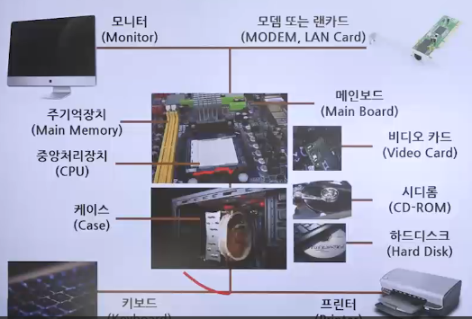

- 용어 정리
  - 메인 메모리 : 메모리(주기억장치 - RAM 등)
  - 보조저장장치 : 저장장치(usb, hdd, ssd 등)
  - 중앙처리장치 : CPU

 
 

- CPU
  - 명령어를 해석하여 실행하는 장치
  - 인간으로 치면 두뇌에 해당
- 메모리
  - 작업에 필요한 프로그램과 데이터를 저장하는 장소
  - 바이트 단위로 분할되어 있으며 분할 공간마다 주소로 구분
- 입/출력장치
  - 입력장치 : 외부 데이터를 컴퓨터에 입력하는 장치
  - 출력장치 : 컴퓨터에서 처리한 결과를 사용자가 원하는 형태로 출력하는 장치
- 저장장치
  - 메모리보다 느리지만 저렴하고 용량이 큼
  - 전원 온/오프와 상관없이 데이터가 영구적으로 저장됨
  - 느린 저장장치를 사용하는 이유는 저장 용량에 비해 가격이 저렴하기 때문
  - 저장장치의 종류
    - 자성 이용 장치
      - 카세트테이프
      - 플로피디스크
      - 하드 디스크 등
    - 레이저 이용 장치
      - CD
      - DVD
      - 블루레이 디스크 등
    - 메모리 이용 장치
      - USB 드라이버
      - SD카드
      - CF카드
      - SSD 등
- 메인보드
  - CPU와 메모리 등 다양한 부품을 연결하는 커다란 판
  - 다양한 장치들을 버스(Bus)로 연결함
    - Bus: 데이터가 지나다니는 통로
  - 그래픽카드, 사운드카드, 랜카드 등이 기본으로 장착되어 있거나, 성능을 향상하기 위해 따로 장착하기도 함
  - 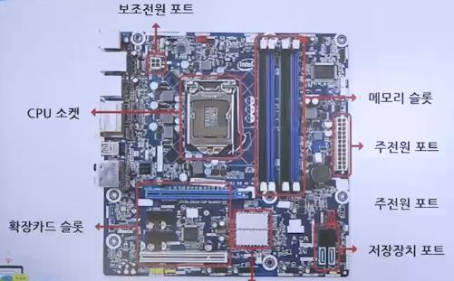

### 폰노이만 구조

- CPU, 메모리, 입출력장치, 저장장치가 버스로 연결된 구조
- 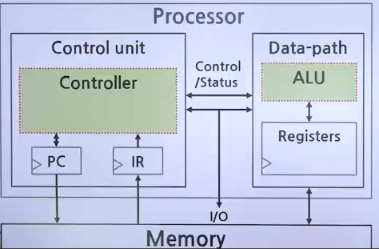
- 프로그램은 하드디스크와 같은 저장 장치에 담겨 있음
- 저장장치에서 바로 실행할 수 없고 메모리로 가지고 올라와야 실행이 가능하다는 것이 폰노이만 구조의 가장 큰 특징
  - 메인 메모리가 유일한 작업 공간이며, 메모리 관리가 중요한 이슈임

### 요리사 모형

> 운영체제의 여러 가지 현상에 대한 이해를 돕기 위한 것

- 폰 노이만 구조와 요리사 모형
  - 요리사(CPU)가 요리를 하려면 보관 창고(저장장치)에 있는 재료를 도마(메모리)로 가져와야 함
    - 주방에서는 도마(메모리)가 핵심적인 작업 공간임
    - 보관 창고(저장장치)는 보조적인 공간임
- 메인 메모리가 작으면 컴퓨터가 느려지는 이유
  - 도마가 클 경우
    - 재료를 전부 올려 놓고 요리할 수 있다면 작업 속도에 영향을 미치지 않음
  - 도마가 작은 경우
    - 재료 하나를 다듬어 보관 창고에 가져다 놓은 뒤, 다른 재료를 가져와야 하므로 재료를 손질하는 시간보다 보관 창고로 옮기는 시간이 많이 걸려 작업 속도가 떨어짐
- 메모리의 이동
  1. 메모리 밀도
     - 메모리 밀도는 이사용 트럭의 크기와 같음
     - 트럭 사이즈가 클수록 더 많은 상자와 가구를 넣을 수 있음
  2. 메모리 속도
     - 메모리 속도는 이사하는 사람이 이사 트럭에 상자와 가구를 싣고 빼는 속도와 비교할 수 있음
  3. CPU, 마더보드 및 기타 요소의 제한
     - 이사 트럭이 이동하는 길, 차선의 수, 속도의 제한은 컴퓨터의 CPU, 마더보드 및 기타 요소의 제한과 비슷함
  4. 트럭의 크기와 이사하는 사람의 속도
     - 트럭의 크기와 이사하는 사람의 속도가 증가할수록 이사가 더 빠르고 편리해지며, 이사할 것이 많을수록 이 두 가지 요소의 장점이 더 잘 드러남
       - 트럭이 더 크고 이사하는 사람이 더 빠를 경우 엄청난 도움을 주지만, 가장 중요한 것은 우선적으로 필요한 모든 것을 트럭(메모리 밀도)에 넣어 이사하는 사람(메모리 속도)이 더 효율적으로 작업할 수 있도록 하는 것

### 하드웨어 사양 관련 용어

1. 클럭(Clock)
   - CPU의 속도와 관련 단위
   - 클럭이 일정 간격으로 틱(Tick)을 만들면 거기에 맞추어 CPU 안의 모든 구성 부품이 작업함
   - 틱은 펄스(Pulse) 또는 클럭 틱(Clock tick)이라고도 부름
2. 헤르츠(Hz)
   - 클럭 틱이 발생하는 속도를 나타내는 단위
   - 1초에 클럭 틱이 한 번이면 1Hz, 1,000번이면 1kHz(1,000Hz)
   - 3.4GHz는 1 초에 클럭 틱이 3,400,000,000(3,4\*109)번 발생하여 CPU가 1초에 약 34억 번의 연산(작업)을 할 수 있음을 의미
3. 시스템 버스
   - 메모리와 주변장치를 연결하는 버스
   - FSB(Front-Side Bus) : 전면 버스라고 함
4. CPU 내부 버스
   - CPU 내부에 있는 장치를 연결하는 버스
   - BSB(Back-Side Bus) : 후면 버스라고 함

#### CPU와 메모리의 속도

- CPU는 CPU 내부 버스(BSB)의 속도로 작동하고 메모리는 시스템 버스(FSB)의 속도로 작동
- 두 버스의 속도 차이로 인하여 작업이 지연되며, 이 문제를 캐시(Cache)로 해결

## CPU와 메모리 구성과 동작

### 산술논리 연산장치

> 산술논리 연산장치 : 데이터의 덧셈, 뺄셈, 곱셉, 나눗셈 같은 산술 연산과 AND, OR 같은 논리 연산을 수행

- 제어장치 : CPU에서 작업을 지시
- 레지스터 : CPU 내 데이터를 임시로 보관

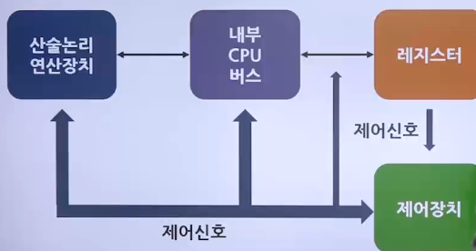

### CPU의 구성과 동작

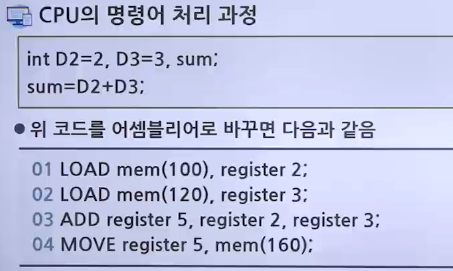

- 01행: 메모리의 100번지(D2)에 있는 값을 레지스터 2로 가져옴
- 02행: 메모리의 120번지(D3)에 있는 값을 레지스터 3으로 가져옴
- 03행: 레지스터 2와 3에 저장된 값을 더한 결과를 레지스터 5에 넣음
- 04행: 레지스터 5의 값을 160번지(sum)로 옮김

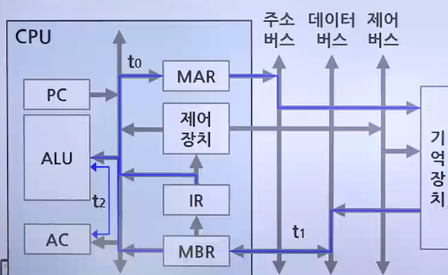

#### 레지스터 종류와 기능

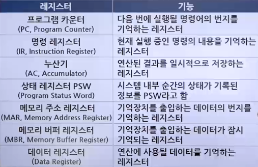

#### 프로그램 상태 레지스터의 역할

- 연산 결과가 양수인지, 음수인지, 0이 아닌지, 자리 올림이 있는지 등 프로그램의 상태를 저장
  - 분기조건이 있는 프로그램
  - 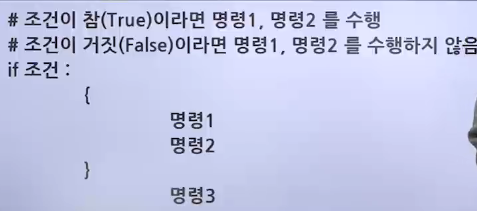

#### 버스의 종류

- 제어 버스
  - 제어장치와 연결된 버스로, CPU가 메모리와 주변장치에 제어 신호를 보내기 위해 사용
  - 메모리와 주변장치에서도 작업이 완료되거나 오류가 발생하면 제어 신호를 보내기 때문에 양방향임
- 주소 버스
  - 메모리 주소 레지스터와 연결된 버스
  - 메모리나 주변장치에 데이터를 읽거나 쓸 때 위치 정보를 보내기 위해 사용하며 단방향임
- 데이터 버스
  - 메모리 버퍼 레지스터와 연결된 버스
  - 데이터의 이동이 양방향으로 이루어짐
- 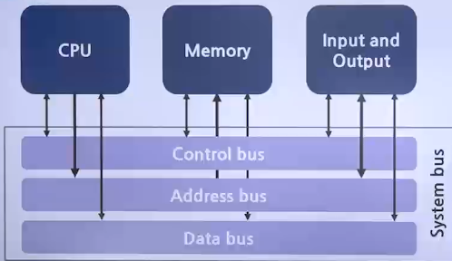

#### 버스의 대역폭

- 한 번에 전달할 수 있는 데이터의 최대 크기
- CPU가 한 번에 처리할 수 있는 데이터의 크기와 같음
- CPU가 한 번에 처리할 수 있는 최대 데이터 크기
  - 워드(Word)라 부름
- 32bit CPU는 메모리에서 데이터를 읽거나 쓸 때 한 번에 최대 32bit를 처리할 수 있으며, 이 경우 레지스터의 크기도 32bit, 버스의 대역폭도 32bit
- 버스의 대역폭, 레지스터의 크기, 메모리에 한 번에 저장할 수 있는 데이터의 크기는 항상 같음

### 메모리의 종류

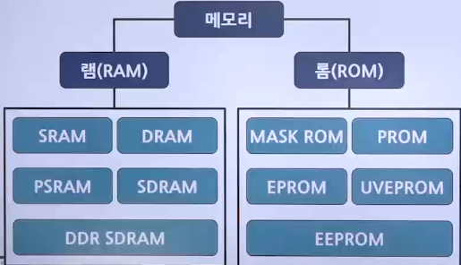

- 램(RAM)의 종류
  1. 휘발성 메모리
     - DRAM(Dynamic RAM)
       - 저장된 0과 1의 데이터가 일정 시간이 지나면 사라지므로 일정 시간마다 다시 재생시켜야 함
     - SRAM(Static RAM)
       - 전력이 공급되는 동안에는 데이터를 보관할 수 있어 재생할 필요가 없음
     - SDRAM(Synchronous Dynamic Random Access Memory)
       - 클럭 틱(펄스)이 발생할 때마다 데이터를 저장하는 동기 DRAM
  2. 비휘발성 메모리
     - 플래시 메모리(Flash memory)
       - 디지털카메라, MP3 플레이어, USB 드라이버 같이 전력이 없어도 데이터를 보관하는 저장장치
     - SSD
       - 가격이 비싸지만 빠른 데이터 접근 속도, 저전력, 내구성 때문에 많이 사용
- 롬(ROM)의 종류
  - 마스크 롬(mask ROM)
    - 데이터를 지우거나 쓸 수 없음
  - PROM(Programmable ROM)
    - 전용 기계를 이용하여 데이터를 한 번만 저장할 수 있음
  - EPROM(Erasable Programmable ROM)
    - 데이터를 여러 번 쓰고 지울 수 있음

### 메모리 보호의 필요성

- 현대의 운영체제는 시분할 기법을 사용하여 여러 프로그램을 동시에 실행하므로 사용자 영역이 여러 개의 작업 공간으로 나뉘어 있음
- 메모리가 보호되지 않으면 어떤 작업이 다른 작업의 영역을 침범하여 프로그램을 파괴하거나 데이터를 지울 수도 있음
- 최악의 경우 운영체제 영역을 침범하면 시스템이 멈출 수도 있음

### 메모리 보호 방법

- 작업의 메모리 시작 주소를 경계 레지스터에 저장 후 작업
- 작업이 차지하고 있는 메모리의 크기, 즉 마지막 주소까지의 차이를 한계 레지스터에 저장
- 사용자의작업이 진행되는 동안 이 두 레지스터의 주소 범위를 벗어나는지 하드웨어적으로 점검
- 두 레지스터의 값을 벗어나면 메모리 오류와 관련된 인터럽트가 발생
- 메모리 영역을 벗어나서 발생한 인터럽트의 경우 운영체제가 해당 프로그램을 강제 종료

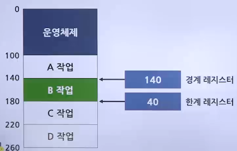
