# 컴퓨터 성능 향상 기술, 병렬 처리

## 버퍼

> 버퍼 : 속도에 차이가 있는 두 장치 사이에서 그 차이를 완화하는 역할을 하는 장치

- 일정량의 데이터를 모아 옮김으로써 속도의 차이를 완화
- 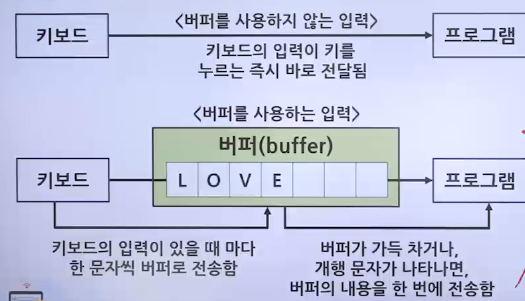

### 스풀

> 스풀 : CPU와 입출력장치가 독립적으로 동작하도록 고안된 소프트웨어적인 버퍼

- ex. 스풀러
  - 인쇄할 내용을 순차적으로 출력하는 소프트웨어로 출력 명령을 내린 프로그램과 독립적으로 동작
  - 인쇄물이 완료될 때까지 다른 인쇄물이 끼어들 수 없으므로 프로그램 간에 배타적임
  - 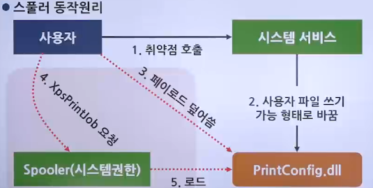

### 캐시

> 캐시 : 메모리와 CPU 간의 속도 차이(BSB와 FSB의 속도 차이)를 완화하기 위해 메모리의 데이터를 미리 가져와 저장해두는 임시 장소

- 필요한 데이터를 모아 한꺼번에 전달하는 버퍼의 일종으로 CPU가 사용할 것으로 예상되는 데이터를 미리 가져다 놓음
- CPU는 메모리에 접근해야 할 때 캐시를 먼저 방문하여 원하는 데이터가 있는지 찾아봄
- 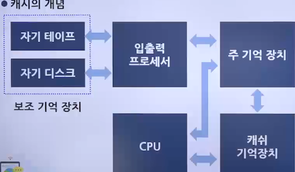
- 캐시의 구조
  - 캐시 히트(Cache hit)
    - 캐시에서 웡ㄴ하는 데이터를 찾는 것, 그 데이터를 바로 사용
  - 캐시 미스(Cache miss)
    - 원하는 데이터가 캐시에 없으면 메모리에서 데이터를 찾음
  - 캐시 적중률(Cache hit ratio)
    - 캐시 히트가 되는 비율, 일반적인 캐시 적중률은 약 90%
- 캐시의 동작
  - 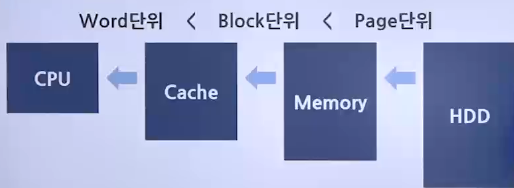

 

1. 즉시 쓰기(Write through)
   - 캐시에 있는 데이터가 변경되면 이를 즉시 메모리에 반영하는 방식
   - 메모리와의 빈번한 데이터 전송으로 인해 성능이 느려짐
   - 메모리의 최신 값이 항상 유지되기 때문에 급작스러운 정전에도 데이터를 잃어버리지 않음
2. 지연 쓰기(Write back)
   - 캐시에 있는 데이터가 변경되면 이를 즉시 메모리에 반영하는 것이 아니라 변경된 내용을 모아서 주기적으로 반영하는 방식
   - 카피백(Copy back)이라고도 함
   - 메모리와의 데이터 전송 횟수가 줄어들어 시스템의 성능을 향상할 수 있음
   - 메모리와 캐시 된 데이터 사이의 불일치가 발생할 수도 있음

#### L1 캐시와 L2 캐시

- 캐시는 명령어와 데이터의 구분 없이 모든 자료를 가져오는 일반 캐시
- 명령어와 데이터를 구분하여 가져오는 특수 캐시로 구분
- 일반 캐시
  - 메모리와 연결되기 때문에 L2(Level 2) 캐시라고 부름
- 특수 캐시
  - CPU 레지스터에 직접 연결되기 때문에 L1(Level 1) 캐시라고 부름
- 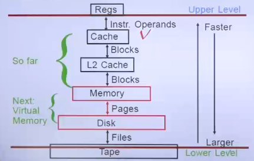

## 저장장치의 계층 구조

- 속도가 빠르고 값이 비싼 저장장치를 CPU 가까운 쪽에 두고, 값이 싸고 용량이 큰 저장장치를 반대쪽에 배치
- 적당한 가격으로 빠른 속도와 큰 용량을 동시에 얻는 방법
- CPU와 가까운 쪽에 레지스터나 캐시를 배치하여 CPU가 작업을 빨리 진행할 수 있음
- 메모리에서 작업한 내용을 하드디스크와 같이 저렴하고 용량이 큰 저장장치에 영구적으로 저장할 수 있음
- 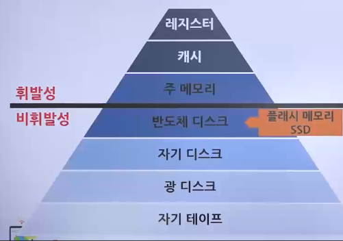

## 인터럽트

### 폴링(Polling)

> 폴링 방식 : CPU가 직접 입출력장치에서 데이터를 가져오거나 내보내는 방식

- CPU가 입출력장치의 상태를 주기적으로 검사하여 일정한 조건을 만족할 때 데이터를 처리
- CPU가 명령어 해석과 실행이라는 본래 역할 외에 모든 입출력까지 관여해야 하므로 작업 효율이 떨어짐
- 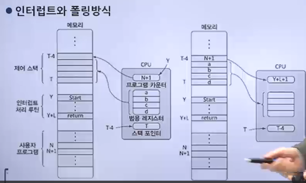

### 인터럽트(Interrupt)

> 인터럽트 방식 : 입출력 관리자가 대신 입출력을 해주는 방식

- CPU의 작업과 저장장치의 데이터 이동을 독립적으로 운영함으로써 시스템의 효율을 높임
- 데이터의 입출력이 이루어지는 동안 CPU가 다른 작업을 할 수 있음
- 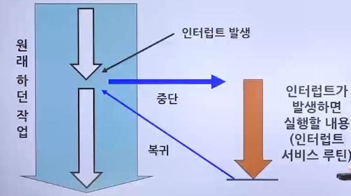

 

- 인터럽트
  - 입출력 관리자가 CPU에 보내는 완료 신호
- 인터럽트 번호
  - 많은 주변장치 중 어떤 것의 작업이 끝났는지 CPU에 알려주기 위해 사용하는 번호
  - 윈도우 운영체제에서는 IRQ라 부름
- 인터럽트 벡터
  - 여러 개의 입출력 작업을 한꺼번에 처리하기 위해 여러 인터럽트를 하나의 배열로 만든 것
- 인터럽트 방식의 동작 과정
  1. CPU가 입출력 관리자에게 입출력 명령을 보냄
  2. 입출력 관리자는 명령 받은 데이터를 메모리에 가져다 놓거나 메모리에 있는 데이터를 저장장치로 옮김
  3. 데이터 전송이 완료되면 입출력 관리자는 완료 신호를 CPU에 보냄
- 인터럽트 처리과정
  - 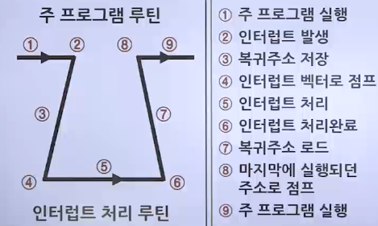

### 직접 메모리 접근 (Direct Memory Access, DMA)

> 직접 메모리 접근 : 입출력 관리자가 CPU의 허락 없이 메모리에 접근할 수 있는 권한

- 메모리는 CPU의 작업 공간이지만, 데이터 전송을 지시 받은 입출력 관리자는 직접 메모리 접근 권한이 있어야만 작업을 처리할 수 있음
- 직접 메모리제어
  - 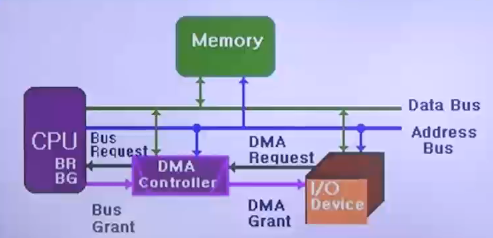

### 메모리 매핑 입출력(Memory Mapped I/O, MMIO)

> 메모리 매핑 입출력 : 메모리의 일정 공간을 입출력에 할당하는 기법

- 메모리 매핑
  - 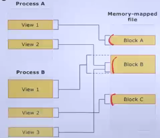

### 사이클 훔치기

- CPU와 직접 메모리 접근이 동시에 메모리에 접근하면 보통 CPU가 메모리 사용 권한을 양보
- 사이클 훔치기 : CPU의 작업 속도보다 입출력장치의 속도가 느리기 때문에 직접 메모리 접근에 양보하는 것

## 병렬 처리의 개념

### 병렬 처리 (Parallel processing)

> 병렬 처리 : 동시에 여러 개의 명령을 처리하여 작업의 능률을 올리는 방식

#### 병렬 처리 기법

- CPU에서 명령어가 실행되는 과정
  1. 명렁어 패치(IF)
     - 다음에 실행할 명령어를 명령어 레지스터에 저장
  2. 명령어 해석(ID)
     - 명령어 해석
  3. 실행(EX)
     - 해석한 결과를 토대로 명령어 실행
  4. 쓰기(WB)
     - 실행된 결과를 메모리에 저장
- 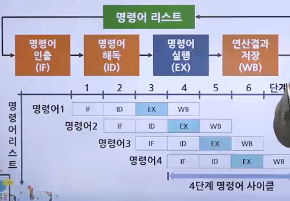

1. 파이프라인 기법
   - CPU의 사용을 극대화하기 위해 명령을 겹쳐서 실행
   - 하나의 코어에 여러 개의 스레드(Thread)를 이용하는 방식
   - 5단계 파이프라인
     - 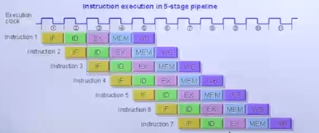
   - 파이프라인의 위험
     - 데이터 위험(Data hazard)
       - 데이터의 의존성 때문에 발생하는 문제
       - 데이터 A를 필요로 하는 두 번째 명령어는 앞의 명령어가 끝날 때까지 동시에 실행되어서는 안됨
       - 데이터 위험은 파이프라인의 명령어 단계를 지연하여 해결
     - 제어 위험(Control hazard)
       - 프로그램 카운터 값을 갑자기 변화시켜 발생하는 위험
       - 첫 명령어를 실행하고 보니 goto 문이어서 다음 문장이 아니라 다른 문장으로 이동하게 되면 현재 동시에 처리되고 있는 명령어들이 쓸모없어짐
       - 제어 위험은 분기 예측이나 분기 지연 방법으로 해결
     - 구조 위험(Structural hazard)
       - 서로 다른 명령어가 같은 자원에 접근하려 할 떄 발생하는 문제
       - 명령어 A가 레지스터 RX를 사용하고 있는데 병렬 처리되는 명령어 B도 레지스터 RX를 사용해야 한다면 서로 충돌
       - 구조 위험은 해결하기 어려운 것으로 알려져 있음
2. 슈퍼스칼라 기법(Super-scalar)
   - 듀얼코어 CPU를 이용해 2개의 작업을 동시에 처리하는 방식
   - 파이프라인을 처리할 수 있는 코어를 여러 개 구성하여 복수의 명령어가 동시에 실행되도록 하는 방식
   - 대부분은 파이프라인 기법과 동일하지만 코어를 2개 구성하여 각 단계에서 동시에 실행되는 명령어가 2개라는 점이 다름
3. 슈퍼파이프라인 기법(Super-pipeline)
   - 파이프라인의 각 단계를 세분하여 한 클럭 내에 여러 명령어를 처리
   - 한 클럭 내에 여러 명령어를 실행하면 다음 명령어가 빠른 시간 안에 시작될 수 있어 병렬 처리 능력이 높아짐
4. 슈퍼파이프라인 슈퍼스칼라 기법(Super-pipelined super-scalar)
   - 슈퍼파이프라인 기법을 여러 개의 코어에서 동시에 수행하는 방식
5. VLIW 기법(Very Long Instruction Word)
   - CPU가 병렬 처리를 지원하지 않을 경우 소프트웨어적으로 병렬 처리를 하는 기법
   - 동시에 수행할 수 있는 명령어들을 컴파일러가 추출하고 하나의 명령어로 압축하여 실행
   - CPU가 병렬 처리를 지원하지 않을 때 사용하는 방법이므로 앞의 병렬 처리 기법들에 비해 동시에 처리하는 명령어의 개수가 적음
   - 컴파일 시 병렬 처리가 이루어짐

#### 병렬 처리 시 고려사항

- 상호 의존성이 없어야 병렬 처리가 가능
  - 각 명령이 서로 독립적이고 앞의 결과가 뒤의 명령에 영향을 미치지 않아야 함
- 각 단계의 시간을 일정하게 맞춰야 함
  - 시간을 일정하게 맞춰야 병렬 처리가 원만하게 이루어짐
  - 오랜 시간이 걸리는 작업 때문에 진행이 전반적으로 밀려서 전체 작업 시간이 늘어나므로 단계별 시간의 차이가 크면 병렬 처리의 효과가 떨어짐
