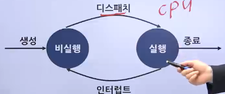

# 프로세스

## 프로세스 상태 변환

### 프로세스의 개념

> Process : 1960년대 먹틱스 시스템(Multics System) 설계자 처음 사용. 이후 작업(Task)이란 용어와 함께 사용되며, 다양한 정의를 가짐

- 가장 일반적인 정의는 "실행 중인 프로그램"
  - 디스크에 저장되어 있던 실행 가능한 프로그램이 메모리에 적재되어 운영체제의 제어를 받는 상태
  - 해당 프로세스가 사용하고 있는 메모리 영역(자신의 주소 공간)이 존재함을 의미
  - 프로세서 할당(점유) 시간과 메모리, 파일, 입출력장치 등의 자원이 필요하며, 자원은 프로세스 생성 및 실행 시 할당됨
  - 현재의 활동 상태를 나타내는 프로그램 카운터와 프로세서의 현재 활동(레지스터 내용) 포함
- 프로그램과 달리 프로세서는 메모리에 주소 공간을 갖는 능동적인 개체
  - 
- 스택 구조
  - 실행 스택(Stack)
    - 호출된 프로시저(함수)의 복귀 주소와 지역 변수 등의 일시적인 데이터를 저장하는 영역
  - 실행 힙(Heap)
    - 텍스트(코드) 영역과는 별도로 유지되는 자유 영역
  - 데이터(정적 변수)
    - 프로세스 실행 중 동적으로 할당 받는 영역, 전역 또는 정적 변수 저장
  - 텍스트(코드)
    - 프로세서가 실행하는 코드 저장
- 재진입 프로그램(재진입 코드)
  - 메모리 내에 동일한 사본을 여러 사용자가 공유할 수 있도록 작성된 프로그램 또는 루틴
  - 실행 중 사용할 데이터를 보관하는 실행 스택과 공통적인 데이터를 보관하는 데이터 영역을 가짐
  - 프로세서가 동일한 프로그램을 사용하여도 텍스트(코드) 영역은 같으나 별도의 스택에 서로 다른 데이터를 가지므로 별개의 프로세스로 인식됨
  - 데이터베이스, 문서 편집기 등
- 즉, 프로세스란(Process)
  - 사용자 관점에서 세그먼트(코드, 데이터, 스택 등)의 가상 주소 공간을 갖는 상태
  - 즉, 시스템 관점에서 실행중인 프로그램을 의미
  - 
- 처리 상태에 있는 데이터 구조로 표현 가능
  - 스케줄러(디스패칭)에 의해 프로세서 할당
  - 파일에 관련된 자원에 대한 참조
    - 장치 관리, 메모리 관리
  - 프로세스 지원과 협력에 관한 정보 교환
    - 교착상태, 보호, 동기ㅗ하
  - 프로세스 관련 연산은 생성, 종료, 보류, 자원 할당, 해제

### 프로세스의 종류

> 실행 유형에 따라 크게 3가지로 구분

1. 운영체제 프로세스
   - 커널 프로세스 또는 시스템 프로세스라 부름
   - 프로세스 실행 순서 제어, 사용하고 있는 프로세스가 다른 사용자나 운영체제 영역을 침범하지 못하게 감시하는 기능 담당
   - 사용자 프로세스 생성, 입출력 프로세스 등 시스템 운영에 필요한 작업 수행
2. 사용자 프로세스
   - 사용자 코드 수행
3. 병행 프로세스
   - 프로세스 여러 개가 동시에 실행됨
   - 독립 프로세스와 협동 프로세스로 구분
     - 독립 프로세스
       - 프로세스 여러 개가 병행하여 수행 시 주어진 초기값에 따라 항상 같은 결과를 보여줌
       - 서로 독립적으로 싱행되어 다른 프로세스에 영향을 받지 않고, 데이터를 공유하지 않음
     - 협동 프로세스
       - 다른 프로세스에 영향을 주거나 다른 프로세스에 의해 영향을 받음
       - 컴퓨터 시스템의 제한된 자원을 공유하는 프로세스들이 통제되어 상호 작용해야 하는 경우 발생
       - 서로 협동해야 하는 경우, 통신을 위한 수단과 동기화 기능 필요

### 프로세스의 상태

- 실행과 비실행 프로세스로 구분
  - 
  - 프로세스는 실행되며 상태가 변하므로 운영체제는 프로세스 제어에 필요한 프로세스 상태를 점검해야 함
  - 운영체제가 프로세스를 새로 생성하면 비실행 상태로 초기화되어 실행을 기다림
  - 
  - 실행 중인 프로세스 종료 또는 인터럽트 발생 시 비실행 프로세스 중 선택된 프로세스가 실행 상태로 변함(디스패치)
  - 인터럽트 된 프로세스는 비실행 상태로 변경
- 실행 상태 프로세스
  - 대부분의 프로세스는 준비나 대기(보류) 상태이며, 어느 한 순간에 한 프로세스만 실행 상태가 됨
  - 
  - 준비
    - 프로세스가 프로세서를 할당 받기 위해 기다리는 상태
  - 실행
    - 명령어가 실행되는 상태, 즉 프로세스가 프로세서를 점유한 상태
  - 대기 또는 보류
    - 프로세서가 이벤트(입출력 종료와 같은 외부 신호)가 일어나길 기다리는 상태

### 프로세스 상태 변환

- 프로그램과 프로세스
  - 프로그램 : 저장장치에 저장되어 있는 정적인 상태
  - 프로세스 : 실행을 위해 메모리에 올라온 동적인 상태
- 메모리와 프로세스
  - 

### 요리사 모형에의 비유

- 일괄 작업 방식의 요리
  - 
  - 
  - 레스토랑에 테이블이 하나만 있는 것
  - 요리사는 주문서를 받은 순서대로 요리
  - 현재 손님의 식사가 끝나야 다음 손님을 받을 수 있어 작업 효율이 떨어짐
  - 주문서가 도착한 순서대로 요리르 하기 위해 '주문 목록'을 사용
    - 주문 목록은 큐(Queue)로 처리
- 시분할 방식의 요리
  - 
  - 
  - 요리사 1명이 시간을 적당히 배분하여 여러 가지 요리를 동시에 하는 방식
  - 요리사는 주문 목록에 있는 주문서 중 하나를 가져다가 요리함
  - 모든 요리가 제공되면 주문 목록에서 삭제

## 프로세스 처리 과정

### 프로그램에서 프로세스로의 전환

- 프로그램 처리 과정
  - 
  - 프로세스 제어 블록(Process Control Block, PCB)
    - 운영체제가 해당 프로세스를 위해 관리하는 자료 구조
    - 프로세스 구분자
      - 각 프로세스를 구분하는 구분자
    - 메모리 관련 정보
      - 프로세스의 메모리 위치 정보
    - 각종 중간 값
      - 프로세스가 사용했던 중간 값
  - 프로그램이 프로세스가 된다는 것
    - 운영체제로부터 프로세스 제어 블록을 얻는다는 뜻
  - 프로세스가 종료된다는 것
    - 해당 프로세스 제어 블록이 폐기된다는 뜻
  - 프로세서 = 프로그램 + 프로세서 제어블록
  - 프로그램 = 프로세서 - 프로세서 제어블록

### 프로세스의 상태

- 프로세스의 4가지 상태
  - 
  - 생성상태
    - 프로세스가 메모리에 올라와 실행 준비를 완료한 상태
  - 준비 상태
    - 생성된 프로세스가 CPU를 얻을 때까지 기다리는 상태
  - 실행 상태
    - 준비 상태에 있는 프로세스 중 하나가 CPU를 얻어 실제 작업을 수행하는 상태
  - 완료 상태
    - 실행 상태의 프로세스가 주어진 시간 동안 작업을 마치면 진입하는 상태
    - (프로세스 제어 블록이 사라진 상태)
  - - - 디스패치 : 준비 상태의 프로세스 중 하나를 골라 실행 상태로 바꾸는 CPU 스케줄러의 작업
      - 타임아웃 : 프로세스가 자신에게 주어진 하나의 타임 슬라이스 동안 작업을 끝내지 못하면 다시 준비 상태로 돌아가는 것
- 프로세스의 5가지 상태
  - 
  1. 생성 상태
     - 프로그램이 메모리에 올라오고 운영체제로부터 프로세스 제어 블록을 할당 받은 상태
     - 생성된 프로세스는 바로 실행되는 것이 아니라 준비 상태에서 자기 순서를 기다리며, 프로세스 제어 블록도 같이 준비 상태로 옮겨짐
  2. 준비 상태
     - CPU 스케줄러가 어떤 프로세스 제어 블록을 선택하는 작업은 dispatch(PID) 명령으로 처리
     - CPU 스케줄러가 dispatch(PID)를 실행하면 해당 프로세스가 준비 상태에서 실행 상태로 바뀌어 작업이 이루어짐
  3. 실행 상태
     - 프로세스가 CPU를 할당 받아 실행되는 상태
     - 실행 상태에 있는 프로세스는 자신에게 주어진 시간, 즉 타임 슬라이스 동안만 작업할 수 있음
     - 그 시간을 다 사용하면 timeout(PID)가 실행되어 실행 상태에서 준비 상태로 옮김
     - 실행 상태 동안 작업이 완료되면 exit(PID)가 실행되어 프로세스가 정상 종료
  4. 대기 상태
     - 실행 상태에 있는 프로세스가 입출력을 요청하면 입출력이 완료될 때까지 기다리는 상태
     - 대기 상태의 프로세스는 입출력 장치별로 마련된 큐에서 기다리다가 완료되면 인터럽트가 발생하고, 대기 상태에 있는 여러 프로세스 중 해당 인터럽트로 깨어날 프로세스를 찾는데 이것이 wakeup(PID)
     - wakeup(PID)로 해당 프로세스의 프로세스 제어 블록이 준비 상태로 이동
  5. 완료 상태
     - 프로세스가 종료되는 상태
     - 코드와 사용했던 데이터를 메모리에서 삭제하고 프로세스 제어 블록을 폐기
     - 정상적인 종료는 간단히 exit()로 처리
     - 오류나 다른 프로세스에 의해 비정상적으로 종료되는 강제 종료를 만나면 디버깅하기 위해 종료 직전의 메모리 상태를 저장장치로 옮기는데 이를 코어 덤프(Core dump)라고 함
  - 

#### 보류 상태를 포함한 프로세스의 상태

- 
  1. 휴식 상태
     - 프로세스가 작업을 일시적으로 쉬고 있는 상태
     - 유닉스에서 프로그램을 실행하는 도중에 Ctrl+Z 키를 누르면 볼 수 있음
     - 종료 상태가 아니기 때문에 원할 때 다시 시작할 수 있는 상태
  2. 보류 상태
     - 프로세스가 메모리에서 잠시 쫓겨난 상태
     - 프로세스는 다음과 같은 경우에 보류 상태가 됨
     - 메모리가 꽉 차서 일부 프로세스를 밖으로 내보낼 때
     - 프로그램에 오류가 있어서 실행을 미루어야 할 때
     - 바이러스와 같이 악의적인 공격을 하는 프로세스라고 판단될 때
     - 매우 긴 주기로 반복되는 프로세스라 메모리 밖으로 쫓아내도 큰 문제가 없을 때
     - 입출력을 기다리는 프로세스의 입출력이 계속 지연될 떄
