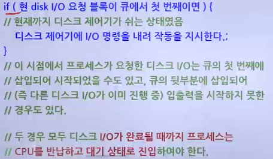

# 프로세스 제어 블록과 문맥 교환

## 프로세스 제어 블록

### 프로세스 제어 블록(PCB)의 구성

> PCB : 프로세스를 실행하는 데 필요한 중요핞 정보를 보관하는 자료 구조

- 프로세스는 고유의 프로세스 제어 블록을 가짐
- 프로세스 생성 시 만들어져서 프로세스가 실행을 완료하면 폐기
- 
- 포인터
  - 준비 상태나 대기 상태의 큐를 구현할 때 사용
  - 대기 상태에는 같은 입출력을 요구한 프로세스끼리 연결할 때 포인터 사용
- 프로세스 상태
  - 프로세스가 현재 어떤 상태에 있는지를 나타내는 정보
- 프로세스 구분자
  - 운영체제 내에 있는 여러 프로세스를 구현하기 위한 구분자
- 프로그램 카운터
  - 다음에 실행될 명령어의 위치를 가리키는 프로그램 카운터의 값
- 프로세스 우선순위
  - 프로세스의 실행 순서를 결정하는 우선순위
- 각종 레지스터 정보
  - 프로세스가 실행되는 중에 사용하던 레지스터의 값
- 메모리 관리 정보
  - 프로세스가 메모리의 어디에 있는지 나타내는 메모리 위치 정보, 메모리 보호를 위해 사용하는 경계 레지스터 값과 한계 레지스터 값 등
- 할당된 자원 정보
  - 프로세스를 실행하기 위해 사용하는 입출력 자원이나 오픈 파일 등에 대한 정보
- 계정 정보
  - 계정 번호, CPU 할당 시간, CPU 사용 시간 등
- 부모 프로세스 구분자와 자식 프로세스 구분자
  - 부모 프로세스를 가리키는 PPID와, 자식 프로세스를 가리키는 CPID 정보

### 대기 상태에서의 포인터 사용

- 

## 문맥 교환(Context Switching)

### 프로세스 교환

- 실행 중인 프로세스가 인터럽트되면, 운영체제가 다른 프로세스를 실행 상태로 변경
- 해당 프로세스에 제어를 넘겨주는 과정에서 실행 중인 프로세스로부터 제어를 인수한 운영체제가 또 다른 프로세스에 제어를 넘겨주기 위해 발생
- 인터럽트 처리 루틴을 실행한 후 현재 실행 중인 프로세스가 재실행될 수 있으므로 대부분의 운영체제는 프로세스 교환으로 인터럽트가 발생하지 않음
  - 트랩은 시스템이 치명적인 오류인지를 판단
    - 치명적 오류일 경우
      - 프로세스를 종료하면서 프로세스 교환 발생

### 문맥 교환

> 문맥 교환 : 프로세스를 다른 프로세스로 교환하기 위해 이전 프로세스의 상태 레지스터 내용을 보관하고 다른 프로세스의 레지스터를 적재하는 일련의 과정

- 프로세스가 "준비 -> 실행", "실행 -> 준비", "실행 -> 대기" 상태로 변할 때 발생
- 오버헤드가 발생하며 오버헤드는 메모리 속도, 레지스터 수, 특수 명령어의 존재에 따라 다르므로 시스템마다 다름
- 문맥 교환 과정
  - 

### 인터럽트와 트랩

- 인터럽트(Interrupt)
  - 현재 실행되는 프로세스와 별도로 외부에서 발생되는 여러 종류의 이벤트(입출력 동작 종료 등)에 의해 발생
  - 제어가 인터럽트 처리 루틴으로 넘어간 후에도 기본 시스템 관리 작업을 처리
  - 인터럽트 형태에 따라 관련된 운영체제 루틴으로 분기
  - 대표적인 인터럽트 예
    - 입출력 인터럽트
      - 입출력 동작이 발생한 사실을 확인 후 이벤트를 기다리는 프로세스를 준비 상태로 변경
      - 실행할 프로세스를 결정
    - 클럭 인터럽트
      - 현재 실행 중인 프로세스의 할당 시간을 조사하여 실행 중인 프로세스를 준비 상태로 변경
      - 다른 프로세스를 디스패치하여 실행 상태로 변경
- 트랩(Trap)
  - 부적절한 파일 접근 또는 현재 실행 중인 프로세스에 의해 발생되는 오류나 예외 상황으로 인해 발생

### 프로세스 문맥의 구성

1. 사용자 수준 문맥(User-level context)
   - 텍스트(Text) 영역
     - 프로그램 코드
   - 자료(Data) 영역
     - global variable
   - 스택(Stack) 영역
     - Runtime stack(Local variable)
2. 시스템 수준 문맥(System-level context)
   - CPU 내의 각종 범용 및 특수 레지스터의 내용
     - PC-Program Counter register 포함
   - 프로세스의 현재의 각종 자원 사용 정보
   - 기타 커널의 프로세스 관리 정보

### 디스크 파일 입출력의 예

- 
- 사용자 프로세스가 디스크 입력을 위한 read() 시스템 호출을 하여 완료될 때까지의 과정을 설명
- 시스템 호출 실행 및 처리
  - open(), read() - read() 실행 시 trap 발생
- 대기 상태에 의한 문맥 교환(Context Switch) 발생
- 커널의 시스템 호출 입력의 처리
- 입력 완료 후 인터럽트 발생
- 준비 상태로의 전환
  - 커널 모드에서 사용자 모드로 전환됨
- ```c
    // 사용자 프로세스 실행
    int main()
    {
        int fd;
        char buf[100]

        // do something;
        fd = open("my_file" ,0);
        n = read(df, buf, 100) ; // 사용자 모드에서 실행 중 시스템
                                 // 호출을 하여 커널로 진입하며
                                 // 커널 모드 실행으로 전환
                                 // 복귀 시는 다시 사용자 모드임
    }
  ```

#### 커널의 시스템 호출 처리 루틴

- 
- 
- 

#### 커널 내부 함수 sleep_on()

- 

#### 인터럽트에 의한 디스크 I/O의 진행

- 디스크 인터럽트 처리기의 주요 기능
  - 입출력이 종료된 프로세스의 PCB를 대기(Blocked) 큐에서 준비 상태로 만들어 준비(Ready) 큐로 옮김
  - 준비 상태가 된 프로세스는 스케줄링을 기다리게 됨
  - 일반적으로 사용자 모드에서 실행할 때보다 높은 우선순위를 할당함
  - 대기 상태였던 프로세스를 일반 프로세스보다 우선 실행하기 위함
- 디스크 제어기(Controller)는 큐에 등록된 다음 입출력 정보 블록을 이용하여 대기중인 다음 입출력 명령을 실행시킴

### 프로세스의 협동

- 병행 프로그래밍 - Concurrent(parallel) programming
  - 여러 개의 협동하는 프로세스로 하나의 작업을 수행
  - 어떤 순서로 진행될지 예측 불가
    - CPU 스케줄러가 결정
    - 반복 실행 시 주어진 초기값에 대해 항상 같은 결과를 생성해야 함
- 목적
  - 정보 공유
    - 같은 정보를 여러 사용자가 이용하는 경우
  - 병렬 처리
    - CPU와 I/O의 중첩 처리
  - 모듈성
    - 시스템을 여러 개의 별도 기능으로 분류하기 위함
  - 편리성
    - 한 번에 여러 작업을 수행하는 경우
  - 비동기적 사건의 처리
    - 각 사건 당 하나의 프로세스가 처리

### 생산자-소비자 문제 및 프로세스

- 
- 생산자- 소비자 문제

  - Bounded buffer 문제
    - 버퍼의 크기가 제한된 경우
  - 양쪽 프로세스의 속도차이를 조절함
  - Buffer에 대한 동시 접근 시의 문제
    - 상호 배제 : Mutual Exclusion
  - 버퍼 empty, full 시의 대기/깨움 문제
    - 동기화
  - ```c
      // 생산자 (Producer)
      while(1) {
          ...
          produce an item in nextp
          ...
          // 대기 loop
          while( (in + 1) % n == out);

          buffer[in] = nextp;
          in++
          in %= n;
      }

      // 소비자 (Consumer)
      while(1) {
          // 대기 loop
          while(in == out);

          nextc = buffer[out];
          out++;
          out %= n;
          ...
          consume the item in nextc
          ...
      }
    ```

    - in 포인터 : 생산자가 저장할 아이템의 위치 지정
    - out 포인터 : 소비자가 소비할 아이템의 위치 지정
    - (in == out)이면 버퍼는 비어있는 상태
    - ((in + 1 ) == out)이면 버퍼는 모두 차 있는 상태
      - (n-1)개의 아이템만 저장 가능
