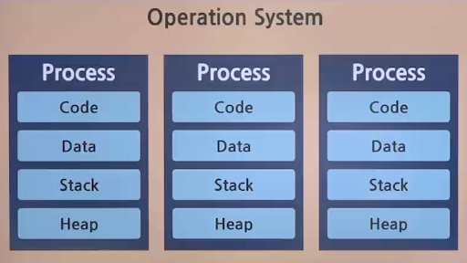
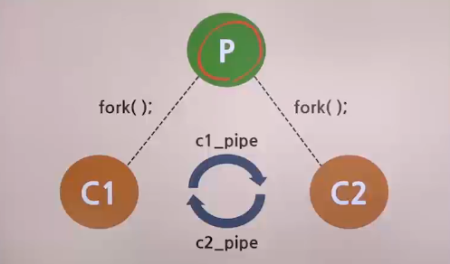
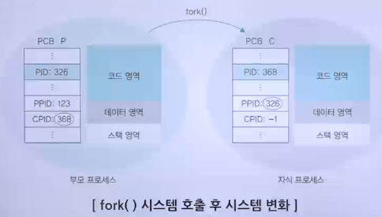
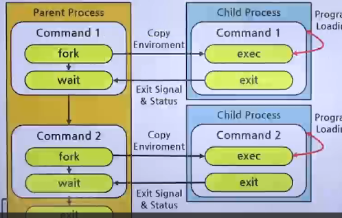
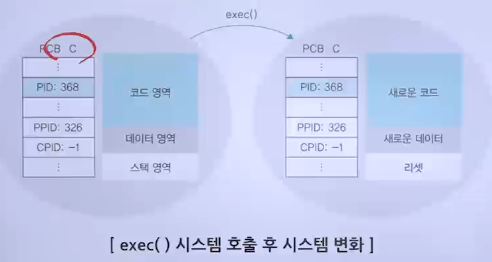
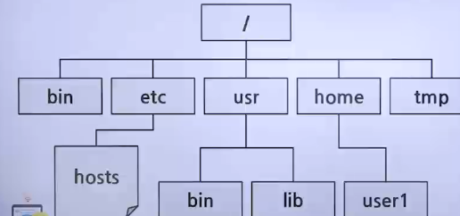
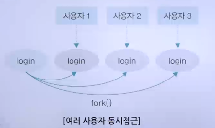
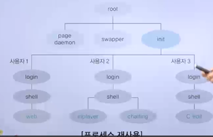

# 프로세스 연산

## 프로세스 생성과 복사

### 프로세스의 구조

- 
- 코드 영역
  - 프로그램의 본문이 기술된 곳
  - 프로그래머가 작성한 코드가 탑재되며 탑재된 코드는 읽기 전용으로 처리됨
- 데이터 영역
  - 코드가 실행되면서 사용하는 변수나 파일 등의 각종 데이터를 모아놓은 곳
  - 데이터는 변하는 값이기 때문에 이곳의 내용은 기본적으로 읽기와 쓰기가 가능
- 스택 영역
  - 운영체제가 프로세스를 실행하기 위해 부수적으로 필요한 데이터를 모아놓은 곳
  - 프로세스 내에서 함수를 호출하면 함수를 수행하고 원래 프로그램으로 되돌아올 위치를 이 영역에 저장
  - 운영체제가 사용자의 프로세스를 작동하기 위해 유지하는 영역이므로 사용자에게는 보이지 않음

### 프로세스의 생성과 복사

- fork() 시스템 호출의 개념
  - 실행 중인 프로세스로부터 새로운 프로세스를 복사하는 함수
  - 실행 중인 프로세스와 똑같은 프로세스가 하나 더 만들어짐
  - fork는 새로운 프로세스를 띄우는 시스템콜
    - pid라는 변수를 선언하면서 동시에 fork 함수를 실행하고 반환값을 pid에 저장하게 하여, 함수 fork()가 실행되는 순간 프로세스가 하나 복제됨
    - pid 변수에 0이 들어있는 것이 부모 프로세스이고, 자식 프로세스는 pid에 0이 아닌 새로운 프로세스 번호를 부여 받게 됨
  - 
- fork() 시스템 호출의 동작과정
  - 
  - fork() 시스템 호출을 하면 프로세스 제어 블록을 포함한 부모 프로세스 영역의 대부분이 자식 프로세스에 복사되어 똑같은 프로세스가 만들어짐
    - 단, 프로세스 제어 블록의 내용 중 다음이 변경됨
      - 프로세스 구분자
      - 메모리 관련 정보
      - 부모 프로세스 구분자와 자식 프로세스 구분자
- fork() 시스템 호출의 장점
  - 프로세스의 생성 속도가 빠름
  - 추가 작업 없이 자원을 상속할 수 있음
  - 시스템 관리를 효율적으로 할 수 있음
- fork() 시스템 호출의 예
  1. 부모 프로세스의 코드가 실행되어 fork() 문을 만나면 똑같은 내용의 자식 프로세스를 하나 생성
  2. 이때 fork() 문은 부모 프로세스에 0보다 큰 값을 반환하고 자식 프로세스에 0을 반환
  3. 만약, 0보다 작은 값을 반환하면 자식 프로세스가 생성되지 않은 것으로 여겨 'Error'를 출력
  - 

## 프로세스의 전환 과정

### 프로세스의 전환

- exec() 시스템 호출의 개념
  - 기존의 프로세스를 새로운 프로세스로 전환(재사용)하는 함수
    - fork(): 새로운 프로세스를 복사하는 시스템 호출
    - exec(): 프로세스는 그대로 둔 채 내용만 바꾸는 시스템 호출
  - 이미 만들어진 프로세서의 구조를 재활용하는 것임
- exec() 시스템 호출의 동작 과정
  - exec() 시스템 호출을 하면 코드 영역에 있는 기존의 내용을 지우고 새로운 코드로 바꿔버림
    - 데이터 영역이 새로운 변수로 채워지고 스택 영역 리셋
      - 프로세스 제어 블록의 내용 중 프로세스 구분자, 부모 프로세스 구분자, 자식 프로세스 구분자, 메모리 관련 사항 등은 변하지 않지만,
      - 프로그램 카운터 레지스터 값을 비롯한 각종 레지스터와 사용한 파일 정보가 모두 리셋
      - 
- exec() 시스템 호출의 예
  1. 부모 프로세스의 fork() 문을 실행하여 자식 프로세스를 생성
  2. wait() 문을 실행하여 자식 프로세스가 끝날 때까지 기다림
  3. 새로 생성된 자식 프로세스는 부모 프로세스의 코드와 같음
  4. exec() 시스템 호출을 사용하여 새로운 프로세스로 전환하더라도 프로세스 제어 블록의 각종 프로세스 구분자(PID, PPID, CPID)가 변경되지 않음
  5. 때문에, 프로세스가 종료된 후 부모 프로세스로 돌아올 수 있음

### 프로세스의 계충 구조

- 유닉스의 프로세스 계층 구조
  - 유닉스의 모든 프로세스는 init 프로세세ㅡ의 자식이 되어 트리 구조를 이룸
  - 
- 프로세스 계층 구조의 장점
  - 여러 작업을 동시에 처리할 수 있음
    - 
  - 프로세스의 재사용이 용이함
    - 
  - 자원 회수가 쉬움
  - 프로세스를 계층 구조로 만들면 프로세스 간의 책임 관계가 분명해져서 시스템을 관리하기가 수월함
