# 스레드

## 스레드의 개념

### 스레드의 정의

> 스레드 : CPU 스케줄러가 CPU에 전달하는 일 하나

- CPU가 처리하는 작업의 단위는 프로세스로부터 전달받은 스레드
  - 운영체제 입장에서의 작업 단위는 프로세스
  - CPU 입장에서의 작업 단위는 스레드

### 스레드의 구조

> 스레드 : 프로세스에서 실행 제어만 분리한 실행 단위

- 경량 프로세스(LWP, Light Weight Process)라고도 부름
  - 중량 프로세스(HWP, Heavy Weight Process)
    - 스레드를 하나 가진 작업
- 프로세서를 사용하는 기본 단위
- 명령어를 독립적으로 실행할 수 있는 하나의 제어 흐름
- 작업
  - 스레드의 그룹 환경으로, 같은 그룹의 스레드와 코드, 주소 공간, 운영체제의 자원(파일, 신호) 등을 공유함
  - 작업에 스레드가 없으면 아무 일도 할 수 없으므로 반드시 스레드가 있어야 함
- 프로세스는 스레드를 하나 이상 가짐
  - 각 스레드는 다음 내용을 포함
    - 스레드 실행 시의 상태(실행, 준비 등)
    - 실행 스택
    - 지역 변수와 스레드의 특정 데이터를 저장하기 위한 스레드별 정적 저장소
    - 프로세스의 다른 스레드가 공유하는 프로세스의 메모리와 자원에 대한 접근 등의 스레드 실행 환경 정보(문맥 정보)
- 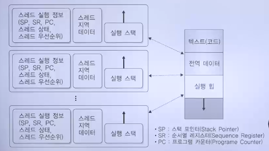

### 스레드의 장점

> 스레드를 이용하여 다음과 같은 이점을 얻을 수 있음

1. 사용자에 대한 응답성 증가
   - 응용 프로그램 하나가 비슷한 작업들을 여러 개 수행
   - 응용 프로그램의 일부분이 봉쇄 또는 긴 작업 수행 시에도 프로그램 실행을 계속 허용하여 사용자에 대한 응답성 증가
2. 경제성
   - 한 프로세스의 자원을 공유하므로 프로세스를 생성하는 것보다 오버헤드를 줄일 수 있음
3. 프로세스의 자원과 메모리 공유 가능
   - 프로세스에 포함된 스레드들은 공통의 목적 달성을 위해 병렬로 수행
   - 자원을 공유하여 한 프로세스에서 동시 적업 가능
   - 시스템 성능과 효율 향상
   - 스레드는 그들이 속한 프로세스의 자원과 메모리를 공유하므로, 응용 프로그램 하나가 같은 주소 공간에서 여러 개의 스레드를 실행
     - 시스템 성능 향상과 편리함 제공
4. 다중 프로세서 구조 활용
   - 하나의 프로세스가 서로 다른 프로세서에서 프로그램의 다른 부분을 동시에 실행 가능
   - 다중 프로세서 구조에서 각 스레드는 다른 프로세서에서 병렬로 실행될 수 있음
   - 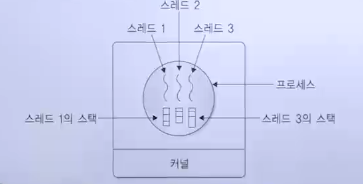

## 멀티스레드 시스템

### 다중 스레드

- 단일 스레드와 다중 스레드
  - 운영체제는 단일 프로세스에서 단일 스레드 실행과 다중 스레드 실행을 지원
  - 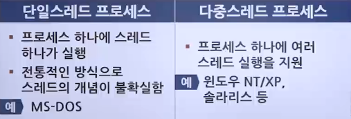
  - 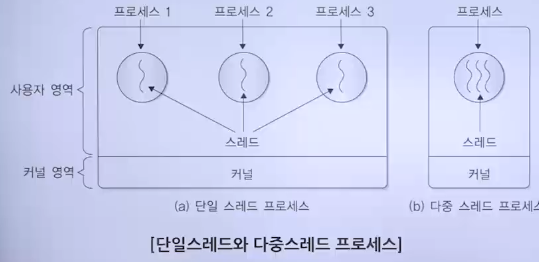
- 다중스레드의 특징
  - 각 스레드를 별도의 프로세서에서 실행하는 측면 다중 프로세싱(프로세서)와 같은 의미
  - 동일 프로세스 내의 스레드는 메모리와 파일을 공유하므로, 프로세스 하나에 다수의 실행 단위로 구분된 자원을 공유
  - 자원 생성과 관리의 중복성을 최소화하여 실행 능력 향상
  - 각 스레드는 커널 개입 없이 서로 통신이 가능하여 독립적으로 실행
  - 서버에서 많은 요청을 효과적으로 처리할 수 있는 환경
  - 프로세스를 새로 생성하는 것보다 기존 프로세스에서 스레드를 생성하는 것이 빠르고, 같은 프로세스 내 스레드 간 교환이나 스레드 종료 역시 빠름
  - 프로세스의 상대적인 무게를 줄여 효율을 극대화하는 것이 목표
  - 프로그램 변경 없이 프로세서의 개수에 따라 스레드를 병렬로 처리 가능
  - 같은 그룹의 스레드에 프로세서를 할당 또는 스레드 생성 시 중량 프로세서들 사이의 문맥 교환과 비교하여 더 경제적임

### 다중 스레드 모델

- 단일 스레드와 다중 스레드 프로세스 모델
  - 
  - 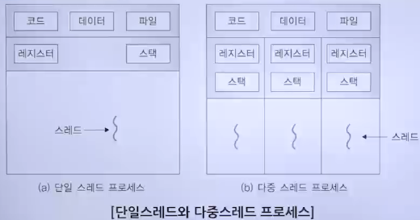
- 스레드 용법
  - 단일 사용자 다중 처리 시스템 환경
    - 시스템 호출이 아닌 사용자 라이브러리 수준에서 스레드 개념을 제공
      - 빠른 속도
    - 프로그램에 비동기적 요소를 구현 가능
    - 실행 중인 스레드를 대기 상태로 변경
      - 다른 스레드로 제어를 이동시키는 상태 변화는 하나의 서버가 많은 요청을 받아들여 처리하는 효과적인 방법
  - 공유 메모리 형태의 다중 프로세서 시스템 환경
    - 프로그램을 공유 메모리에 저장
    - 스레드를 각 프로세서에 할당
    - 병렬 처리하여 프로세서 성능을 매우 향상시킬 수 있음
  - 사용자 수준 스레드는 커널 자체가 스레드 하나로 구성
  - 시스템 호출 실행 시 해당 스레드가 포함된 전체 작업이 시스템 호출 결과가 돌아올 때까지 대기
  - 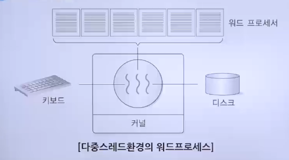
  - 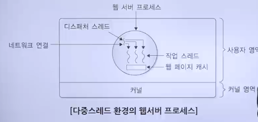

### 스레드의 상태 변화

- 스레드의 특징
  - 준비, 실행, 대기, 종료 상태로 구분
    - 프로세서를 함께 사용하며 항상 스레드 하나만 실행됨
  - 한 프로세스에 있는 스레드는 순차적으로 실행
    - 자신의 정보를 위한 프로그램 카운터와 스택을 가짐
  - 스레드 생성 시 운영체제는 부모 프로세스와 공유할 자원을 초기화하지 않음
  - 프로세스 내 스레드는 해당 프로세스에서 다른 스레드 생성
    - 새로 형성된 스레드를 위한 스택과 레지스터를 제공함으로 프로세스의 생성 및 종료 과정보다 오버헤드가 적음
  - 하나의 스레드가 대기 상태로 변할 때 전체 프로세스를 대기 상태로 변화시키지 않음
    - 하나의 스레드가 대기 상태일 경우 다른 스레드 실행 가능
  - 서로 독립적이지 않음
    - 한 작업에 있는 모든 스레드는 작업의 모든 주소 접근 가능
  - 보호 문제
    - 프로세서는 다수의 사용자에게서 발생, 경쟁적인 자원 요구와 서로 다른 관계 유지
    - 스레드는 한 명의 사용자가 여러 스레드를 가진 작업 하나를 보유
- 스레드의 상태
  - 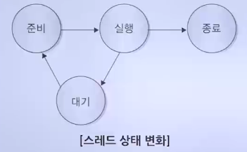
  - 준비
    - 스레드가 프로세서에 의해 실행될 수 있는 상태
    - 스레드를 대기시킨 이벤트 발생 시 해당 스레드는 준비 리스트에 삽입됨
  - 대기
    - 스레드가 이벤트를 기다릴 때, 즉 입출력 작업 등이 완료될 때까지 대기(보류) 상태
    - 자신의 정보(프로그램 카운터, 스택 포인터 등)를 실행 스택에 저장
  - 실행
    - 스레드가 프로세서를 점유하여 실행 중인 활성화 상태
  - 종료
    - 스레드가 작업을 종료하면 자원을 해제, 레지스터 문맥과 스택 할당 제거

### 스레드의 구현

- 사용자 수준 스레드
  1. 개념
     - 커널 스레드를 지원하지 않는 운영체제에서 사용
     - 사용자 수준 스레드 여러 개가 커널 스레드(프로세스) 하나로 매핑되는 방식
     - 다중스레드 프로세스에 대해 프로세서(실행 문맥) 하나를 할당하므로 다대일 스레드 매핑이라 칭함
     - 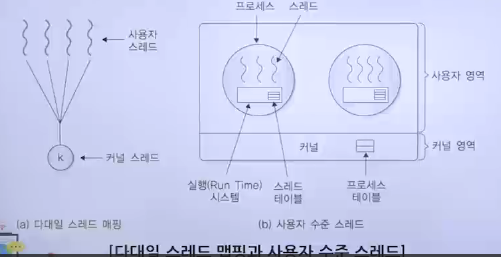
     - 사용자 수준(공간)에서 스레드 관리가 효율적으로 이루어지므로 스레드와 관련된 모든 과정을 응용 프로그램이 수행
     - 응용 프로그램은 사용자 수준 스레드 관리를 위한 루틴으로 구성된 스레드 라이브러리(스레드 패키지)를 이용
       - 다중스레드로 프로그래밍 가능
     - 응용 프로그램은 기본적으로 스레드 하나에서 시작
       - 해당 스레드에서 실행을 시작함
  2. 스레드 라이브러리
     - 스레드 생성, 종료, 문맥 교환을 위한 코드, 동기화, 메모리 할당, 스레드 간 메시지 전달, 스레드 실행 스케줄링 등의 정보를 포함
     - 생성 유틸리티를 통해 스레드가 생성
     - 제어는 프로시저 호출을 통해 해당 유틸리티로 이동하여 수행
  3. 사용자 수준 스레드의 장점
     - 커널 도움 없이 사용자 주소 공간에 구현된 스레드 패키지로 스레드 연산 실행
     - 커널은 연산 과정은 모르고 프로세스를 계속 하나의 단위로 스케줄하고 하나의 실행 상태를 할당
     - 커널과 상관없이 다양한 목적의 응용 프로그램이나 언어 인터페이스의 요구에 적용할 수 있는 융통성을 가짐
     - 여러 수준에서 스레드 구현 가능
     - 운영체제에 따라 다르며 일반적으로 사용자 수준과 커널 수준, 혹은 혼합한 방식 중 하나를 사용
     - 윈도우 2000/XP, Mach, OS/2, 솔라리스 운영체제는 커널 수준 지원, 시스템 호출 제공
     - 사용자 수준에서 라이브러리 호출을 통한 지원 가능
  4. 사용자 수준 스레드 이용 시 시스템의 장점
     - 높은 이식성
       - 기본 커널 변경 없이 모든 운영체제에 적용 가능
     - 오버헤드 감소
       - 스레드 관리를 위한 모든 데이터 구조가 프로세스의 사용자 주소 공간에 있어 커널의 도움 없이 스레드 교환 가능
     - 스케줄링의 유연성
       - 스레드 라이브러리에서 스레드 스케줄링을 제어하므로 스케줄링이 응용 프로그램에 맞게 적절히 구성됨
  5. 사용자 수준 스레드 이용 시 시스템의 단점
     - 시스템의 동시성 지원 불가
       - 한 번에 하나의 스레드만 커널에 접근 가능하므로 여러 스레드가 시스템 호출을 동시에 사용할 수 없음
     - 시스템 규모 확장 제약
       - 커널이 프로세서 내부의 다중스레드를 프로세스 하나로 관리
       - 다중 처리 환경에서 여러 프로세스를 이용한 분산 처리를 할 수 없음
     - 스레드 간 보호가 어려움
       - 스레드 간의 보호에 커널의 보호 기법을 사용할 수 없음
       - 스레드 라이브러리에서 스레드 간 보호를 제공해야 프로세스 수준에서 보호됨
- 커널 수준 스레드
  1. 개념
     - 사용자 수준 스레드의 한계를 해결하기 위해 사용자 스레드마다 프로세서(실행 문맥)를 매핑하는 일대일 스레드 매핑을 지원
     - 커널에 의해 생성, 삭제되고 커널의 텍스트와 전역 데이터를 공유
     - 자신만의 커널 스택을 가짐
     - 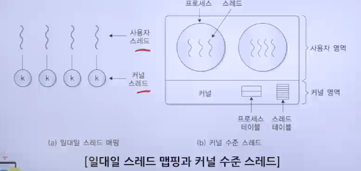
     - 사용자 영역에는 스레드 관리를 위한 코드가 없음
       - 모든 응용 프로그램은 다중스레드로 지원
       - 으용 프로그램의 스레드는 하나의 프로세스에서 지원
       - 스레드 관련 모든 작업은 커널(운영체제)이 지원
       - 프로세스와 스레드에 대한 실행 문맥 정보 유지
     - 일대일 모델 구현 운영체제
       - 윈도우 NT/XP/2000, 리눅스, 솔라리스 9 이상 버전, OS/2
  2. 커널 지원 부족 문제 해결
     - 커널에 의한 직접적인 스케줄링과 실행으로 사용자 수준 스레드의 문제를 해결하여 시스템 성능 향상
  3. 병렬 실행
     - 하나가 시스템 호출 시 다른 스레드가 중단되는 다대일 방식의 문제를 해결할 수 있어 다중 프로세서에서 다중스레드를 병렬로 실행 가능
     - 시스템 규모 확장이 쉬우며 처리량을 늘릴 수 있음
  4. 커널 모드 전환 오버헤드
     - 커널 스레드 생성으로 인한 오버헤드 증가로 응용 프로그램의 성능 저하를 막기 위해 시스템이 지원 스레드 수를 제한해야 함
     - 사용자 수준 스레드보다 스케줄링과 동기화를 위해 자원이 더 필요함
     - 시스템이 모든 스레드를 관리하므로 오버헤드 증가
  5. 이식성이 떨어짐
     - 시스템 변경 시 제공된 스레드 API(Application program Interface)를 사용하여 프로그램을 수정
     - 제한적인 자원으로 인해 사용자 수준 스레드 생성에 따라 커널 스레드를 무한정 생성할 수 없음
  6. 혼합형 스레드 지원
     - 스레드 생성은 사용자 영역에서, 여러 개의 사용자 수준 스레드에 여러 개의 커널 스레드가 매핑되는 다대다 스레드 모델
     - 사용자 수준 스레드 생성 시 커널 수준 스레드를 생성
       - 성능 감소
     - 시스템 호출 시 다른 스레드가 중단되는 문제를 해결하기 위한 방법
     - 다대다 모델 구현 운영체제
       - 솔라리스(Solaris)
     - 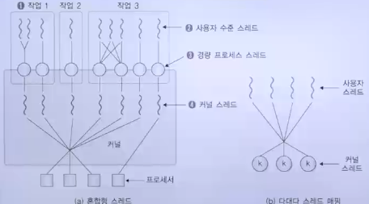
     - 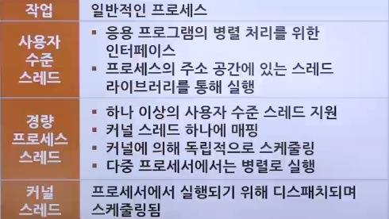
  7. 경량 프로세스 단위로 구성된 자원과 입출력 대기를 위한 대기
     - 스레드는 하나의 커널 스레드와 경량 프로세스(LWP)가 연결됨
     - 각 작업(프로세스)은 경량 프로세스를 한 개 이상 가지며, 경량 프로세스는 대응하는 커널 스레드를 가짐
     - 어떤 작업의 경량 프로세스가 입출력 완료를 기다리더라도 프로세서는 그 작업의 다른 경량 프로세스로 이동하여 작업을 계속 수행할 수 있음
  8. 스레드 라이브러리가 지원하는 최적의 성능
     - 경량 프로세스의 수를 동적으로 조절
       - 사용자 수준 스레드와 커널 수준 스레드를 다대다 스레드 매핑함
     - 다대다 스레드 매핑은 스레드 풀링 기법을 통해 일대일 스레드 매핑에서의 오버헤드를 줄여줌
  9. 스레드 활용 운영체제 예
     - 매크(Mach)
       - 다중스레드 시스템, 커널은 여러 개의 요청을 동시에 서비스할 수 있음
       - 스레드 자신은 동기적
     - 유닉스 커널
       - 단일 작업(Single-Tasking)
       - 하나의 프로세스만 수정하는 것을 허용하여 데이터 제어의 동시성 문제 해결 가능
     - 스레드가 비동기적 시스템
       - 록킹(Locking) 기능 필요
