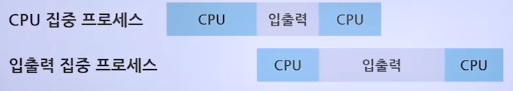

# 스케줄링과 스케줄링 시 고려사항

## CPU 스케줄링의 단계와 목적

### 스케줄링 이해

- 운영체제에서 식당 관리자의 역할을 담당
- 여러 프로세스의 상황을 고려하여 CPU와 시스템 자원의 배정을 결정
- 

### 스케줄링의 단계

1. 고수준 스케줄링
   > 전체 시스템의 부하를 고려하여 작업을 시작할지 말지 결정
   - 시스템 내의 전체 작업 수를 조절하는 것
   - 어떤 작업을 시스템이 받아들일지 또는 거부할지를 결정
   - 시스템 내에서 동시에 실행 가능한 프로세스의 총 개수가 정해짐
   - 장기 스케줄링, 작업 스케줄링, 승인 스케줄링이라고도 함
2. 저수준 스케줄링
   > 실제 작업을 수행
   - 어떤 프로세스에 CPU를 할당할지, 어떤 프로세스를 대기상태로 보낼지 등을 결정
   - 아주 짧은 시간에 일어남
     - 때문에 단기 스케줄링이라고도 함
3. 중간 수준 스케줄링
   > 시스템에 과부하가 걸려서 전체 프로세스 수를 조절해야 한다면 이미 활성화된 프로세스 중 일부를 보류 상태로 보냄
   - 중지와 활성화로 전체 시스템의 활성화된 프로세스 수를 조절하여 과부하를 막음
   - 일부 프로세스를 중지 상태로 옮김으로써 나머지 프로세스가 원만하게 작동하도록 지원
   - 저수준 스케줄링이 원만하게 이루어지도록 완충하는 역할

- 

### 스케줄링의 목적

1. 공평성
   - 모든 프로세스가 자원을 공평하게 배정받아야 하며, 자원 배정 과정에서 특정 프로세스가 배제되어서는 안 됨
2. 효율성
   - 시스템 자원이 유휴 시간 없이 사용되도록 스케줄링을 하고, 유휴 자원을 사용하려는 프로세스에는 우선권을 주어야 함.
3. 안정성
   - 우선순위를 사용하여 중요 프로세스가 먼저 작동하도록 배정함으로써 시스템 자원을 점유하거나 파괴하려는 프로세스로부터 자원을 보호해야 함
4. 확장성
   - 프로세스가 증가해도 시스템이 안정적으로 작동하도록 조치해야 하며, 시스템 자원이 늘어나는 경우 이 혜택이 시스템에 반영되게 해야 함
5. 반응 시간 보장
   - 응답이 없는 경우 사용자는 시스템이 멈춘 것으로 가정하기 때문에 시스템은 적절한 시간 안에 프로세스의 요구에 반응해야 함
6. 무한 연기 방지
   - 특정 프로세스의 작업이 무한히 연기되어서는 안 됨

### 선점형 스케줄링과 비선점형 스케줄링

1. 선점형 스케줄링
   - 운영체제가 필요하다고 판단하면 실행 상태에 있는 프로세스의 작업을 중단시키고 새로운 작업을 시작할 수 있는 방식
   - 하나의 프로세스가 CPU를 독점할 수 없기 때문에 빠른 응답 시간을 요구하는 대화형 시스템이나 시분할 시스템에 적함
   - 대부분의 저수준 스케줄러는 선점형 스케줄링 방식을 사용
2. 비선점형 스케줄링
   - 어떤 프로세스가 실행 상태에 들어가 CPU를 사용하면 그 프로세스가 종료되거나 자발적으로 대기 상태에 들어가기 전까지는 계속 실행되는 방식
   - 선점형 스케줄링보다 스케줄러의 작업량이 적고 문맥 교환에 의한 낭비도 적음
   - CPU 사용 시간이 긴 프로세스 때문에 CPU 사용 시간이 짧은 여러 프로세스가 오랫동안 기다리게 됨
     - 전체 시스템의 처리율이 떨어짐
   - 과거의 일괄 작업 시스템에서 사용하던 방식

- 

### 프로세스 우선순위

- 커널 프로세스의 우선순위가 일반 프로세스보다 높음
  - 시스템에는 다양한 우선순위의 프로세스가 공존하며, 우선순위가 높은 프로세스가 CPU를 먼저, 더 오래 차지함
  - 시스템에 따라 높은 숫자가 높은 우선순위를 나타내기도 하고, 낮은 숫자가 높은 우선순위를 나타내기도 함

### CPU 집중 프로세스와 입출력 집중 프로세스

- CPU 집중 프로세스
  - 수학 연산과 같이 CPU를 많이 사용하는 프로세스로 CPU 버스트가 많은 프로세스
- 입출력 집중 프로세스
  - 저장장치에서 데이터를 복사하는 일과 같이 입출력을 많이 사용하는 프로세스로 입출력 버스트가 많은 프로세스
  - 
- 스케줄링을 할 때 입출력 집중 프로세스의 우선순위를 CPU 집중 프로세스보다 높이면 시스템의 효율이 향상
  1. CPU 집중 프로세스 우선 배정
     - 
  2. 입출력 집중 프로세스 우선 배정
     - 

### 전면 프로세스와 후면 프로세스

- 전면 프로세스
  - GUI를 사용하는 운영체제에서 화면의 맨 앞에 놓인 프로세스
  - 현재 입력과 출력을 사용하는 프로세스
  - 사용자와 상호작용이 가능하여 상호작용 프로세스라고도 함
- 후면 프로세스
  - 사용자와 상호작용이 없는 프로세스
  - 사용자의 입력 없이 작동하기 때문에 일괄 작업 프로세스라고도 함
  - 전면 프로세스의 우선순위가 후면 프로세스보다 높음
