# 다중 큐, 스케줄링 알고리즘

## 준비 상태와 대기 상태에서 다중 큐

### 준비 상태의 다중 큐

#### 준비 상태의 다중 큐

- 프로세스는 준비 상태에 들어올 때마다 자신의 우선순위에 해당하는 큐의 마지막에 삽입
- CPU 스케줄러는 우선순위가 가장 높은 큐(0번 큐)의 맨 앞에 있는 프로세스 6에 CPU 할당
- 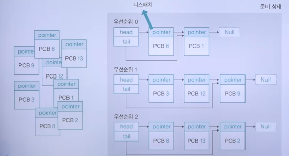

#### 프로세스의 우선순위를 배정하는 방식

1. 고정 우선순위 방식
   - 운영체제가 프로세스에 우선순위를 부여하면 프로세스가 끝날 때까지 바뀌지 않는 방식
   - 프로세스가 작업하는 동안 우선순위가 변하지 않기 때문에 구현하기 쉬움
   - 하지만, 시스템의 상황이 시시각각 변하는데 우선순위를 고정하면 시스템의 변화에 대응하기 어려워 작업 효율이 떨어짐
2. 변동 우선순위 방식
   - 프로세스 생성 시 부여 받은 우선순위가 프로세스 작업 중간에 변하는 방식
   - 구현하기 어렵지만 시스템의 효율성을 높일 수 있음

### 대기 상태의 다중 큐

#### 대기 상태의 다중 큐

- 시스템의 효율을 높이기 위해 대기 상태에서는 같은 입출력을 요구한 프로세스끼리 모아 놓음
- 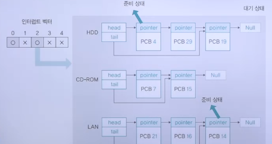

#### 다중 큐 비교

- 준비 큐
  - 한 번에 하나의 프로세스를 꺼내어 CPU를 할당
- 대기 큐
  - 여러 개의 프로세스 제어 블록을 동시에 꺼내어 준비 상태로 옮김
- 대기 큐에서 동시에 끝나는 인터럽트를 처리하기 위해 인터럽트 벡터라는 자료 구조 사용
- 다중 큐
  - 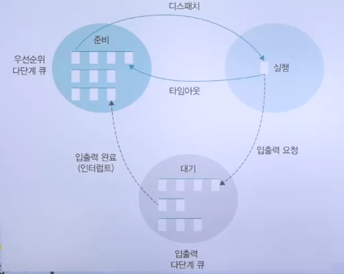

## 스케줄링 알고리즘의 종류

### 스케줄링 알고리즘의 선택 기준

#### 스케줄링 알고리즘의 종류

- 선점 스케줄링
  - Round Robin 스케줄링
  - SRT(Shortest Remaining time) 스케줄링
  - MLQ(Multi Level Queue) 스케줄링
  - MFQ(Multi Level feedback Queue) 스케줄링
- 비선점 스케줄링
  - 우선순위 스케줄링
  - 기한부 스케줄링
  - FIFO 스케줄링
  - SJF(Shortest job first) 스케줄링
  - HRN(Highest Response ratio Next) 스케줄링

#### 스케줄링 알고리즘의 평가 기준

1. CPU 사용률
   - 전체 시스템의 동작 시간 중 CPU가 사용된 시간을 측정하는 방법
   - 가장 이상적인 수치는 100% 이지만 실제로는 여러 가지 이유로 90%에도 못 미침
2. 처리량
   - 단위 시간당 작업을 마친 프로세스의 수
   - 수치가 클수록 좋은 알고리즘임
   - 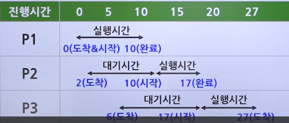
   - 대기 시간: 프로세스가 생성된 후 실행되기 전까지 대기하는 시간
   - 응답 시간 : 첫 작업을 시작한 후 첫 번째 출력(반응)이 나오기까지의 시간
   - 실행 시간 : 프로세스 작업이 시작된 후 종료되기까지의 시간
   - 반환 시간 : 대기 시간을 포함하여 실행이 종료될 때까지의 시간
   - 평균 대기 시간
     - 모든 프로세스의 대기 시간을 합한 뒤 프로세스의 수로 나눈 값
     - 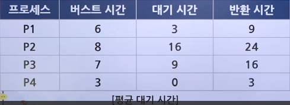

### FCFS 스케줄링

#### FCFS 스케줄링의 동작 방식

- 준비 큐에 도착한 순서대로 CPU를 할당하는 비선점형 방식
- 한 번 실행되면 그 프로세스가 끝나야만 다음 프로세스를 실행할 수 있음
- 큐가 하나라 모든 프로세스는 우선순위가 동일
- 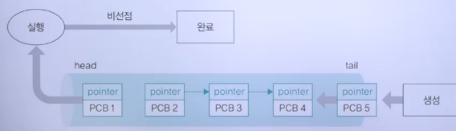

#### FCFS 스케줄링의 성능

- 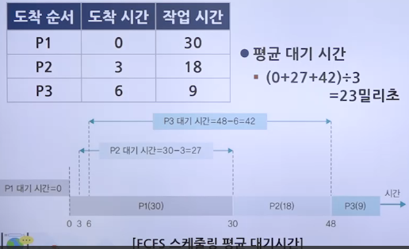

#### FCFS 스케줄링의 평가

- 처리 시간이 긴 프로세스가 CPU를 차지하면 다른 프로세스들은 하염없이 기다려 시스템의 효율성이 떨어짐
- 특히 현재 작업 중인 프로세스가 입출력 작업을 요청하는 경우 CPU가 작업하지 않고 쉬는 시간이 많아져 작업 효율이 떨어짐

### SJF 스케줄링

#### SJF 스케줄링의 동작 방식

- 준비 큐에 있는 프로세스 중에서 실행 시간이 가장 짧은 작업부터 CPU를 할당하는 비선점형 방식
- 최단 작업 우선 스케줄링이라고도 함
- 콘보이 효과를 완화하여 시스템의 효율성을 높임
  - Convoy Effect: CPU를 많이 필요로 하지 않는 프로세스들이, CPU를 오랫동안 사용하는 프로세스가 끝나기를 기다리는 현상
- 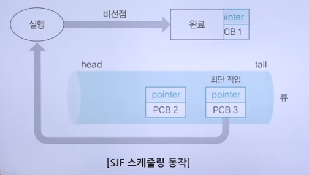

#### SJF 스케줄링의 성능

- 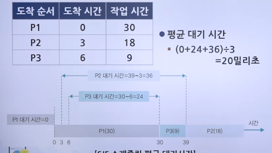

#### SJF 스케줄링의 평가

- 운영체제가 프로세스의 종료 시간을 정확하게 예측하기 어려움
- 작업 시간이 길다는 이유만으로 계속 뒤로 밀려 공평성이 현저히 떨어짐
- 이를 아사(Starvation) 현상이라 부름
- 에이징
  - 아사 현상의 완화 방법
  - 프로세스가 양보할 수 있는 상한선을 정하는 방식
  - 프로세스가 자신의 순서를 양보할 때마다 나이를 한 살씩 먹어 최대 몇 살까지 양보하도록 규정하는 것

### HRN 스케줄링

#### HRN 스케줄링의 동작 방식

- SJF 스케줄링에서 발생할 수 있는 아사 현상을 해결하기 위해 만들어진 비선점형 알고리즘
- 최고 응답률 우선 스케줄링이라고도 함
- 서비스를 받기 위해 기다린 시간과 CPU 사용 시간을 고려하여 스케줄링을 하는 방식
- 프로세스의 우선순위를 결정하는 기준
  - 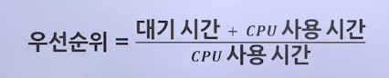

#### HRN 스케줄링의 평가

- 실행 시간이 짧은 프로세스의 우선순위를 높게 설정하면서도 대기 시간을 고려하여 아사 현상을 완화
- 대기 시간이 긴 프로세스의 우선순위를 높임으로써 CPU를 할당 받을 확률을 높임
- 여전히 공평성이 위배되어 많이 사용되지 않음

### 라운드 로빈 스케줄링

#### 라운드 로빈 스케줄링의 동작 방식

- 한 프로세스가 할당 받은 시간(타임 슬라이스) 동안 작업을 하다가 작업을 완료하지 못하면 준비 큐의 맨 뒤로 가서 자기 차례를 기다리는 방식
- 선점형 알고리즘 중 가장 단순하고 대표적인 방식
- 프로세스들이 작업을 완료할 때까지 계속 순환하면서 실행
- 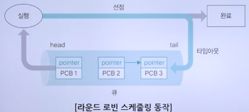

#### 타임 슬라이스의 크기와 문맥 교환

- 라운드 로빈 스케줄링이 효과적으로 작동하려면 문맥 교환에 따른 추가 시간을 고려해 타임 슬라이스를 적절히 설정해야 함
  - 타임 슬라이스가 큰 경우
    - 하나의 작업이 끝난 뒤 다음 작업이 시작되는 것처럼 보여 FCFS 스케줄링과 다를 게 없음
  - 타임 슬라이스가 작은 경우
    - 문맥 교환이 너무 자주 일어나 문맥 교환에 걸리는 시간이 실제 작업 시간보다 상대적으로 커지며, 문맥 교환에 많은 시간을 낭비하여 실제 작업을 못하는 문제가 발생

### SRT 우선 스케줄링

#### SRT 스케줄링의 동작 방식

- 기본적으로 라운드 로빈 스케줄링을 사용하지만, CPU를 할당 받을 프로세스를 선택할 때 남아 있는 작업 시간이 가장 적은 프로세스를 선택
- 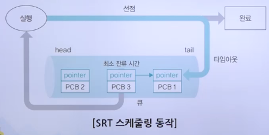

#### SRT 스케줄링의 평가

- 현재 실행 중인 프로세스와 큐에 있는 프로세스의 남은 시간을 주기적으로 계산하고, 남은 시간이 더 적은 프로세스와 문맥 교환을 해야 하므로 SJF 스케줄링에는 없는 작업이 추가됨
- 운영체제가 프로세스의 종료 시간을 예측하기 어렵고 아사 현상이 일어나기 때문에 잘 사용하지 않음

### 우선순위 스케줄링

#### 우선순위 스케줄링의 동작 방식

- 프로세스의 중요도에 따른 우선순위를 반영한 스케줄링 알고리즘
- 우선순위
  - 비선점형 방식과 선점형 방식에 모두 적용할 수 있음

#### 우선순위 적용

- 비선점형 방식
  - SJF 스케줄링
    - 작업 시간이 짧은 프로세스에 높은 우선순위를 부여
  - HRN 스케줄링
    - 작업 시간이 짧거나 대기 시간이 긴 프로세스에 높은 우선순위를 부여
- 선점형 방식
  - SRT 스케줄링
    - 남은 시간이 짧은 프로세스에 높은 우선순위를 부여
- 고정 우선순위 알고리즘
  - 한 번 우선순위를 부여받으면 종료될 때까지 우선순위 고정
  - 단순하게 구현할 수 있지만, 시시각각 변하는 시스템의 상황을 반영하지 못해 효율성이 떨어짐
- 변동 우선순위 알고리즘
  - 일정 시간마다 우선순위가 변하여 일정 시간마다 우선순위를 새로 계산하고 이를 반영
  - 복잡하지만 시스템의 상황을 반영하여 효율적인 운영 가능

#### 우선순위 스케줄링의 평가

- 준비 큐에 있는 프로세스의 순서를 무시하고 우선순위가 높은 프로세스에 먼저 CPU를 할당하므로 공평성을 위배하고 아사 현상을 일으킴
- 준비 큐에 있는 프로세스의 순서를 무시하고 프로세스의 우선순위를 매번 바꿔야 하기 때문에 오버헤드가 발생하여 시스템의 효율성을 떨어뜨림

### 다단계 큐 스케줄링

#### 다단계 큐 스케줄링의 동작 방식

- 우선순위에 따라 준비 큐를 여러 개 사용하는 방식
- 프로세스는 운영체제로부터 부여 받은 우선순위에 따라 해당 우선순위의 큐에 삽입
- 우선순위는 고정형 우선순위를 사용
- 상단의 큐에 있는 모든 프로세스의 작업이 끝나야 다음 우선순위 큐의 작업이 시작됨
- 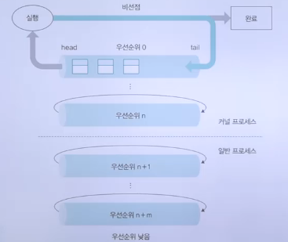

#### 다단계 피드백 큐 스케줄링의 동작 방식

- 프로세스가 CPU를 한 번씩 할당 받아 실행될 때마다 프로세스의 우선순위를 낮춤
  - 다단계 큐에서 우선순위가 낮은 프로세스의 실행이 연기되는 문제를 완화
- 우선순위가 낮아진다고 할지라도 커널 프로세스가 일반 프로세스의 큐에 삽입되지는 않음
- 우선순위에 따라 타임 슬라이스의 크기가 다름
- 우선순위가 낮아질수록 CPU를 얻을 확률이 적어짐
  - 따라서 한 번 CPU를 잡을 때 많이 작업하라고 낮은 우선순위의 타임 슬라이스를 크게 함
  - 마지막 큐에 있는(우선순위가 가장 낮은) 프로세스는 무한대의 타임 슬라이스를 얻음
  - 마지막 큐는 들어온 순서대로 작업을 마치는 FCFS 스케줄링 방식으로 동작
- 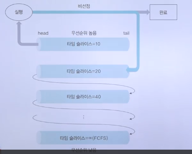
