# 프로세스 간 통신

## 프로세스 간 통신의 개념

### 프로세스 간 통신의 종류

- 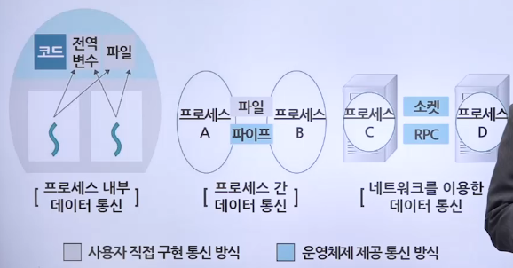

 

- 프로세스 내부 데이터 통신
  - 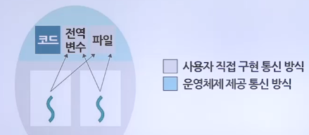
  - 하나의 프로세스 내에 2개 이상으의 스레드가 존재하는 경우의 통신
  - 프로세스 내부의 스레드는 전역 변수나 파일을 이용하여 데이터를 주고받음
- 프로세스 간 데이터 통신
  - 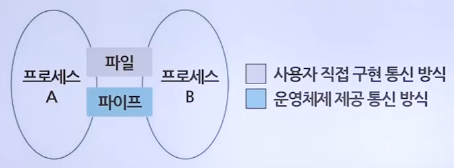
  - 같은 컴퓨터에 있는 여러 프로세스끼리 통신하는 경우
  - 공용 파일 또는 운영체제가 제공하는 파이프를 사용하여 통신
- 네트워크를 이용한 데이터 통신
  - 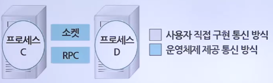
  - 여러 컴퓨터가 네트워크로 연결되어 있을 때 통신
  - 소켓을 이용하여 데이터를 주고받음

#### 통신 방향에 따른 분류

- 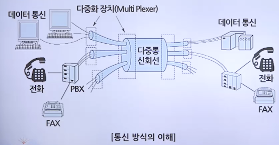

 

- 양방향 통신
  - 데이터를 동시에 양쪽 방향으로 전송할 수 있는 구조로, 일반적인 통신은 모두 양방향 통신
  - 프로세스 간 통신에서는 소켓 통신이 양방향 통신에 해당
- 반양방향 통신
  - 데이터를 양쪽 방향으로 전송할 수 있지만 동시 전송은 불가능하고 특정 시점에 한쪽 방향으로만 전송할 수 있는 구조
  - 반양방향 통신의 대표적인 예는 무전기
- 단뱡향 통신
  - 모스 신호처럼 한쪽 방향으로만 데이터를 전송할 수 있는 구조
  - 프로세스 간 통신에서는 전역 변수와 파이프가 단방향 통신에 해당
  - 전역 변수는 단방향 통신
  - 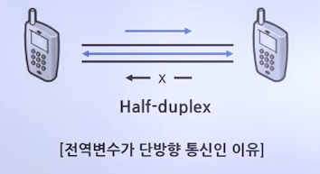

#### 통신 구현 방식에 따른 분류

- 대기가 있는 통신
  - 동기화를 지원하는 통신 방식
  - 데이터를 받는 쪽은 데이터가 도착할 때까지 자동으로 대기 상태에 머물러 있음
- 대기가 없는 통신
  - 동기화를 지원하지 않는 통신 방식
  - 데이터를 받는 쪽은 바쁜 대기를 사용하여 데이터가 도착했는지 여부를 직접 확인

## 프로세스 종류

### 프로세스 간 통신 방식

> 데이터를 주거나 받는 쓰기 연산과 읽기 연산으로 이루어짐

- 
- GV : global value(전역변수)

#### 전역 변수를 이용한 통신

- 공동으로 관리하는 메모리를 사용하여 데이터를 주고받는 것
- 데이터를 보내는 쪽에서는 전역 변수나 파일에 값을 쓰고, 데이터를 받는 쪽에서는 전역 변수의 값을 읽음
- 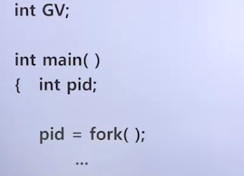
- 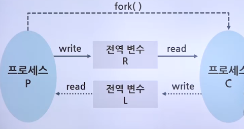

#### 파일을 이용한 통신

- 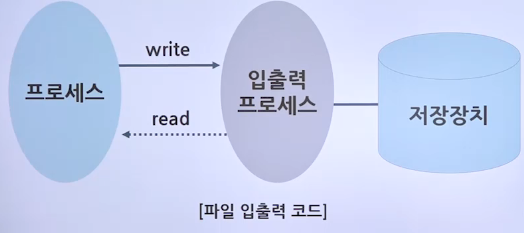
- 파일 열기
  - open("com.txt", O_RDWR)
    - com.txt 파일을 읽기와 쓰기를 할 수 있는 형태로 준비
  - 파일이 열리면 open 함수는 그 파일에 접근할 수 있는 권한인 파일 기술자 fd를 사용자에게 반환
- 읽기 또는 쓰기 연산
  - write(fd, "test", 5)
    - fd, 즉 com.txt 파일에 test라는 문자열을 쓰라는 뜻
  - read(fd, buf, 5)
    - fd, 즉 com.txt 파일에서 5개를 읽어 변수 buf에 저장
- 파일 닫기
  - close(fd)는 fd가 가리키는 파일
  - 즉, com.txt 파일을 닫음

#### 파이프를 이용한 통신

- 운영체제가 제공하는 동기화 통신 방식으로, 파일 입출력과 같이 open() 함수로 기술자를 얻고 작업을 한 후 close() 함수로 마무리
- 파이프로 양방향 통신을 하려면 파이프 2개 사용
- 파이프에 쓰기 연산을 하면 데이터가 전송되고 읽기 연산을 하면 데이터를 받음
- 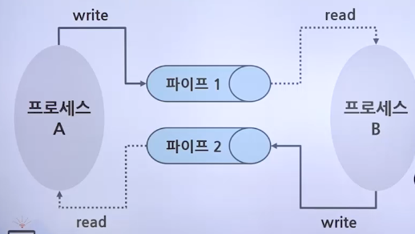
- 이름 없는 파이프
  - 일반적으로 파이프라고 하면 이름 없는 파이프를 가리킴
- 이름 있는 파이프
  - FIFO라 불리는 특수 파일을 이용하며 서로 관련 없는 프로세스 간 통신에 사용하며, 프로세스간 통신임

#### 소켓을 이용한 통신

- 여러 컴퓨터에 있는 프로세스끼리 통신하는 방법
- 통신하고자 하는 프로세스는 자신의 소켓과 상대의 소켓 연결
- 시스템에 있는 프로세스가 소켓을 바인딩 한 후 소켓에 쓰기 연산을 하면 데이터가 전송되고, 읽기 연산을 하면 데이터를 받게 됨
- 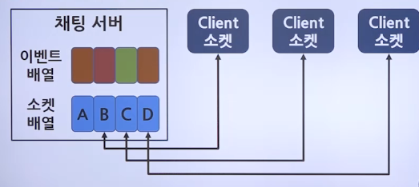
