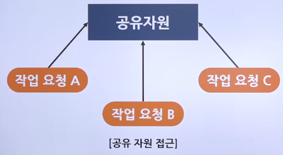

# 공유 자원, 임계 구역 해결 방법

## 공유 자원 사용 시의 임계 구역

### 공유 자원의 접근

- 공유 자원
  - 여러 프로세스가 공동으로 이용하는 변수, 메모리, 파일 등
  - 공동으로 이용되기 때문에 누가 언제 데이터를 읽거나 쓰느냐에 따라 그 결과가 달라질 수 있음
- 경쟁 조건
  - 2개 이상의 프로세스가 공유 자원을 병행적으로 읽거나 쓰는 상황
  - 경쟁 조건이 발생하면 공유 자원 접근 순서에 따라 실행 결과가 달라질 수 있음

#### 공유 자원의 접근 예

- 

### 임계 구역

> 임계 구역 : 공유 자원 접근 순서에 따라 실행 결과가 달라지는 프로그램의 영역

- 믹서는 공유가 불가능한 자원으로서 주방의 임계 구역
- 임계 구역에서는 프로세스들이 동시에 작업하면 안 됨
- 어떤 프로세스가 임계구역에 들어가면 다른 프로세스는 임계 구역 밖에서 기다려야 하며, 임계 구역의 프로세스가 나와야 들어갈 수 있음
- 

### 생산자-소비자 문제

#### 코드 및 실행 순서에 따른 결과

- 
- 생산자는 수를 증가시켜가며 물건을 채우고 소비자는 생산자를 쫓아가며 물건을 소비
- 생산자 코드와 소비자 코드가 동시에 실행되면 문제가 발생

## 임계 구역 문제의 해결 조건 및 방법

### 임계 구역 해결 조건

- 상호 배제(Mutual exclusion)
  - 한 프로세스가 임계 구역에 들어가면 다른 프로세스는 임계 구역에 들어갈 수 없는 것
- 한정 대기(Bounded waiting)
  - 어떤 프로세스도 무한 대기하지 않아야 함
- 진행의 융통성(Progress flexibility)
  - 한 프로세스가 다른 프로세스의 진행을 방해해서는 안 된다는 것

### 기본 코드

```c
#include <stdio.h>

typedef enum {false, true} boolean;
extern boolean lock = false;
extern int balance;

main(){
    while(lock==true);
    lock=true;
    balance=balance+10; // 임계구역
    lock=false;
}


```

### 임계 구역 해결 조건을 고려한 코드 설계

#### 전역 변수로 잠금을 구현한 코드

- 

#### 전역 변수로 잠금을 구현한 코드의 문제

- 
- 프로세스 P1은 while(lock==true); 문을 실행
- 프로세스 P2는 while(lock==true); 문을 실행
- 프로세스 P1은 lock=true; 문을 실행하여 임계 구역에 잠금을 걸고 진입
- 프로세스 P2도 lock=true; 문을 실행하여 임계 구역에 잠금을 걸고 진입
  > 결국 둘 다 임계 구역에 진입

#### 상호 배제 조건을 충족하는 코드

- 

#### 상호 배제 조건을 충족하는 코드의 문제

- 
- 프로세스 P1은 lock1=true; 문을 실행한 후 자신의 CPU 시간을 다 씀(타임아웃)
  - 문맥 교환이 발생하고 프로세스 P2가 실행 상태로 바뀜
- 프로세스 P2도 lock2=true; 문을 실행한 후 자신의 CPU 시간을 다 씀(타임아웃)
  - 문맥 교환이 발생하고 프로세스 P1이 실행 상태로 바뀜
- 프로세스 P2가 lock2=true; 문을 실행했기 때문에 프로세스 P1은 while(lock2==true); 문에서 무한 루프에 빠짐
- 프로세스 P1이 lock1=true; 문을 실행했기 때문에 프로세스 P2도 while(lock1==true); 문에서 무한 루프에 빠짐

### 피터슨 알고리즘

- 임계 구역 해결의 세 가지 조건을 모두 만족
- 2개의 프로세스만 사용 가능하다는 한계가 있음
- 

### 데커 알고리즘

- 

#### 데커 알고리즘의 동작

- 프로세스 P1은 우선 잠금을 검(lock1=true;)
- 프로세스 P2의 잠금이 걸렸는지 확인[while(lock2==true)]
- 만약 프로세스 P2도 잠금을 걸었다면 누가 먼저인지 확인
  - [if(turn == 2)]
- 만약 프로세스 P1의 차례라면(turn = 1) 임계 구역으로 진입
- 만약 프로세스 P2의 차례라면(turn = 2) 4로 이동
- 프로세스 P1은 잠금을 풀고(lock1 = false; ) 프로세스 P2가 작업을 마칠 때까지 기다림 [while(turn == 2);]
- 프로세스 P2가 작업을 마치면 잠금을 걸고 (lock1 = true;) 임계 구역으로 진입

### 세마포어

- 임계 구역에 진입하기 전에 스위치를 사용 중으로 놓고 임계 구역으로 들어감
- 이후에 도착하는 프로세스는 앞의 프로세스가 작업을 마칠 때까지 기다림
- 프로세스가 작업을 마치면 다음 프로세스에 임계 구역을 사용하라는 동기화 신호를 보냄
- 

#### 세마포어 내부 코드

- Semaphore(n)
  - 전역 변수 RS를 n으로 초기화
  - RS에는 현재 사용 가능한 자원의 수가 저장
- P()
  - 잠금을 수행하는 코드로 RS가 0보다 크면(사용 가능한 자원이 있으면) 1만큼 감소시키고 임계 구역에 진입
  - 만약 RS가 0보다 작으면(사용 가능한 자원이 없으면) 0보다 커질 때까지 기다림
- V()
  - 잠금 해제와 동기화를 같이 수행하는 코드
  - RS 값을 1 증가시키고 세마포어에서 기다리는 프로세스에게 임계 구역에 진입해도 좋다는 wake_up 신호를 보냄
- 

#### 예금 5만 원이 사라진 문제를 세마포어를 사용하여 해결한 코드

- 

#### 세마포어의 잘못된 사용 예

- 프로세스가 세마포어를 사용하지 않고 바로 임계 구역에 들어간 경우로 임계 구역을 보호할 수 없음
- P()를 두 번 사용하여 wake_up 신호가 발생하지 않은 경우로 프로세스 간의 동기화가 이루어지지 않아 세마포어 큐에서 대기하고 있는 프로세스들이 무한 대기에 빠짐
- P()와 V()를 반대로 사용하여 상호 배제가 보장되지 않은 경우로 임계 구역을 보호할 수 없음

### 모니터

#### 모니터(Monitor)

> 공유 자원을 내부적으로 숨기고 공유 자원에 접근하기 위한 인터페이스만 제공함으로써 자원을 보호하고 프로세스 간에 동기화를 시킴

#### 모니터의 작동 원리

- 임계 구역으로 지정된 변수나 자원에 접근하고자 하는 프로세스는 직접 P()나 V()를 사용하지 않고 모니터에 작업 요청
- 모니터는 요청 받은 작업을 모니터 큐에 저장한 후 순서대로 처리하고 그 결과만 해당 프로세스에 알려줌
- 

#### 예금 5만 원이 사라진 문제를 모니터를 사용하여 해결한 코드

- 
