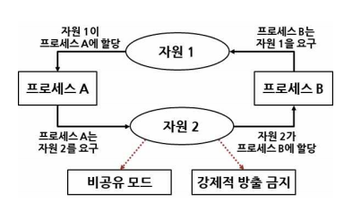
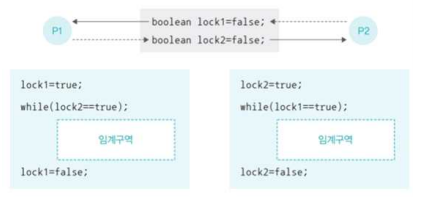
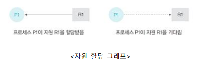
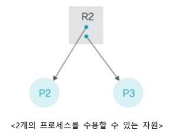
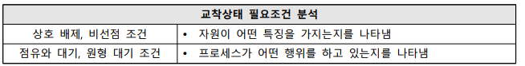
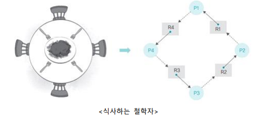
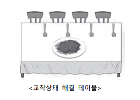

# 교착상태 필요조건

## 교착상태의 정의와 발생원인

### 교착상태의 정의

- 교착상태
  - 2개 이상의 프로세스가 다른 프로세스의 작업이 끝나기만 기다리며 작업을 더 이상 진행하지 못하는 상태를 의미
- 아사 현상과의 차이
  - 아사 현상 : 운영체제가 잘못된 정책을 사용하여 특정 프로세스의 작업이 지연되는 문제
  - 교착상태 : 여러 프로세스가 작업을 진행하다보니 자연 발생적으로 일어나는 문제

### 교착상태의 발생

- 시스템 자원
  - 교착상태는 다른 프로세스와 공유할 수 없는 자원을 사용할 때 발생
    - 
  - 공유 변수
    - 교착상태는 공유 변수를 사용할 때 발생
      - 
  - 응용 프로그램
    - 데이터베이스같은 응용 프로그램에서도 교착상태 발생
    - 데이터베이스는 데이터의 일관성을 유지하기 위해 잠금을 사용하는데, 이때 교착상태가 발생할 수 있음

### 자원 할당 그래프

- 자원 할당 그래프
  - 프로세스가 어떤 자원을 사용 중이고 어떤 자원을 기다리고 있는지를 방향성이 있는 그래프로 표현한 것
  - 프로세스는 원으로, 자원은 사각형으로 표현
    - 
- 다중 자원
  - 여러 프로세스가 하나의 자원을 동시에 사용하는 경우
  - 수용할 수 있는 프로세스 수를 사각형 안에 작은 동그라미로 표현
    - 

## 교착상태가 발생하는 필요조건

### 교착상태 필요조건

- 
- 교착상태
  - 어떤 상태가 굳어버려서 변동이나 전진 없이 머물러 있는 상태를 뜻함
  - 컴퓨터를 통해 여러 가지 작업을 할 때 각 프로그램들은 특정 자원을 사용해야 함
  - 만일 필요한 자원을 다른 프로그램이 사용 중이라면
    - 필요한 자원을 사용할 수 있을 때까지 프로그램들이 계속 기다리기만 해야함
    - 이를 바로 컴퓨터 내의 교착상태라고 함

### 식사하는 철학자 문제와 교착상태 필요조건

- 식사하는 철학자 문제
  - 왼쪽에 있는 포크를 잡은 뒤 오른쪽에 있는 포크를 잡아야만 식사 가능
    - 
- 식사하는 철학자 문제에서 교착상태가 발생하는 조건
  - 철학자들은 서로 포크를 공유할 수 없음
    - 자원을 공유하지 못하면 교착상태가 발생
  - 각 철학자는 다른 철학자의 포크를 빼앗을 수 없음
    - 자원을 뺴앗을 수 없으면 자원을 놓을 때까지 기다려야 하므로 교착상태가 발생
  - 각 철학자는 왼쪽 포크를 잡은 채 오른쪽 포크를 기다림
    - 자원 하나를 잡은 상태에서 다른 자원을 기다리면 교착상태가 발생
  - 자원 할당 그래프가 원형
    - 자원을 요구하는 방향이 원을 이루면 양보를 하지 않기 때문에 교착상태가 발생
- 교착상태 필요조건
  - 다음 4가지 조건이 모두 발생해야만 교착상태 발생(필요조건)(만약 단 한 가지라도 만족하지 않으면 교착상태가 발생하지 않음)
  - 상호 배제(Mutual exclusion)
    - 한 프로세스가 사용하는 자원은 다른 프로세스와 공유할 수 없는 배타적인 자원이어야 함
  - 비선점(Non-preemptive)
    - 한 프로세스가 사용 중인 자원은 중간에 다른 프로세스가 빼앗을 수 없는 비선점 자원이어야 함
  - 점유와 대기(Hold and wait)
    - 프로세스가 어떤 자원을 할당받은 상태에서 다른 자원을 기다리는 상태여야 함
  - 원형 대기(Circular wait)
    - 점유와 대기를 하는 프로세스 간의 관계가 원을 이루어야 함
- 식사하는 철학자 문제와 교착상태 필요조건
  - 상호 배제
    - 포크는 한 사람이 사용하면 다른 사람이 사용할 수 없는 배타적인 자원임
  - 비선점
    - 철학자 중 어떤 사람의 힘이 월등하여 옆 사람의 포크를 빼앗을 수 없음
  - 점유와 대기
    - 한 철학자가 두 자원(왼쪽 포크와 오른쪽 포크)을 다 점유하거나, 반대로 두 자원을 다 기다릴 수 없음
  - 원형 대기
    - 철학자들은 둥그런 식탁에서 식사를 함, 원을 이룬다는 것은 선후 관계를 결정할 수 없어 문제가 계속 맴돈다는 의미(사각형 식탁에서 한 줄로 앉아서 식사를 한다면 교착상태가 발생하지 않음)
- 교착상태 해결 테이블
  - 
