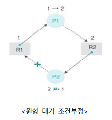

# 교착상태 해결 방법

## 교착상태 해결 방법

### 교착상태 해결 방법

- 교착상태 예방(Prevention)
  - 교착상태를 유발하는 4가지 조건이 발생하지 않도록 무력화하는 방식으로 교착상태 조건 4가지에 대하여 각각의 방법이 존재함
- 교착상태 회피(Avoidance)
  - 교착상태가 발생하지 않도록 자원 할당량을 조절하여 교착상태를 회피하는 방식
- 교착상태 검출(Detection)과 회복(Recovery)
  - 교착상태 검출은 어떤 제약을 가하지 않고 자원 할당 그래프를 모니터링 하면서 교착상태가 발생하는지 살펴보는 방식으로 만약 교착상태가 발생하면 교착상태 회복 단계가 진행됨

### 교착상태 예방

> 교착상태 조건 4가지에 대해 각각의 방식이 존재

- 상호 배제 예방
  - 시스템 내에 있는 상호 배타적인 모든 자원, 즉 독점적으로 사용할 수 있는 자원을 없애버리는 방법
  - 현실적으로는 모든 자원을 공유할 수 없으며 상호 배제를 적용하여 보호해야 하는 자원이 있음
  - 상호 배제를 무력화하는 것은 사실상 어려움
- 비선점 예방
  - 모든 자원을 빼앗을 수 있도록 만드는 방법
  - 그러나 아사 현상을 일으켜 비선점 조건을 무력화하기는 어려움
- 점유와 대기 예방
  - 프로세스가 자원을 점유한 상태에서 다른 자원을 기다리지 못하게 하는 방법
  - '전부 할당하거나 아니면 아예 할당하지 않는' 방식을 적용
  - 자원이 아닌 프로세스의 자원 사용 방식을 변화시켜 교착상태를 처리한다는 점에서 의미가 있음
  - 
- 점유와 대기 예방의 단점
  - 프로세스가 자신이 사용하는 모든 자원을 자세히 알기 어려움
  - 자원의 활용성이 떨어짐
  - 많은 자원을 사용하는 프로세스가 적은 자원을 사용하는 프로세스보다 불리함
    - 결국 일괄 작업 방식으로 동작
    - 
- 원형 대기 예방
  - 점유와 대기를 하는 프로세스들이 원형을 이루지 못하도록 막는 방법
  - 모든 자원에 숫자를 부여하고 숫자가 큰 방향으로만 자원을 할당하는 것
    - ex. 마우스를 할당받은 상태에서 프린터를 할당받을 수는 있지만, 프린터를 할당받은 상태에서는 마우스나 하드디스크를 할당받을 수 없음
      - 
  - 원형 대기 예방과 교착상태 해결
    - 프로세스 P2는 자원을 할당받을 수 없어 강제 종료되고 프로세스 P1은 정상적으로 실행
      - 
  - 원형 대기 예방의 단점
    - 프로세스 작업 진행에 유연성이 떨어짐
    - 자원의 번호를 어떻게 부여할 것인지가 문제
- 교착상태 예방 정리
  - 교착상태를 유발하는 4가지 조건이 일어나지 않도록 제약을 가하는 방법
  - 자원을 보호하기 위해 상호 배제와 비선점을 예방하기 어려움
  - 점유와 대기, 원형 대기는 프로세스 작업 방식을 제한하고 자원을 낭비하기 때문에 사용할 수 없음

### 교착상태 회피

- 교착상태 회피의 개념
  - 프로세스에 자원을 할당할 때 어느 수준 이상의 자원을 나누어주면 교착상태가 발생하는지 파악하여 그 수준 이하로 자원을 나누어주는 방법
  - 교착상태가 발생하지 않는 범위 내에서만 자원을 할당하고, 교착상태가 발생하는 범위에 있으면 프로세스를 대기시킴
  - 즉, 할당되는 자원의 수를 조절하여 교착상태를 피함
- 안정상태와 불안정상태
  - 교착상태 회피는 자원의 총수와 현재 할당된 자원의 수를 기준으로 시스템을 안정상태(Safe state)와 불안정상태(Unsafea state)로 나누고 시스템이 안정상태를 유지하도록 자원을 할당
  - 할당된 자원이 적으면 안정 상태가 크고, 할당된 자원이 늘어날수록 불안정상태가 커짐
  - 교착상태는 불안정상태의 일부분이며, 불안정상태가 커질수록 교착상태가 발생할 가능성이 높아짐
  - 교착상태 회피는 안정상태를 유지할 수 있는 범위 내에서 자원을 할당함으로써 교착상태를 피함
    - 
- 은행원 알고리즘
  - 교착상태 회피를 구현하는 대표적인 알고리즘
  - 은행이 대출을 해주는 방식, 즉 대출 금액이 대출 가능한 범위 내이면(안정 상태이면) 허용되지만 그렇지 않으면 거부되는 것과 유사한 방식
    - 
  - 은행원 알고리즘에서 자원 할당 기준
    - 
    - 안정상태 : 각 프로세스의 기대자원과 비교하여 가용자원이 크거나 같은 경우가 1번 이상인 경우를 말함
    - 각 프로세스의 기대 자원과 비교하여 가용 자원이 하나라도 크거나 같으면 자원을 할당
    - 가용 자원이 어떤 기대 자원보다 크지 않으면 할당하지 않음
  - 교착상태 회피의 문제점
    - 프로세스가 자신이 사용할 모든 자원을 미리 선언해야 함
    - 시스템의 전체 자원 수가 고정적이어야 함
    - 자원이 낭비됨

### 교착상태 검출

- 교착상태 검출의 개념
  - 운영체제가 프로세스의 작업을 관찰하면서 교착상태 발생 여부를 계속 주시하는 방식
  - 교착상태가 발견되면 이를 해결하기 위해 교착상태 회복 단계를 밟음
- 타임아웃을 이용한 교착상태 검출
  - 일정 시간 동안 작업이 진행되지 않은 프로세스를 교착상태가 발생한 것으로 간주하여 처리하는 방법
  - 교착상태가 자주 발생하지 않을 것이라는 가정 하에 사용하는 것으로, 특별한 알고리즘이 없어 쉽게 구현할 수 있음
  - 타임아웃이 되면 프로세스가 종료됨
- 데이터베이스에서 타임아웃의 문제
  - 데이터베이스에서 타임아웃으로 프로세스가 종료되면 일부 데이터의 일관성이 깨질 수 있음
  - 데이터의 일관성이 깨지는 문제를 해결하기 위해 체크포인트와 롤백 사용
  - 체크포인트 : 작업을 하다가 문제가 발생하면 저장된 상태로 돌아오기 위한 표시
  - 롤백: 작업을 하다가 문제가 발생하여 과거의 체크포인트로 되돌아가는 것
    - 
- 자원 할당 그래프를 이용한 교착상태 검출
  - 단일 자원을 사용하는 경우 자원 할당 그래프에 사이클이 있으면 교착상태
    - 

## 실효성

- 교착상태 회복
  - 교착상태가 검출된 후 교착상태를 푸는 후속 작업을 하는 것
  - 교착상태 회복 단계에서는 교착상태를 유발한 프로세스를 강제로 종료
- 프로세스를 강제로 종료하는 방법
  - 교착상태를 일으킨 모든 프로세스를 동시에 종료
  - 교착상태를 일으킨 프로세스 중 하나를 골라 순서대로 종료
    - 우선순위가 낮은 프로세스를 먼저 종료
    - 우선순위가 같은 경우 작업 시간이 짧은 프로세스를 먼저 종료
      - 위의 두 조건이 같은 경우 자원을 많이 사용하는 프로세스를 먼저 종료
