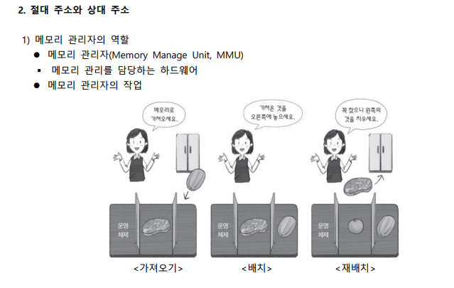
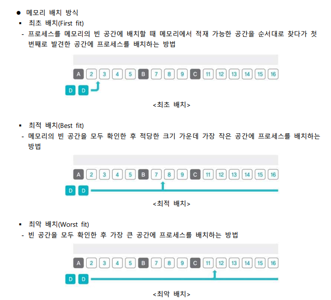
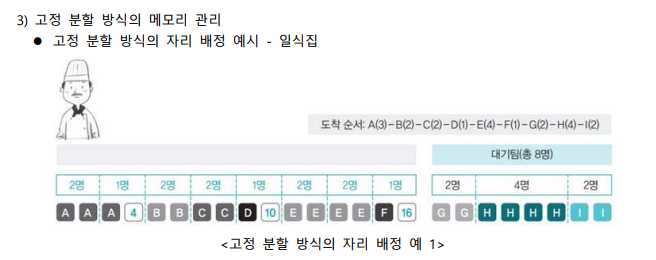
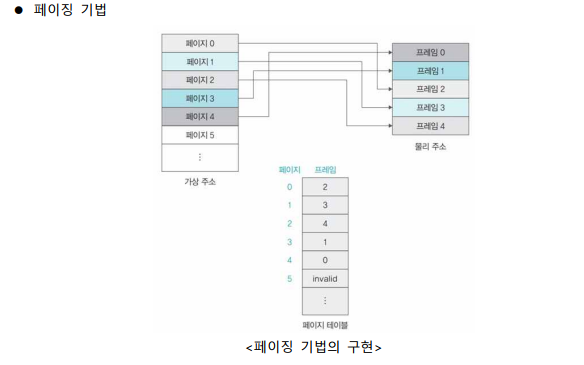
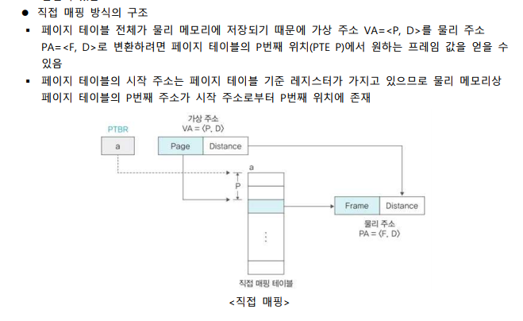
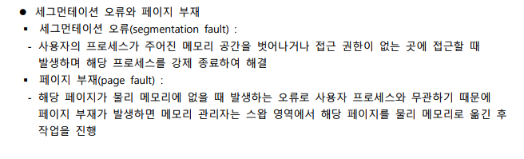
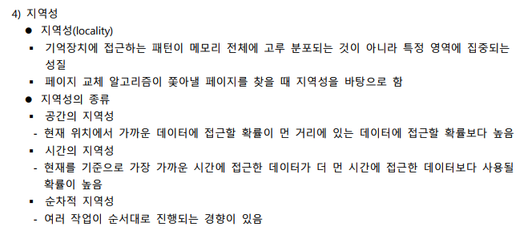
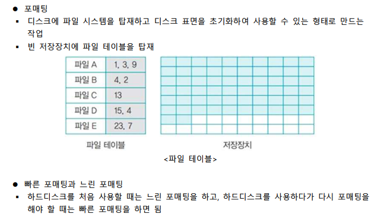
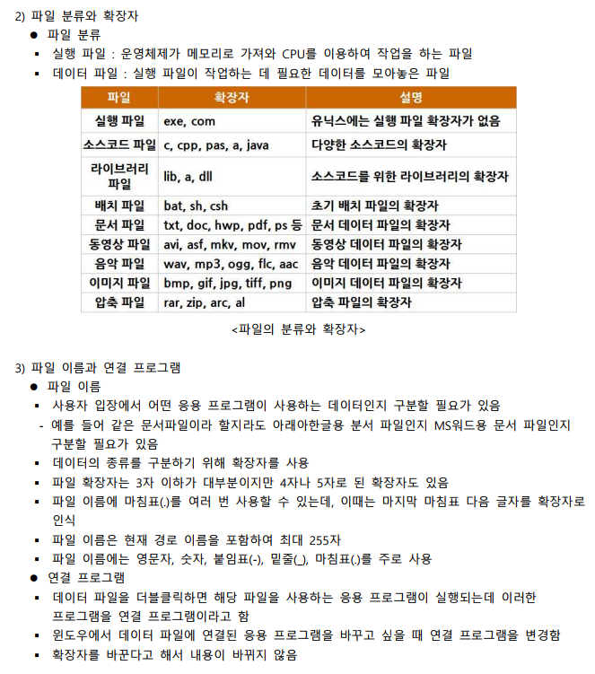

# 메모리 관리 1

# 메모리 관리 2

---

# 가상메모리와 페이징 기법

# 세그먼테이션-페이징 혼용 기법

---

# 요구 페이징 및 페이지 교체 알고리즘

# 스레싱과 프레임 할당 및 교체

---

# 입출력 시스템 및 디스크 장치

# 디스크 스케줄링과 RAID

---

# 파일 시스템, 디렉터리의 구조

# 디스크 파일 할당

---

# 네트워크와 인터넷

# 분산 시스템과 고가용성

---

# 정리

## 메모리 관리

- 시분할 시스템에서는 모든 응용프로그램이 메모리에 올라와 실행되어 메모리 관리가 복잡한데, 이를 '메모리 관리의 복잡성'이라고 표현한다. 또한 메모리 관리에 있어서 프로세스 입장에서는 메모리를 독차지하려 하고, 메모리 관리자 입장에서는 되도록 관리를 효율적으로 하고 싶어 한다는 점을 '메모리 관리의 이중성'으로 표현한다.
- 메모리 접근 시 상대 주소를 사용하면 절대 주소로 변환하도록 한다.
- 프로그램의 크기가 실제 메모리보다 큰 경우에는 전체 프로그램을 메모리에 가져오는 대신 적당한 크기로 잘라서 가져오는 메모리 오버레이 기법을 사용할 수 있다.
- 메모리에 여러 개의 프로세스를 배치하기 위해서는 프로세스의 크기에 따라 메모리를 나누는 가변 분할 방식과 프로세스의 크기와 상관없이 메모리를 같은 크기로 나누는 고정 분할 방식이 있다.
- 버디 시스템은 프로세스의 크기에 맞게 메모리를 반으로 자르고 프로세스를 메모리에 배치하게 된다.

## 가상메모리와 페이징 기법

- 가상 메모리의 메모리 분할 방식에는 가변 분할 방식을 이용한 세그먼테이션과 고정 분할 방식을 이용한 페이징 기법이 있다.
- 가상 메모리 시스템에서 메모리 관리자는 가상 주소와 물리 주소를 일대일 매핑 테이블로 관리한다.
- 페이징 기법은 고정 분할 방식을 이용한 가상 메모리 관리 기법으로, 물리 주소 공간을 같은 크기로 나누어 사용하는 것이다.
- 페이지 테이블 매핑 방식에는 직접 매핑, 연관 매핑, 집합-연관 매핑, 역매핑 등이 있다.

## 세그먼테이션-페이징 혼용 기법

- 세그먼테이션 기법을 구현할 때 각 세그먼트가 자신에게 주어진메모리 영역을 넘어가면 안되기 때문에 세그먼트의 크기 정보에는 크기를 뜻하는 size 대신 제한을 뜻하는 limit를 사용하게 된다.
- 세그먼테이션-페이징 혼용 기법은 페이징 기법에서 읽기, 쓰기, 실행, 추가 등의 메모리 접근 권한까지 고려한 것을 말한다.

## 요구 페이징 및 페이지 교체 알고리즘

- 요구 페이징이란 사용자가 요구할 때 해당 페이지를 메모리로 가져오는 것으로, 이를 통한 효과에는 메모리의 절약, 메모리의 효율적 관리, 프로세스의 응답 속도 향상 등이 있다.
- 어떤 알고리즘이 다른 알고리즘보다 성능이 좋은지 평가하는 데에는 무작위 페이지 교체 알고리즘, FIFO 페이지 교체 알고리즘, 최적 페이지 교체 알고리즘, LRU 페이지 교체 알고리즘, LFU 페이지 교체 알고리즘, NUR 페이지 교체 알고리즘, FIFO 변형 알고리즘 등이 있다.

## 스레싱과 프레임 할당 및 교체

- 스레싱은 하드디스크의 입출력이 너무 많아져 잦은 페이지 부재로 작업이 멈춘 것 같은 상태로, CPU가 작업하는 시간보다 스왑 영역으로 페이지를 보내고 새로운 페이지를 메모리에 가져오는 작업이 빈번해져서 CPU가 작업할 수 없는 상태에 이르게 될 때 발생한다.
- 프로세스에 프레임을 할당하는 방식은 크게 정적 할당과 동적 할당으로 구분되는데, 정적 할당에는 균등 할당, 비례 할당이 있고, 동적 할당에는 작업집합 모델 등이 있다.

## 입출력 시스템 및 디스크 장치

- 하나의 버스로 주변장치를 묶으면 저속장치가 고속장치의 데이터 이동을 방해할 수 있다. 이때에는 입출력 제어기를 통해 메인 버스와 입출력 버스로 2개 채널로 나누거나, 입출력 버스를 고속 입출력 버스와 저속 입출력 버스로 분리하는 등의 다양한 방법으로 관리할 수 있다.
- 디스크 장치에는 섹터, 트랙, 플래터, 표면, 스핀들, 읽기/쓰기 헤드, 디스크 암 등이 있다.

## 디스크 스케줄링과 RAID

- 디스크 스케줄링은 트랙의 이동을 최소화함으로써 탐색 시간을 줄이기 위한 것으로, 여기에는 FCFS 디스크 스케줄링, SSTF 디스크 스케줄링, 블록 SSTF 디스크 스케줄링, SCAN 디스크 스케줄링, C-SCAN 디스크 스케줄링, LOOK 디스크 스케줄링, C-LOOK 디스크 스케줄링 등의 기법들이 있다.
- RAID는 자동으로 백업을 하고 장애가 발생하면 이를 복구하는 시스템으로, 여기에는 RAID 0, RAID 1, RAID 2, RAID 3, RAID 4, RAID 5, RAID 6, RAID 10, RAID 50과 RAID 60 등이 있다.

## 파일 시스템, 디렉토리의 구조

- 파일 시스템은 사용자가 직접 파일을 보관하는 대신 파일 관리자를 두어 저장 장치의 관리를 맡기는 시스템으로, 파일 관리자는 파일 테이블을 사용하여 파일을 관리하게 된다.
- 파일 구조에는 순차 파일 구조, 인덱스 파일 구조, 직접 파일 구조가 있다.

## 디스크 파일 할당

- 하나의 디렉토리에는 여러 개의 파일과 자식 디렉토리가 존재하게 되는데, 디렉토리 구조에는 1단계 디렉토리 구조, 다단계 디렉토리 구조, 바로가기 링크를 포함한 디렉퇼 구조 등이 있다.
- 파일 시스템에서는 파일 테이블의 헤더를 삭제하고 사용했던 블록을 빈 공간 리스트에 등록하는 것을 파일이 삭제된 것으로 간주한다.

## 네트워크와 인터넷

- 통신은 방향에 따라 단방향 통신과 양방향 통신, 반양방향 통신으로 나눠볼 수 잇고, 네트워크는 구성 방식에 따라 강결합 시스템과 약결합 시스템으로 나누어 볼 수 있다.
- 1960년대 서로 호환되지 않는 LAN을 묶어 하나의 네트워크로 만드는 알파넷의 개발을 시작으로 1995년 마이크로소프트가 인터넷 익스플로러를 개발하였다. 이는 윈도우 운영체제에 포함하여 무료로 배포하면서 웹 브라우저가 급속도로 보급되어 현재에도 활발히 사용되고 있다.

## 분산 시스템과 고가용성

- 분산 시스템은 네트워크상에 분산되어 있는 컴퓨터가 작업을 처리하고 그 내용이나 결과를 서로 교환하는 것으로, 네트워크로 연결된 기기가 여러 자원을 공유할 수 있는 장점이 있다.
- 고가용성은 업무 또는 서비스 중단을 최소화하기 위해 이중화 작업을 하는 것, 작게는 운영체제의 디스크 미러링부터 크게는 시스템 자체를 이중화하는 것을 포함하는 개념이다.
